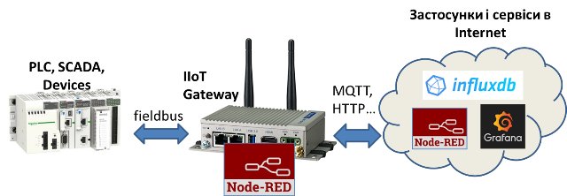
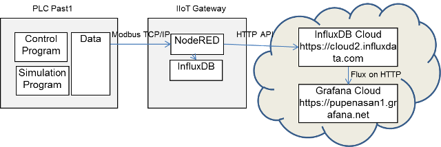

| [Курсовий](README.md) | [на сторінку курсу](../README.md) |
| --------------------- | --------------------------------- |
|                       |                                   |

# Методичні рекомендації до виконання курсової роботи з дисципліни "Розробка та імітаційне моделювання інтегрованих систем керування" 

# Вступ

Сучасні інтегровані системи керування можуть використовувати весь доступний потенціал тільки при використанні технологій промислового інтернету речей. При цьому використання моделе-орієнтованих підходів значно прискорює розробку складних програмно-технічних комплексів. Для дослідника важливо вміти проектувати такі системи та забезпечувати збір та аналіз даних для їх наступного використання при розробці та навчання моделей.  

Курсова робота передбачає практичне закріплення теоретичного матеріалу, здобутого на лекційному курсі та навичок, отриманих на лабораторних заняттях шляхом виконання проектних робіт по створенню програмно-технічного комплексу збору та аналізу даних з промислової установки.   

# 1. Мета і завдання курсового проектування

**Мета курсової роботи** – зміцнення і поглиблення теоретичних знань з дисципліни “Розробка та імітаційне моделювання інтегрованих систем керування” а також набуття практичних навичок в розробці проектів інтегрованих систем керування з використанням технологій промислового Інтернету речей (IIoT) та імітаційного моделювання.   

Курсова робота передбачає розроблення проекту та впровадження його частин для збору та аналізу даних з автоматизованих систем контролю/керування технологічними процесами на базі технологій IIoT. Вважається, що зібрані дані будуть використовуватися для подальшого аналізу та машинного навчання, які виходять за рамки даної курсової роботи. Для перевірки працездатності рішення а також для формування масивів даних для первинного навчання будується імітаційна модель для об'єкту керування/контролю.

На рис.1 показана типова структура системи IIoT, яка розробляється в курсовій роботі. Вона може бути іншою в залежності від вибраної теми.

   

рис.1. Типова структура системи IIoT для курсової роботи 

У якості класичного прототипу структури IIoT, розглядається система, яка включає в себе наступні апаратні та програмні частини:

- пристрої промислової автоматизації або збору даних
-  IIoT Gateway, як пристрій та відповідне системне ПЗ для інтеграції
- Node-RED в IIoT Gateway для:
  - збору даних з польових засобів та засобів керування
  - перетворення та локального накопичення даних
  - виконання імітаційної моделі, у випадку, якщо вона не виконується на іншому пристрої (наприклад ПЛК)

- Node-RED, як хмарний сервіс, для інтеграції з іншими сервісами та додаткових перетворень, ставиться за необхідності
- InfluxDB, або інший сервіс ведення бази даних у вигляді часових рядів (історії) 
- Grafana, або інший сервіс для побудови приладових панелей (дашбордів) для візуального аналізу даних
- інші сервіси та ПЗ     

Структура у курсовій роботі може відрізнятися від наведеної на рис.1 і включати інші апаратні та програмні компоненти. Рішення про структуру приймає здобувач за узгодженням з викладачем та науковим керівником.   

# 2. Тематика курсових робіт та порядок видачі завдання 

Умовно теми курсових робіт можна розділити на кілька типів:

- розроблення системи віддаленого контролю та керування об'єктом з використанням технологій IIoT
- розроблення прототипу установки керування (вказується об'єкт керування)
- спеціальна тема, що стосується розробки програмного компоненту або комплексу 

Передбачається, що тема курсової роботи пересікається з темою дисертаційної роботи в частині об'єкта та/або технічної реалізації розроблювальної системи або дослідницької установки. Тема обирається та узгоджується з керівником протягом перших двох тижнів семестру. Бажано узгодити тему також з науковим керівником здобувача. 

# 3. Зміст курсової роботи 

Вступ.

1) Розроблення вимог до системи та ПЗ.

- Загальний опис об'єкта керування/дослідження
- Загальний опис проектованої системи
- Вимоги до функцій та задач
- Вимоги до видів забезпечення 

2) Розроблення архітектури та необхідної проектної документації

- Технічна структура системи (структура комплексу технічних засобів)
- Програмна структура системи

3) Розроблення математичного забезпечення для системи та імітаційної моделі обєкта

- Структурна схема математичної моделі об'єкта
- Математичний опис моделі
- Розроблення плану імітаційного моделювання

4) Розроблення та налагодження програмного забезпечення

- ПЗ для Edge-рівня: PLC, IIoT Gateway
- ПЗ для побудови імітаційної моделі
- Опис конфігурування хмарних сервісів збору та аналізу даних 
- Перевірка та налагодження 

5) Список використаних джерел.

Структура для інших типів тем узгоджується індивідуально. У будь якому випадку вона має мати вступну частину, список джерел та кілька змістовних розділів. 

# 4. Послідовність виконання роботи

Орієнтовний календарний графік для виконання курсових робіт по розробці IIoT рішень має вигляд як в таблиці 1.

Таблиця 1. Календарний графік виконання курсової роботи

| Опис робіт                                                   | Терміни виконання (тижні семестру) | Примітки                  |
| ------------------------------------------------------------ | ---------------------------------- | ------------------------- |
| Формування теми                                              | 1,2                                | Стадія "Формування вимог" |
| Дослідження та загальний опис об'єкта та проектованої системи | 3, 4                               | Стадія "Формування вимог" |
| Формування вимог до функцій та задач, а також вимог до видів забезпечення | 5                                  | Стадія "Формування вимог" |
| Розроблення технічної (структури КТС) та програмної структури системи | 6                                  | Стадія "Проект"           |
| Розроблення математичної моделі та опис принципів імітаційного моделювання | 7,8                                | Стадія "Проект"           |
| Розроблення ПЗ для Edge-рівня: PLC, IIoT Gateway             | 9,10                               | Стадія "Реалізація"       |
| Розроблення ПЗ для побудови імітаційної моделі               | 11,12                              | Стадія "Реалізація"       |
| Реалізація збору та аналізу даних з використанням хмарних сервісів | 13,14                              | Стадія "Реалізація"       |
| Перевірка та налагодження всього комплексу                   | 15                                 | Стадія "Тестування"       |
| Попередній захист                                            | 16                                 | Стадія "Тестування"       |
| Коригування проекту відповідно до зауважень                  | 17                                 | Стадія "Тестування"       |
| Захист                                                       | 18                                 | Стадія "Захист"           |

**Стадія "Формування вимог"**. Після затвердження теми, необхідно дослідити об'єкт керування/контролю, якщо він ще не був досліджений до того. За результатами досліджень формуються вимоги до функцій та задач та до видів забезпечення, що є формалізованим переліком вихідних даних. 

**Стадія "Проект"**. Після затвердження керівником вихідних даних розробляється структура проектованої системи в технічній та програмній реалізації. Після затвердження структури здобувач приступає до розробки моделі та принципів імітаційного моделювання. 

**Стадія "Реалізація"**. Після вироблення і затвердження керівником проектних рішень здобувач приступає до програмної реалізації імітаційної моделі та компонентів системи. Це ітераційні процеси і можуть проходити за різними моделями керування. Наприклад, можна спочатку реалізувати всю систему але тільки для частини функцій в кожній частині. Або реалізовувати усі частини повністю і послідовно.   

**Стадія "Тестування"**. Після розробки та налагодження компонентів йде перевірка працездатності системи відповідно до усіх сформованих вимог на стадії "Формування вимог". Після перевірки роботи системи здобувачем, остаточно формуються розділи пояснювальної записки після чого він іде на передзахист. На передзахисті здобувач демонструє роботу системи та відповідає на запитання щодо її функціонування. Якщо зауважень від керівника немає, здобувач допускається до захисту. У іншому випадку йде коригування роботи до повторного передзахисту.

**Стадія "Захист"**. На захисті здобувача питають щодо реалізації системи та по питанням теоретичної частини. 

# 5. Вказівки до виконання окремих розділів роботи

## 5.1. Вступна частина та список використаних джерел

У вступі необхідно вказати загальну ідею проекту і її відношення до теми дисертаційної роботи. Зокрема, необхідно вказати актуальність дисертаційної роботи, основну мету та цілі. Також вказати яку саме частину з дисертаційної роботи буде реалізовано в курсовій роботі або як результати курсової роботи увійдуть в дослідницьку діяльність.    

У списку використаних джерел необхідно перерахувати тільки посилання на ті ресурси, з яких була використана інформація при розробленні проекту. Слід зазначити, що якщо в роботі є запозичення без вказівки на першоджерело, то це вважається плагіатом і у випадку виявлення такого здобувачу може бути поставлена незадовільна оцінка. У випадку використання запозичення в місці його використання  необхідно вказувати посилання на джерело.  

## 5.2. Розроблення вимог до системи та ПЗ

У пункті "Загальний опис об'єкта керування/дослідження" необхідно навести усю необхідну інформацію для розуміння об'єкту дослідження та системи керування, якщо вона передбачається. Зокрема тут можуть наводитися (але не обмежено ними):

- технологічні схеми об'єкта керування/контролю 
- апаратурно-технологічні схеми об'єкта керування/контролю 
- структурні схеми системи керування/контролю
- схеми автоматизації
- схеми розміщення обладнання 

У пункті "Загальний опис проектованої системи" необхідно вказати для чого призначена розроблювальна система і в яких умовах вона буде працювати. Детальний перелік функцій з їх описом наводяться в "Вимоги до функцій та задач", а обмеження щодо використання ПЗ в "Вимоги до видів забезпечення" 

## 5.3. Розроблення архітектури та необхідної проектної документації

У пункті "Технічна структура системи (структура комплексу технічних засобів)" необхідно показати та описати структуру проектованої системи, що повинна включати усі технічні засоби які приймають участь в функції збору, керування, контролю та передачі даних. Приклад структури КТС наведений на рис.1.

рис.2. Приклад структури КТС

У пункті "Програмна структура системи" необхідно навести програмні компоненти та схему інформаційної взаємодії між ними.  Приклад схеми показаний на рис.3.

рис.3. Приклад програмної структури рішення 

Зокрема тут треба описати призначення кожної компоненти, принципи та протоколи взаємодії з іншими компонентами.  

## 5.4. Розроблення математичного забезпечення для системи та імітаційної моделі об'єкта

У даному розділі наводяться усі математичні розрахунки, якщо вони використовуються в системі та математична модель об'єкту для подальшого імітаційного моделювання.  

У курсовій роботі імітаційна модель використовується для моделювання роботи об'єкту разом з програмою керування та діями оператору в реальному часі. Це потрібно для максимального наближення до реальних умов роботи системи при експлуатації при тестуванні. 

Імітаційне (комп'ютерне) моделювання можна проводити у будь якому доступному середовищі. При цьому окрім роботи моделі в реальному масштабі часу треба передбачити обмін даними з підсистемою збору та аналізу даних. У лекційному матеріалі курсу розглядаються принципи і приклади побудови моделі з використанням мов IEC 61131-3 та засобів ПЛК. Тим не менше для імітаційного моделювання можна використати спеціальні пакети типу Matlab або Octave, або мови Python чи інші. У цьому випадку інтеграцію з підсистемою збору можна проводити з використанням Node-RED.

Під час розроблення імітаційної моделі спочатку розробляється структурна схема математичної моделі об'єкта, на якій показуються вхідні та вихідні параметри моделі. Наприклад на рис.4 показаний приклад дуже простої математичної моделі, в якій показані: регулювальна змінна – температура пастеризації молока, керувальна дія – витрата пари, в якості основного збурення обрано витрату молока на пастеризатор. 

рис.4. Приклад примітивної структури математичної моделі. 

Математична модель об'єкта керування/контролю формується на основі вхідних/вихідних змінних шляхом завдання її структури та коефіцієнтів. Потім обираються передавальні функції за каналом керування, а потім за каналом збурення. Для багатоконтурних систем задаються передавальні функції за кожним з каналів. 

У пункті "Математичний опис моделі" динамічна модель наводиться у вигляді системи диференційних рівнянь або у вигляді операторних рівнянь. Наприклад, для наведеного вище прикладу, враховуючи фізичні особливості пастеризатора, а також те, що температура в пастеризаторі є змінною, що характеризується самовирівнюванням, то за каналом керування обирається математична модель з наступними коефіцієнтами:

*k* *= 1.2 %ХРО/0С*, *T*1 = 125 с, *T*2 = 155 с, *T*3 = 250 с.

Таким чином, передавальна функція за каналом керування буде:

               

За каналом збурення, який прикладений до виходу об'єкта, обирається аперіодична ланка з запізнюванням виду:

   

У пункті "Розроблення плану імітаційного моделювання" вказується перелік дій, які необхідно зробити в процесі виконання імітаційної моделі. У загальному під плануванням експерименту розуміється процедура вибору числа дослідів та умов їх проведення, необхідних для вирішення поставленого завдання з необхідною точністю. Оскільки для даної курсової роботи імітаційна модель використовується з метою тестування системи в умовах, максимально наближеними до реальних, то планування імітаційного моделювання по суті є плануванням експерименту з фізичним об'єктом. Тому під час планування експериментів, необхідно означити: 

- умови початку та завершення 
- вхідні дані для кожного експерименту і кількість прогонів імітаційної моделі; 
- тривалість одного прогону моделі і перехідного процесу моделювання;
- стратегію збирання даних під час кожного прогону моделі;
- умови і сценарії проведення експерименту;
- умови генерування потоків випадкових чисел у системі моделювання та імовірнісних вхідних даних;
- стратегію досягнення мети експерименту (наприклад, порівняння альтернативних варіантів системи або оптимізація цільової функції).

Наведений перелік є прикладом і сильно залежить від цілі розроблювальної системи. Якщо система призначена для проведення експериментів для реального об'єкту, даний пункт включає практично усі пункти планування цих експериментів разом з додатковими особливими, що характерні саме для первірки модельованої установки.   

## 5.5. Розроблення та налагодження програмного забезпечення

Даний розділ містить опис програмного забезпечення та результати його тестування.  

У пункті "ПЗ для Edge-рівня: PLC, IIoT Gateway" описується програма керування в ПЛК, якщо така має місце. Важливо показати саме ту частину програми, що забезпечує збір, обробку даних та взаємодію з іншими підсистемами. Наводяться лістинги POU (Program organization unit) та перелік змінних а також описується структура прикладної програми.  Враховуючи, що система як правило передбачає наявність людино-машинного інтерфейсу, його реалізацію в частині, вказаних у вимогах також наводиться в даному розділі. Зокрема тут наводяться копії операторських екранів, описується їх призначення та опис роботи з ними.      

У цьому ж пункті описується ПЗ для IIoT Gateway. Тут необхідно навести перелік встановленого ПЗ, та його конфігурування (перелік та схеми взаємодії показані в описі архітектури)  в частині, що відповідає за збір та оброблення даних (не за моделювання). Якщо реалізація базується на Node-RED - наводяться копії екранів потоків з їх описом  та переліки використаних пакунків. Також наводяться копії екранів з контекстами  потоків та глобальними, якщо вони використовуються. Якщо шлюз реалізовано на базі іншого ПЗ необхідно навести лістинги з описом. У випадку використання кількох модулів, описується також їх взаємодія. У всіх випадках експорти програм та потоків прикладаються до курсової роботи при здачі. Також необхідно навести копії екранів для людино-машинного інтерфейсу, якщо такий має місце в IIoT Gateway.

У пункті "ПЗ для побудови імітаційної моделі" наводяться коди та копії екранів програм, які використовуються для імітаційного моделювання. У випадку графічних мов моделювання (наприклад Simulink) - наводяться копії екранів, текстових - їх лістинги. Також наводяться описи в тих частинах, що не є очевидними. Наприклад, при реалізації моделі в Simulink опис типових блоків наводити не потрібно, в противагу розроблених самим функцій в Matlab або Octave, для яких треба навести лістинг з описом. Якщо модель робиться в середовищі програмування IEC 61131, треба навести опис функціональних блоків та моделі. Якщо для побудови моделі взяті існуючі функціональні блоки (наприклад взяті з лекційного/лабораторного курсу) їх внутрішню реалізацію наводити не потрібно.     

У пункті "Опис конфігурування хмарних сервісів збору та аналізу даних" для кожного використаного сервісу наводяться:

- перелік зроблених дій для конфігурування, зокрема: налаштування облікового запису (але без вказівки даних автентифікації), означення структурних частин (баз даних, дашбордів),  інші налаштування сервісу
- умови роботи сервісу, зокрема: дії для запуску сервісу (якщо він не працює 24/7), обмеження (на об'єм даних, на час збереження, тощо), вимоги до клієнтської частини (робочого місця дослідника), тощо;
- лістинги програм з описами, якщо такі мають місце
- тексти запитів (SQL, FluxDB, тощо) з описами, якщо такі мають місце
- копії екранів з описами призначення  

У пункті "Перевірка та налагодження" наводяться процедури тестування та їх результати. Процедури включають перелік експериментів, в яких вказується порядок проведення експерименту та очікувані результати (таб.2). Окремою таблицею наводиться процедура проведення експерименту з імітаційною моделлю, що було наведено в попередньому розділі.    

Таблиця 2. Процедура тестування функцій та задач 

| Номер | Функція/задача (підфункція/підзадача)                        | Попередні умови                                              | Порядок проведення                                           | Очікуваний результат                                         | Примітки |
| ----- | ------------------------------------------------------------ | ------------------------------------------------------------ | ------------------------------------------------------------ | ------------------------------------------------------------ | -------- |
| 1     | Архівування вимірювальних параметрів з їх відображенням на аналітичних екранах | імітаційна модель працює, усе обладнання та усі сервіси запущені | 1. Зробити форсування технологічної змінної.  2. Збільшити значення на 10%; 3. Перевірити наявність відповідних змін в архіві InfluxDB з використанням DataExlporer;    4. Перевірити наявність відповідних змін на екрані Grafana; 5.Повторити пп.1-4 для всіх інших змінних | 1. На HMI змінна показала статус "Форсована". 2. Значення повинно змінитися: на усіх HMI.  3. У вікні DataExlporer в режимі відображення сирих даних видно відповідне значення з відміткою часу; 4. У вікні відображення усіх вимірювальних змінних Grafana відображається відповідна зміна;  5. Аналогічно пп.1-4 |          |
| ...   |                                                              |                                                              |                                                              |                                                              |          |

# 5. Вимоги до оформлення розрахунково-пояснювальної записки і графічної частини роботи

- усі проектні файли оформлюються у форматі MarkDown або docx (з використанням стилів)
- усі лістинги програм додаються окремими файлами експортів
- усі файли подаються як один архів RAR 
- титульний аркуш оформлюється відповідно до наведеного в Додатку 1

# 6. Порядок захисту курсової роботи

Після успішного передзахисту, назначається час захисту. 

Спочатку під час захисту, здобувач розповідає про призначення системи та перелік функцій та задач. Далі здобувач коротко розповідає про прийняті рішення та структуру системи. Після цього коротко розповідає про імітаційну модель та способи її реалізації. Потім комісія вибірково перевіряє працездатність прототипу системи відповідно до наведених процедур. Тобто здобувач показує працездатність вибраних комісією функцій, користуючись таблицею процедури тестування.  

Після, або під час демонстрації комісія задає питання, які безпосередньо стосуються роботи, або тих технологій чи інструментів, які були використані в ній.  Нижче наведені приклади питань до захисту.

1. Як розроблювальна система пов'язана з дисертаційною роботою?
2. Як планується використовувати отримані і збережені дані в майбутньому?
3. Обґрунтуйте поставлену функцію/задачу.  
4. Обґрунтуйте вибір компонентів, технічну та програмну структуру системи.
5. Обґрунтуйте вибір засобу для імітаційного моделювання.
6. Яким чином забезпечується виконання іміаційної моделі в режимі реального часу?
7. Які чисельні методи використані в імітаційному моделюванні?
8. Обґрунтуйте процедуру проведення експерименту з імітаційною моделлю. 
9. Які протоколи використовуються для зв'язку між програмними компонентами? Як вони реалізовані у вашому ПЗ?
10. Поясніть запити на вибірку даних, які використовуються для перевірки та аналізу даних.
11. Як реалізовані функції (назвати) в IIoT Gateway? 
12. Як реалізовані функції ведення архіву?
13. Які дашбоарди і чому використані? Як вони налаштовуються? 

# 7. Рекомендована література

## Базова

1. Пупена О.М., Ельперін І.В., Луцька Н.М., Ладанюк А.П. Промислові мережі та інтеграційні технології в автоматизованих системах: Навчальний посібник. – К.: Вид-во "Ліра-К", 2011. – 552 с.

2. Пупена О.М., Ельперін І.В. Програмування промислових контролерів у середовищі UnityPro.Навч. посібник., — К.: Видавництво Ліра-К. — 2013. —340с.

3. Пупена О.М. Розроблення людино-машинних інтерфейсів та систем збирання даних з використанням програмних засобів SCADA/HMI.: Навч. посіб. Київ : Видавництво Ліра-К, 2020. — 594 с.

4. Пупена О.М. [Електронний ресурс]: Технології Індустрії 4.0: конспект лекцій для здобувачів освітнього ступеня "магістр" спеціальності 151 "Автоматизація та комп’ютерно-інтегровані технології" освітньо-професійних програм "Інтелектуальні комп'ютерні системи керування" та "Комп'ютерні технології та програмування в автоматизованих системах управління", денної та заочної форм навчання. / О.М. Пупена, – К.: НУХТ, 2020. – 81 с.

5. Пупена О.М. Довідник з розроблення застосунків в середовищі NODE-RED [Електронний ресурс]: електронний довідник. / О.М.Пупена – К.: НУХТ, 2021. – 170 с.

## Допоміжна

6. Технології Індустрії 4.0: [Електронний ресурс]: Лабораторний практикум для здобувачів освітнього ступеня "магістр" спеціальності 151 "Автоматизація та комп’ютерно-інтегровані технології" освітньо-професійних програм "Інтелектуальні комп'ютерні системи керування" та "Комп'ютерні технології та програмування в автоматизованих системах управління", денної та заочної форм навчання. / уклад.: О.М. Пупена, – К.: НУХТ, 2020.– 164 с.

7. Пупена, О. М. Розробка та використання імітаційних моделей для відлагодження програмного забезпечення програмованих логічних контролерів / О. М. Пупена, І. В. Ельперін, В. М. Кушков // Наукові праці НУХТ. - 2012. - № 44. - С. 6-11.

8) Pupena A., Mirkevich R., Klymenko O., Polupan V. Developmentoftheframeworkforthecontrollersoftheprocessbasemanagementsystem to meettherequirementsforintegrationwithothersubsystemsand to implementservicefunctionsanddiagnosticsservice. Енергетика і автоматика. 2017. Т. 34. №4. С. 78–89.

## Інформаційні ресурси

9) Довідникз Node-RED https://github.com/pupenasan/NodeREDGuidUKR 

10) Програмнаінженерія в системах управління https://github.com/pupenasan/ProgIngContrSystems

11) Функціональний каркас для розробкиприкладногопрограмногозабезпечення для промисловихконтролерів https://github.com/pupenasan/PACFramework 

12) ТехнологіїІндустрії 4.0 https://github.com/pupenasan/TI40

| [Курсовий](README.md) | [на сторінку курсу](../README.md) |
| --------------------- | --------------------------------- |
|                       |                                   |

