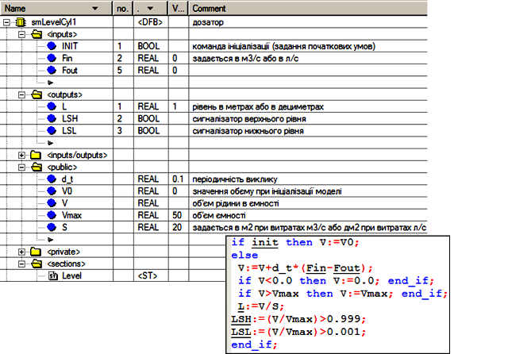
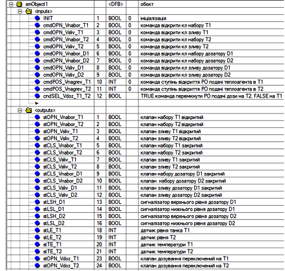
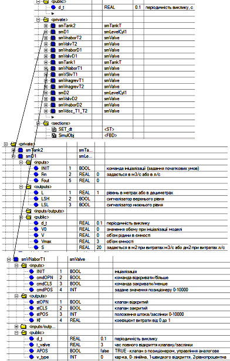
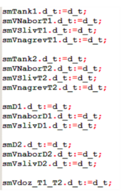
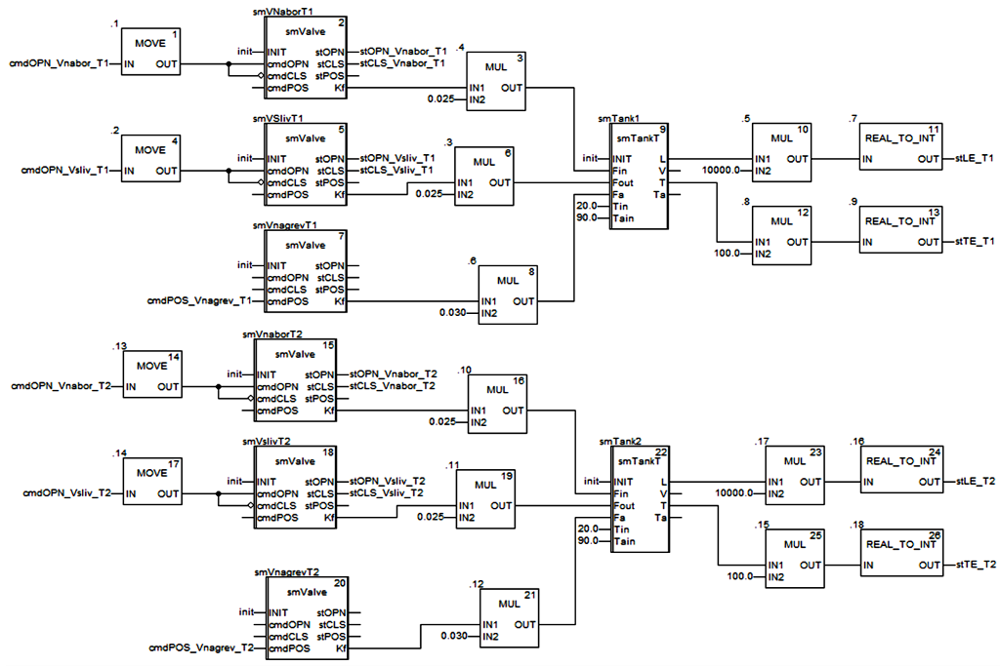
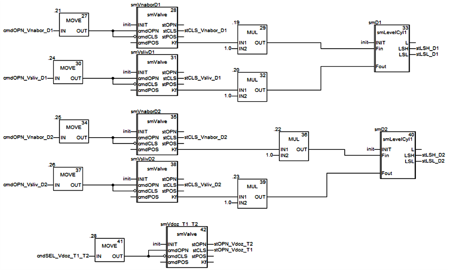
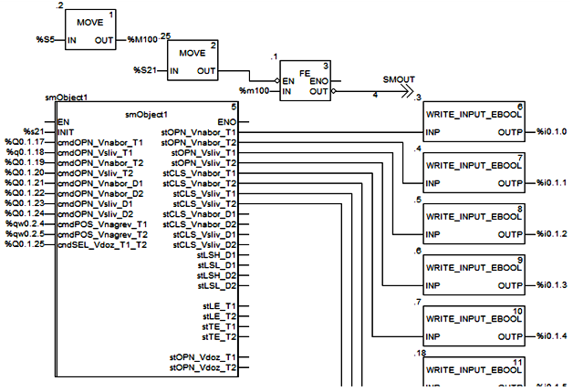

**Розробка і імітаційне моделювання інтегрованих систем керування. Лабораторний практикум. ** Автор і лектор: Олександр Пупена 

# Лабораторна робота №10. Розробка імітаційної моделі об'єкту при розробці інтегрованої системи керування.

**Тривалість**: 4 акад. години.

**Мета:** Навчитися розробляти імітаційні моделі для програмованих контролерів з метою перевірки та тестування роботи застосунків 

**Лабораторна установка**

- Апаратне забезпечення: ПК
- Програмне забезпечення: UNITY PRO V>=7.0 або Control Expert

## Порядок виконання роботи 

У цій лабораторній роботі необхідно розробити імітаційну модель установки з використанням та модифікацією існуючих бібліотечних елементів.  

**Увага!** Для виконання лабораторної роботи необхідне встановлене ПЗ [Unity PRO](https://schneider-electric.app.box.com/s/lgd27nur1rin1hs4x822g8lr6tlr2y82/folder/50504496333) або [Control Expert](https://schneider-electric.app.box.com/s/lgd27nur1rin1hs4x822g8lr6tlr2y82/folder/101662336138). За наведеними посиланнями знаходяться пробні версії з ключом активації на 60 діб. Після завершення терміну дане ПЗ більше не буде запускатися навіть після перевстановлення. Тому рекомендується встановлювати його на віртуальну машину. Мінімальна версія потрібного [UnityPro_XL_V7.0](https://schneider-electric.app.box.com/s/lgd27nur1rin1hs4x822g8lr6tlr2y82/folder/50505220340) у цій роботі використовується [Unity PRO 13.1](https://schneider-electric.app.box.com/s/lgd27nur1rin1hs4x822g8lr6tlr2y82/folder/71210166883)

## 1. Аналіз існуючої імітаційної моделі

- [ ] Відкрийте проект, збережений в попередній лабораторній роботі.
- [ ] Прочитайте опис роботи установки та особливості імітаційного моделювання для неї, що описаний нижче.   

Установка складається з наступних елементів (рис.10.1):

-  танки Т1 та Т2, в яких готовляться продукти за різними рецептами; танки обв’язані наступними засобами КВПіА:

  - запірні клапани набору та зливу, кожний з датчиками кінцевого положення "закритий" та "відкритий";

  - регулюючий клапан (0-100%) подачі теплоагента у теплообмінний кожух танку (далі по тексту клапан нагрівання);

  - датчик рівня (0-100%) в танку;

  - датчик температури в танку (0-100°С); 

- дозатори (мірні ємності) D1 та D2, які забезпечують подачу дози компоненту; дозатори обв’язані наступними засобами КВПіА:

  - сигналізатор нижнього і верхнього рівнів;

  - запірні клапани набору та зливу, кожний з датчиками кінцевого положення "закритий";

- 3-ходовий клапан перемикання трубопроводу подачі з дозаторів на танки T1 та T2; в нормальному стані положення "на Т1"; має датчики кінцевого положення "Т1" та "Т2".

Рис.10.1. Операторський екран для контролю та управління за процесом приготування продукту. 

**Припущення**

Імітаційна модель розроблена з урахуванням наступних припущень:

- ємність і кожух танків і дозаторів – це об’єкти з зосередженими параметрами;
- густини на входах і виходах кожуха і ємності танків та дозатора однакові;
- танки мають ідеальну теплову ізоляцію, тому втратами теплоти в навколишнє середовище можна знехтувати;
- теплова ємність конструкції мала, тому можна знехтувати нею;
- площина теплообміну залежить від ступені заповнення танків;
- кожух танків завжди заповнений рідиною;
- об’єм дозаторів вважається дуже малим порівняно з об’ємом танків, тому можна вважати що витрата з дозаторів не впливає на температуру та об’єм рідини в танку;
- всі ємності являються циліндричними;
- всі виконавчі механізми разом з регулюючими органами мають лінійні витратні характеристики;
- довжиною трубопроводів можна знехтувати;
- характеристики обладнання та речовин наведені в табл. 10.1.

Таблиця 10.1. Характеристики обладнання та речовин.

| танки *Т1, Т2*                                 |                 |
| ---------------------------------------------- | --------------- |
| Об’єм ємності                                  | 1 м3            |
| Об’єм кожуха                                   | 0.05 м3         |
| Поперечний переріз  ємності                    | 1 м2            |
| Повна поверхня  теплообміну кожуха             | 10 м2           |
| Коефіцієнт  теплопередачі кожуха               | 2 кВт/(м2*°С)   |
| Висота кожуха                                  | 1 м             |
| **дозатор *D1***                               |                 |
| Об’єм ємності                                  | 3 л             |
| Поперечний переріз  ємності                    | 20 дм2          |
| **дозатор *D2***                               |                 |
| Об’єм ємності                                  | 2 л             |
| Поперечний переріз  ємності                    | 20 дм2          |
| **рідина**                                     |                 |
| Діапазон витрат рідини  в *Т1,  Т2*            | 0-25 л/с        |
| температура рідини на  вході *Т1, Т2*          | 20 °С           |
| густина рідини                                 | 1000 кг*м3      |
| теплоємність рідини                            | 4.19 кДж/(кг*К) |
| **теплоагент**                                 |                 |
| Діапазон витрат теплоагента  в кожух *Т1, Т2*  | 0-30 л/с        |
| температура теплоносія  на вході *Т1*, *Т2*    | 90 °С           |
| густина теплоносія                             | 1000 кг*м3      |
| теплоємність теплоносія                        | 4.19 кДж/(кг*К) |
| **компонент дозатора**                         |                 |
| Діапазон витрат  компоента в/з дозатора        | 0-1 л/с         |
| **клапан набору *Т1***                         |                 |
| час повного відкриття  клапану/заслінки        | 3 с             |
| **клапан набору *Т2,* клапани зливу *Т1, Т2*** |                 |
| час повного відкриття  клапану/заслінки        | 4 с             |
| **клапани набору та зливу *D1,D2***            |                 |
| час повного відкриття  клапану/заслінки        | 1 c             |

Примітка. Всі наведені характеристики взяті тільки для прикладу і не мають зв’язку з реальним обладнанням.   

Імітаційна модель є програмою, яка використовує стандартні функціональні блоки моделей елементів об’єкту. У загальному задача може бути зведена до такої послідовності:

1) корекція імітаційних моделей компонентів (при необхідності); 

2) означення інтерфейсу DFB імітаційної моделі об’єкту;

3) означення внутрішніх та глобальних даних DFB імітаційної моделі об’єкту;

4) написання програмної секції DFB імітаційної моделі об’єкту;

5) написання програми та її налагодження для перевірки імітаційної моделі об’єкта. 

**Корекція імітаційних моделей компонентів.** 

У програмі створено DFB тип smLevelCyl1, структура та програма якого показана на рис.10.2. Крім зменшення кількості вхідних та вихідних потоків, модель має два додаткові виходи для сигналізаторів рівнів: LSH – верхнього, і LSL – нижнього. 

 

Рис.10.2.Блок DFB для імітації дозаторів

Всі інші імітаційні блоки описані [в лекції](../lecture/15_simul.md) і використовуються тут без змін.

Визначення інтерфейсу DFB імітаційної моделі об’єкту. Вхідними параметрами блоку є значення на виконавчі механізми (рис.10.3): для запірних регулюючих органів (РО) - типу BOOL, для регулюючих клапанів - типу INT в діапазоні 0-10000. Вихідними параметрами блоку є стан датчиків: для дискретних - типу BOOL, аналогових  - типу INT в діапазоні 0-10000.

Згідно прийнятого в курсі підходу до імітаційного моделювання, блок повинен включати вхід INIT, через який ініціалізується модель, приймаючи початкові значення.    

Рис.10.3. Інтерфейс блоку DFB для імітації установки. 

**Означення внутрішніх та глобальних даних DFB імітаційної моделі об’єкту.** 

Для кожного елементу імітаційної моделі створюється окремий екземпляр DFB, який інкапсулюється в середині екземпляру DFB загальної моделі. Таким чином, для кожного клапану, дозаторів та танків створюється свій екземпляр конкретного типу (рис.10.4). Саме тут означуються їх глобальні параметри згідно таблиці 5.1. Нагадаємо, що локальні параметри DFB в тому числі і екземпляри функціональних блоків недосяжні для доступу з боку зовнішньої програми. Однак тип DFB блоків повинен бути означений в проекті. 

Крім екземплярів функціональних блоків, DFB також включає глобальну змінну `d_t`, призначення якої не відрізняється від прийнятих в інших моделях.    

Рис.10.4. Інтерфейс DFB

Написання програмної секції DFB імітаційної моделі об’єкту. DFB включає дві програмні секції: 

- `SimulObj`, яка реалізовує безпосередньо модель (див. рис.10.6-10.7); 
- `SET_dt`, яка забезпечує переприсвоювання загального для моделі масштабу часу (періодичності виклику) всім елементам моделі тобто екземплярам блоків (див. рис.10.5). 

Рис.10.5. Секція `SET_dt` 

Програма реалізації моделі показана на рис.10.6-10.7. Хоч розрахунки в моделі проводяться в основному з типами REAL, вхідні і вихідні дані повинні бути INT, оскільки передбачається, що модель буде задіяна по 1-му або 2-му варіанту (див. лекцію). 

    

Рис.10.6. Програма DFB блоку імітаційної моделі. 

FBD секція складається з 5 ланцюгів:

- імітаційна модель роботи танку Т1 та обв’язаних клапанів;

- імітаційна модель роботи танку Т2 та обв’язаних клапанів;

- імітаційна модель роботи дозатору D1 та обв’язаних клапанів;

- імітаційна модель роботи дозатору D2 та обв’язаних клапанів;

- імітаційна модель роботи 3-х ходового клапану переключення подачі дози на Т1 та Т2; 

У центрі перших двох FBD-ланцюгів (рис.10.6) знаходяться по одному екземпляру DFB типу `smTankT`, який описаний в лекції. Ці екземпляри реалізують імітаційні моделі безпосередньо танків. Параметри `Tin` (температура вхідної рідини) та `Tain` (температура теплоагента на вході кожуха) задані згідно таблиці 5.1. При необхідності визначення їх, як змінних параметрів (збурення або управління), ці входи можна вивести в зовнішній інтерфейс блоку, або в глобальні параметри блоку. У даній задачі параметри були прийнятими константами навмисно для спрощення моделі. 

Значення входів `Fin` (вхідна витрата рідини), `Fout`(вихідна витрата рідини) та `Fa`(витрата теплоагента) розраховуються по стану відповідних клапанів. Модель усіх клапанів в програмі реалізовані з використанням екземплярів DFB-типу `smValve`, який описаний в лекції. Вихід клапану `Kf` (коефіцієнт витрати, від 0-1) попередньо перемножується на потрібний масштабний коефіцієнт відповідно до діапазону витрат, заданого в таблиці 5.1. Слід звернути увагу, що для запірних клапанів значення глобального параметру `APOS` повинно бути `FALSE`, а для регулюючих - `TRUE`. Усі запірні клапани управляються одним сигналом – на відкриття, який подається з входу інтерфейсу блоку на вхід `cmdOPN`, тому на `cmdCLS` подається його інверсна копія. Виходи `stOPN` та `stCLS` екземплярів клапанів набору та зливу, подаються на відповідні виходи інтерфейсу блоку для імітації роботи датчиків кінцевого положення штоку. 

Робота наступних двох FBD-ланцюгів працює подібним чином (рис.10.7). У центрі ланцюга використовуються блоки типу `smLevelCyl1`, який описаний вище. Конструктивні параметри задаються в дециметрах, а витратні – в літрах. Клапани набору та зливу мають тільки датчики положення "закритий". 

Рис.10.7. Програма DFB блоку імітаційної моделі (продовження). 

Імітація роботи 3-х ходового клапану заключається тільки в часових характеристиках спрацювання датчиків кінцевого положення, оскільки зроблені припущення для моделі дозволяють не враховувати вплив витрати з дозаторів на об’єм рідини в танках. 

**Програмна реалізація всієї імітаційної моделі об’єкта** 

Для імітаційної моделі всієї установки створено екземпляр DFB блоку, який викликається в програмі з прив’язкою до потрібних фактичних параметрів (рис.10.8). У якості входів використовуються вихідні змінні типу %Q та %QW. Виходи не можна безпосередньо прив’язати до %I та %IW, так як ці адреси доступні тільки для читання. Однак для запису в ці комірки можна використовуються функції `WRITE_INPUT_EBOOL` та `WRITE_INPUT_INT`. На рис.10.8 показаний тільки фрагмент програми, інші виходи використовуються аналогічно.  

Рис.10.8.Фрагмент секції для перевірки моделі. 

Ініціалізація моделі проходить по умові `%S21=TRUE`. `%S21` – це системний біт, який переводиться в TRUE на першому циклі Задачі, і скидується на наступному циклі. Таким чином для ініціалізації моделі достатньо перезапустити Задачу в ПЛК (`STOP`, `RUN`). 

Для періодичного виклику моделі використана зв’язка `%S5->%M100->FE-> JUMP`. `%S5` - системний меандр, який змінюється з періодичністю 100 мс. Комірка `%M100` використана для можливості відлову фронтів. Таким чином по задньому фронту `%M100`, тобто кожні 100 мс на один цикл на виході `FE` буде формуватися `TRUE`. Інвертований сигнал на виході `FE` буде відправляти програму на виконання по мітці `SMOUT` (знаходиться нижче блоку імітації, на рис. не показана) завжди, окрім моменту спрацювання заднього фронту. Таким чином, блок `smObject1` буде викликатися 1 раз в 100 мс а також в момент спрацювання `%S21`, тобто на 1-му циклі Задачі.    

Один із зручних способів перевірки моделі – це використання операторського екрану, як наприклад на рис.10.1. Окрім індикаторів датчиків та елементів управління виконавчими механізмами (кнопок, полів для вводу) можна вивести команди на зміну значення масштабу часу, тобто глобального параметру `d_t`, який впливає на швидкість імітації. У прикладі до кнопки "х10" прикріплена команда запису уставки `smObject1.d_t:=1.0`, що вказує на масштаб часу 1 с. Враховуючи що фактична періодичність виклику при цьому не змінюється (100 мс), модель буде працювати в 10 раз швидше ніж в реальному часі. 

## 2. Розробка імітаційної моделі власного об'єкту

- [ ] Для отриманого завдання для курсової роботи, визначте з викладачем для яких саме об'єктів варто розробити імітаційну модель
- [ ] Використовуючи бібліотечні елементи та змінюючи їх за необхідності розробіть типи та екзепляри для своїх об'єктів в середовищі Unity PRO або аналогічних
- [ ] Створіть імітаційну модель для об'єкту і перевірте її роботу       

## Питання до захисту

1. Навіщо потрібні імітатори об’єктів, як вони можуть бути реалізовані? Що таке програмний імітатор?
2. Яким чином можна включити програму імітації в структуру програми користувача? Назвіть переваги та недоліки кожного з підходів.
3. Яким чином можна зробити генератор випадкових чисел? Як на базі генератору випадкових чисел можна зробити імітацію шумів для сигналу? 
4. Розкажіть як зв’язане моделювання динаміки з рішенням диференційних рівнянь? Розкажіть про вирішення диференційних рівнянь явним методом *Ейлера*.
5. Яким чином можна імітувати рівень рідини в ємності? Які особливості треба врахувати при імітації рівня в залежності від форми ємності і яким чином можна це врахувати?

6. Які загальні підходи прийняті при побудові імітаційних моделей? Розкажіть про призначення входу ініціалізації та масштабу часу. Як можна прискорити роботі імітаційної моделі згідно цього підходу?

7. Розкажіть про загальні підходи при імітації температури. Яким чином зв’язані теплові та матеріальні баланси теплообмінників?

8. Яким чином можна реалізувати аперіодичну ланку (1-го порядку)?

9. Яким чином можна реалізувати транспортне запізнення?

10. Які особливості роботи регулюючих органів та виконавчих механізмів бажано враховувати при побудові їх імітаційної моделі? Розкажіть про варіант реалізації імітатора клапану, запропонований в лабораторній роботі.