**Розробка і імітаційне моделювання інтегрованих систем керування. Лабораторний практикум. ** Автор і лектор: Олександр Пупена 

# Лабораторна робота №1. Основи роботи з Node-RED

**Тривалість**: 4 акад. години.

**Мета:** ознайомлення з можливостями середовища Node-RED.  

**Лабораторна установка**

- Апаратне забезпечення: ПК. 
- Програмне забезпечення: Node-RED.

## Порядок виконання роботи 

Редактор Node-RED функціонує на основі браузера, а програма виглядає як об’єднані в потоки (flow) вузли (node), що вибираються з палітри. Після редагування потоки можуть бути розгорнуті в середовище виконання, яке побудоване на Node.js. Потоки, створені в Node-RED, зберігаються за допомогою JSON, які можна легко імпортувати та експортувати для спільного використання з іншими.

### 1. Інсталяція Node-RED під Windows

Node-RED функціонує на основі **Node.js** - платформа для виконання високопродуктивних мережних застосунків, написаних мовою JavaScript, на серверах. Node.js доступна для різних операційних систем, нижче показано як встановити платформу для Windows (Windows 10, Windows 8, Windows 7)

#### 1.1. Завантаження Node.JS

- [ ] Завантажте msi-файл Node.JS з сайту <https://nodejs.org/uk/>, виберіть LTS версію.

#### 1.2. Встановлення Node.JS

- [ ] Запустіть на виконання msi-файл від імені адміністратора і встановіть Node.JS. При виклику діалогових вікон все залишати за замовченням. 

#### 1.3. Визначення версії npm

Програмісти, що використовують Node.JS розробили (і розробляють) велику кількість бібліотек, які доступні усім для використання. Ці бібліотеки доступні у вигляді пакунків Node.JS. Для спрощення керування цими пакунками (добавлення, видалення, оновлення і т.п.) використовується менеджер пакунків **npm** ([Node Package Manager](https://uk.wikipedia.org/wiki/Npm)). Для середовища виконання Node.js npm є менеджером пакунків за замовчуванням, і включає в себе клієнт командного рядка (який також називається npm) та онлайн-базу даних публічних та приватних пакунків, яка називається **реєстром npm**. Доступ до реєстру доступний з клієнта, а доступні пакунки можна переглядати та шукати через веб-сайт npm. 

- [ ] Після інсталяції запустіть командний рядок (CMD), у якому введіть

```bash
node -v
```

повинно вивести версію Node.JS

- [ ] потім введіть

```bash
npm –v
```

повинно вивести версію пакетного менеджера

#### 1.4. Інсталяція Node-RED

Node-RED по суті є також комплектом взаємопов'язаних пакунків. Тому його інсталювання проводиться з використанням npm з командою install. 

- [ ] Наберіть в командному рядку 

```bash
npm install -g --unsafe-perm node-red
```

після чого почнеться процедура інсталяції

З іншими деталями встановлення можна ознайомитися [за посиланням ](https://nodered.org/docs/platforms/windows) 

#### 1.5. Запуск Node-RED.

- [ ] Після інсталяції запустіть Node-RED з командного рядка

```bash
node-red
```

Можуть бути показані повідомлення про пропозицію розблокування брандмауером, з якими треба погодитись.

#### 1.6. Відкриття редактору.

- [ ] Відкрийте браузер, перейдіть до редактору Node-Red, за посиланням <http://127.0.0.1:1880/> 

Для того, щоб Node-RED виконувався, вікно з командним рядком не можна закривати.

## 2. Знайомство з Node-RED

Створена програма на Node-RED виконується в **середовищі виконання**. Зрештою ця програма має текстовий вигляд  у форматі JSON (JavaScript Object Notation), але для розробника вона представляється в графічному вигляді.  Для редагування використовується браузер. 

Програма в редакторі Node-RED виглядає як набір закладок, які звуться **потоками** (**Flow**), що виконуються як умовно незалежні підпрограми, які мають свої незалежні змінні. Програма в потоці  являє собою набір  **вузлів** (**Node**), які виконуються тільки тоді, коли на їх вхід приходить повідомлення. У свою чергу вузли, як правило, після обробки також формують повідомлення. Для того щоб вузли обмінювалися повідомленнями їх об'єднують інформаційними **дротами** (**wires**). 

Таким чином, коли один вузол формує повідомлення, воно надходить усім іншим вузлам, які з ним пов'язані. Це приводить до їх виклику, у результаті якого вони формують повідомлення, які відправляються іншим вузлам і т.д.  

#### 2.1. Ознайомлення з редактором Node-RED.

- [ ] Відкрийте в браузері редактор Node-RED, якщо він ще не відкритий. Ознайомтеся з його основними частинами (рис.1.1.)

                              

рис.1.1. Вигляд редактору Node-RED

#### 2.2. Розміщення вузлів inject і Debug

Усі доступні типи вузлів відображаються на палітрі вузлів. Їх достатньо просто вибрати і розмістити на робочій області потоку. 

Мабуть найбільш вживані вузли в Node-RED це **inject** (**впорскування**), які ініціюють передачу повідомлень, та **debug** (**налагодження**) - який відображає зміст повідомлення на панелі налагодження. 

- [ ] Виберіть з палітри і розмістіть на робочій області наступні вузли

- `Common`->`inject` 
- `Common`->`Debug`

- [ ] З’єднайте їх між собою. Повинно вийти як на рис.1.2. Блакитні кружечки показують, що зміна в вузлах ще не відобразилася в середовищі виконання, так як змінена програма не була в ньому розгорнута.  

       

  рис.1.2. Вигляд програми

#### 2.3. Розгортання

При редагуванні потоку, зміни не одразу вступають в дію. Тобто середовище виконання виконує попередню версію програми. Щоб повідомити Node-RED, що змінений код варто прийняти і запустити в середовищі виконання, необхідно зробити його **розгортання** (**Deploy**). Розгорнути можна як повністю весь проект так і тільки змінені частини.   

- [ ] В заголовку виберіть пункт `Deploy->Modified Nodes` (див.рис.1.3), після чого  натисніть Deploy (Розгортання). 

   

  рис.1.3. Вибір варіанту розгортання

При вдалому розгортанні з’явиться відповідне повідомлення.  А в робочому просторі вузли вже будуть без блакитних кружечків.  

#### 2.4. Відображення вікна повідомлень

- [ ] Для перевірки роботи програми, на бічній панелі треба відобразити вікно **Debug messages** (налагоджувальні повідомлення ) шляхом натиснення кнопки з позначенням «жука».  

​    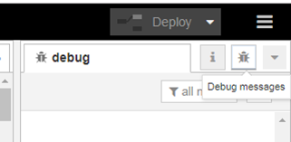

  рис.1.4. Показати вікно повідомлень

- [ ] Ліворуч вузла типу Inject з назвою «timestamp» є кнопка, яка приводить до ініціювання розрахунку ланцюжка вузлів, що починаються з нього. Натисніть на цю кнопку.

В результаті з’явиться повідомлення про успішне впорскування (Inject) а на панелі повідомлень з’явиться повідомлення (рис.1.5). 

​    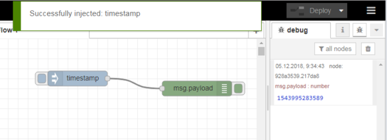

  рис.1.5. Результат виконання програми

- [ ] Натисніть по значенню повідомлення, щоб воно змінило своє представлення.  

На цьому прикладі розглянемо, як виконується програма. 

Як ми уже зазначили, у більшості випадків перерахунок вузлів починається тоді, коли на його вхід подається **повідомлення** (**message**). Повідомлення – це прості об’єкти JavaScript (умовно структурні змінні), що можуть мати будь який набір властивостей. Тобто в даній програмі після перерахунку вузла з іменем `timestamp` буде сформовано об’єкт-повідомлення (**msg**), який буде переданий по дроту вузлу з іменем `msg.payload`. 

На вхід вузла з іменем `timestamp` повідомлення не надходять, бо він є ініціатором розрахунку. Всі вузли палітри що входять в групу **Input** є ініціаторами розрахунку. Ініціація вузлів типу **Inject** відбувається шляхом ручного запуску по кнопці, або через певні інтервали часу, що вказується у налаштуваннях вузлу. Ініціювання повідомлення -- це формування полів **msg** та відправка його іншим вузлам по дротам. 

Повідомлення, надіслане вузлом Inject, має властивості **payload** (корисне навантаження) та **topic** (тема). Ці два поля притаманні більшості змінних повідомлення `msg`. Кожен вузол в полі корисного навантаження вказує певне значення, яке у свою чергу може також бути об'єктом (структурою). Поле теми вказує на назву повідомлення. Така структура повідомлення притаманна протоколу MQTT, що робить Node-RED дуже зручним для використання в застосунках Інтернету речей. Вузли як правило модифікують вхідні повідомлення і відправляють їх на свої виходи. Тому можна сказати, що повідомлення ініціюється вхідними вузлами, і модифікуються у процесі проходження через вузли поки не надійдуть до вихідного вузла.  

За замовченням Inject записує у властивість topic відмітку часу (timestamp – кількість мілісекунд з 1980 року). 

Вузол типу Debug `msg.payload` використовується для відображення повідомлень на бічній панелі Debug. Таким чином, після отримання повідомлення, цей вузол надсилає його зміст на бічній панелі.

#### 2.5. Налаштування Inject на періодичне оновлення

- [ ] Змініть налаштування властивостей вузлів, як показано на рис.6: змініть імена вузлів, вкажіть тему (topic) та періодичність оновлення для вузла типу Inject. Вікно налаштування з’являється по подвійному кліку по вузлу.   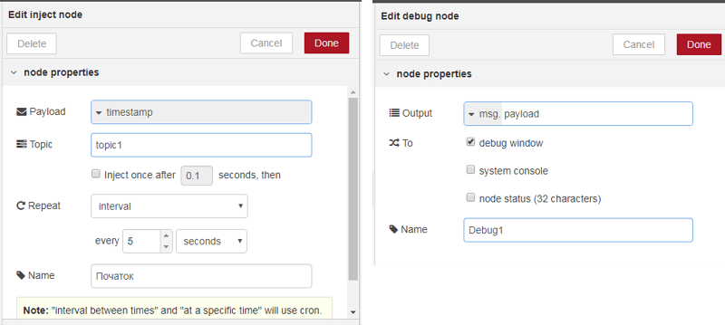  

рис.1.6. Налаштування вузлів

- [ ] Зробіть розгортання, та проаналізуйте зміст виведених у вікні Debug повідомлень.

#### 2.6. Налаштування Inject на текстове повідомлення

- [ ] Змініть вузол «Початок» так, щоб він формував корисне навантаження текстом «Це текстове повідомлення»(рис.1.7), та проаналізуйте як воно виводиться на вікно Debug.  

   

рис.1.7. Формування текстового повідомлення

#### 2.7. Використання вузлів типу change та delay

- [ ] Змініть вузол «Початок» так, щоб він знову формував корисне навантаження відміткою часу (Timestamp). Розгорніть (deploy) програму та проконтролюйте щоб відмітка часу кожні 5 секунд відображалася у вікні повідомлень 

- [ ] Ознайомтеся з роботою вузлів типу **change** та **delay** в інструкції користувача. 

- [ ] Змініть програму, як показано на рис.8, використовуючи вузли delay (“delay 1s”…”delay 4s”) та change (“set1”…”set5”). Для вузлів delay виставте затримки:

- delay 1s – 1 seconds
- delay 2s – 2 seconds
- delay 3s – 3 seconds
- delay 4s – 4 seconds

- [ ] Для вузлів change виставте правило рівним «set», та змініть властивості «to» на наступні текстові поля:

- set1 – один
- set2 – два
- set3 – три
- set4 – чотири
- set5 – п’ять   

   

рис.1.8. Використання вузлів типу change та delay 

- [ ] Розгорніть (deploy) програму та проконтролюйте щоб кожної секунди у вікні повідомлень виводилося конкретне повідомлення від «один» до «п’ять». 

#### 2.8. Ознайомлення з роботою вузлів типу function

- [ ] Ознайомтеся з роботою вузлів типу function з інструкції користувача

Вузол function може обробляти повідомлення з використанням javascript. Змініть програму так, щоб відмітка часу виводилася в форматі дати та часу. Для цього використовується об’єкт типу Data та його метод  toLocaleString(). Зробіть розгортання та переведіть вузол “Debug1” в режим приховання повідомлень. 

   

рис.1.9. Змінена програма з вузлом function

Про синтаксис **javascript** можна дізнатися [тут](http://яваскрипт.укр) (укр. мова) або [тут](https://learn.javascript.ru/) (рос.мова)

Про об’єкт **Date** можна прочитати [тут](http://яваскрипт.укр/Date)  або [тут](https://learn.javascript.ru/datetime) 

## 3. Підключення та ознайомлення з модулем node-red-dashboard

Node-RED дозволяє інсталювати та обновляти палітру вузлів. Це можна робити через менеджер пакунків Node-RED або через Manage Palette (рис.1.10). 

У даному пункті необхідно ознайомитися з можливостями пакунку  `node-red-dashboard` , який дає можливість легко розробляти графічний інтерфейс користувача (GUI) на базі HTML простим розміщенням та налаштування вузлів Node-RED. Тому спочатку його треба інсталювати.

  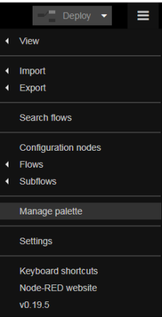 

рис.1.10. Вибір Manage palette

#### 3.1. Інсталяція node-red-dashboard

- [ ] В налаштуваннях палітри на вкладці Install в поле фільтру введіть `node-red-dashboard` і інсталюйте даний пакет (рис.1.11):

- натисніть кнопку install
- підтвердіть інсталяцію у вікні повідомлення 
- після інсталяції закрийте вікно керування палітрою

   

рис.1.11. Вибір Manage palette

- [ ] Перевірте чи з’явилася в палітрі розділ «Dashboard» 

#### 3.2. Добавлення закладок 

- [ ] Після встановлення у бічній панелі з’явилася нова іконка з зображенням діаграми (рис.12) , яка перемикає на панель конфігурування графічного інтерфейсу користувача. Натисніть по ній. 

   

рис.1.12. 

- [ ] У вкладці Layout добавте дві закладки (tab) та змініть їх назви як це показано на рис.13.  Це будуть закладки у вікні браузеру.  

**Ім’я першої закладки повинно називатися Вашим прізвищем та ім’ям, наприклад «Іваненко Іван».**     

  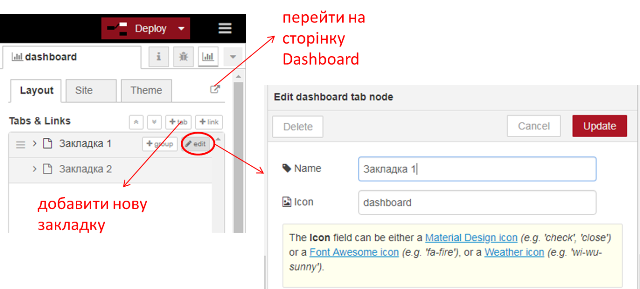 

рис.1.13. 

#### 3.3. Створення вузлу Dashboard text для виведення дати та часу

- [ ] Модифікуйте програму, створивши вузол типу dashboard-> text і підєднавши його до вузла «ДатаЧас» (див. рис.1.14). Налаштуйте вузол відповідно до рис.1.14 **однак ім’я першої групи повинно називатися Вашим прізвищем «Іваненко». Створіть ще одну групу, яка повинна називатися Вашим ім’ям «наприклад Іван».**      

- [ ] Після усіх налаштувань зробіть розгортання, відкрийте створений Dashboard, шляхом натискання кнопки переходу  (див.рис.1.13.), або ввівши в новій вкладці браузера http://127.0.0.1:1880/ui 


рис.1.14. 

На вкладці повинно з’явитися щось типу такого, як показано на рис.15

  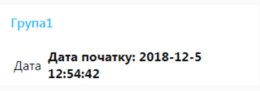  

рис.1.15

#### 3.4. Створення вузлу Dashboard text для виведення числа прописом

- [ ] Аналогічним чином зробіть для відображення числа прописом.

    

рис.1.16

#### 3.5. Використання вузлів Slider, Gauge, Audio out 

- [ ] Добавте до програми фрагмент, як показано на рис.1.17.

   

рис.1.17

Налаштування вузлів показані на рис.1.18-1.21

  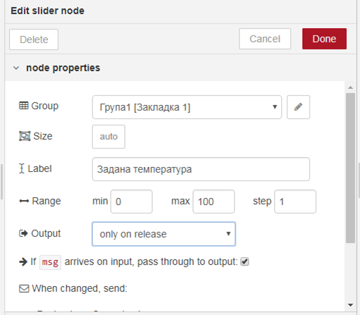 

рис.1.18

   

рис.1.19

   

рис.1.20

  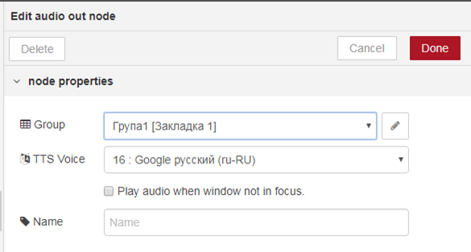 

рис.1.21

- [ ] Зробіть розгортання і подивіться результат на вікні Dashboard.  

#### 3.6. Робота з вузлом switch

- [ ] Ознайомтеся з принципами роботи вузла **switch**. Модифікуйте програму відповідно до наведеної на рис.1.22. Вузли налаштуйте відповідно до рис.1.23-1.26. 

   

рис.1.22. Фрагмент модифікованої програми

    

рис.1.23. Налаштування вузла switch 

   

рис.1.24. Налаштування вузла norma

   

рис.1.25. Налаштування вузла Alarm

  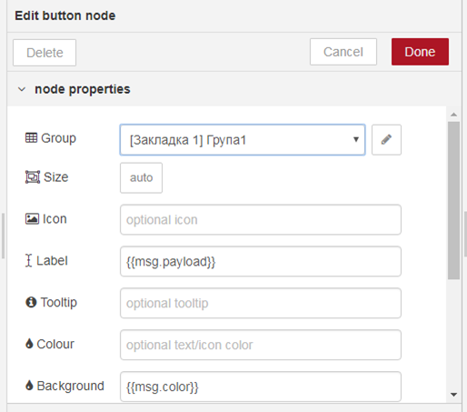  

рис.1.26. Налаштування вузла Button

- [ ] Зробіть розгортання проекту, перевірте як працює програма. Для цього на сторінці веб-інтерфейсу змініть значення заданої температури в діапазоні 0-50, а потім >50.

Ця частина програми працює наступним чином. При зміні значення температури, в msg.payload значення поступає на обробку в вузол switch, де на один із 2-х виходів формується повідомлення в залежності від тієї умови, яка спрацювала. 

При виконанні умови 0<msg.payload<50 (is between), повідомлення передається на перший вихід, до якого в свою чергу приєднаний вузол “Norma” (тип function->change). Той задає текстове значення для властивості msg.payload рівним «НОРМА» і формує нову властивість msg.color рівною “GREEN”. Далі msg поступає вузол «button», який використовується для відображення тексту в прямокутнику. Значення тексту задається полі Label, а колір в полі Background. При формуванні динамічних значень для вузлів, використовується формат angular фільтрів, в якому вказується підстановка в подвійних фігурних дужках.

Аналогічна обробка проводиться при спрацюванні у вузлі switch умови msg.payload>50. Повідомлення згенерується на другому виході, який активує перерахунок вузла “Alarm” що буде формувати текст та колір для кнопки.         

Детальніше про використання фільтрів ангуляр дивіться [за цим посиланням](https://metanit.com/web/angular/2.4.php   ) або [за цим](http://javastudy.ru/angularjs/angularjs-filters/)

## 4. Робота з JS об’єктами та обробка системної інформації

#### 4.1. Встановлення модуля node-red-contrib-os

- [ ] Встановіть в Node-RED модуль `node-red-contrib-os`

  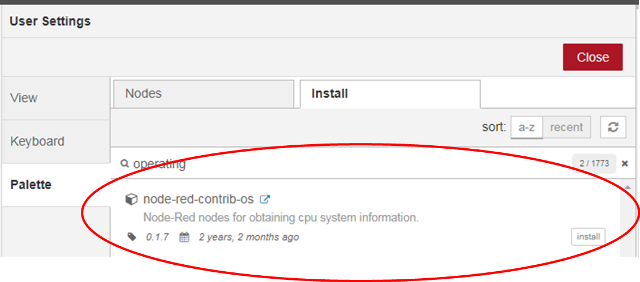 

рис.1.27 Встановлення модуля node-red-contrib-os.

#### 4.2. Використання вузлу Networkintf 

- [ ] З нововстановленого модуля використайте вузол типу Networkintf для створення фрагменту програми, як на рис.1.28. 

    

рис.1.28 Фрагмент програми для виведення інформації по наявним мережним картам 

- [ ] Зробіть розгортання програми, ініціюйте формування повідомлення, проаналізуйте вивід. Приклад виведеної інформації показаний на рис.1.29. Як видно, інформація надається у вигляді JS об’єкту, який включає в себе об’єкт NetworkInterfaces, що в свою чергу вміщує кілька мережних інтерфейсів, що є масивами об’єктів, що представляють певний протокол..  

  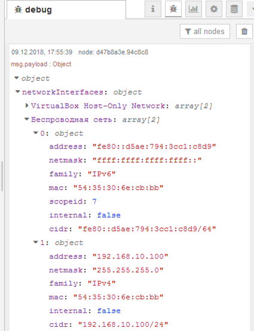  

 рис.1.29 Виведення інформації про мережу.

Про об’єкти в JavaScript можна почитати [тут](http://яваскрипт.укр/object)  або [тут](http://learn.javascript.ru/object).  Для перебору усіх властивостей об’єкту можна скористатися конструкцією [for..in](http://learn.javascript.ru/object-for-in ) 

#### 4.3. Виведення інформації про мережні карти

- [ ] Створіть програму, що буде виводити перелік MAC адрес для мережних карт, що встановлені на Вашому ПК (рис.1.30, 1.31). 

  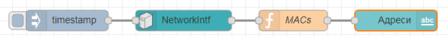

рис.1.30 Виведення інформації про мережні карти.

  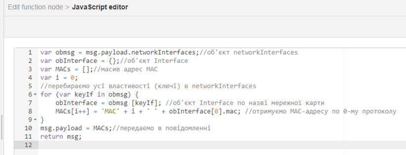 

рис.1.31 Програма для вузла MACs.

Про JSON читайте [тут](http://яваскрипт.укр/json )

У JavaScript та IoT часто використовуються дані типу JSON. Детально про JSON та їх обробку Ви можете почитати тут https://flows.nodered.org/node/node-red-contrib-os

## 5. Звіти та експорт потоку

#### 5.1. Копії екранів 

- [ ] **Зробіть копії екранів програми та візуалізації для звіту до Вашої роботи.**   

#### 5.2. Експорт потоку

- [ ] Відкрийте потік (Flow) створений в лабораторній роботі. Виділіть всі вузли шляхом комбінації Ctrl+A. Усі вузли повинні виділитися червоним контуром. Через меню бокової панелі зробіть експорт виділеного в буфер обміну (рис.1.32).

   

рис.1.32. Експорт потоку Node-RED в буфер обміну.

- [ ] Створіть текстовий файл з назвою `Lab1.json` і скопіюйте з буферу обміну текст експорту. У нових версіях також доступна кнопка запису експортного варіанту в файл. Збережіть файл, він вам знадобиться для звіту та для захисту лабораторних робіт у майбутньому.

## 6. Робота з Modbus

Node-RED, як правило використовується або на стороні Edge або в якості хмарного додатку. Якщо Node-RED використовується на стороні Edge в якості програми для концентратора або шлюзу чи маршрутизатору, наприклад на апаратній платформі Raspberry PI, він може збирати дані з різних пристроїв по протоколам промислових мереж. Найбільш поширеним і простим протоколом на сьогоднішній день є Modbus, тому в спільноті Node-RED розробили кілька бібліотек з ним. Таким чином, як варіант Raspberry PI буде взаємодіяти з пристроями по протоколу Modbus TCP/IP, а з іншого боку він буде взаємодіяти з хмарними додатками та сервісами(рис.1.33) 

 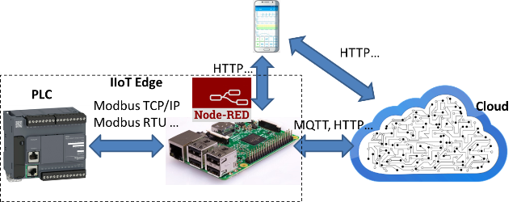                         

рис.1.33. Приклад структури рішення IIoT з використанням Raspberry PI та Node-RED.

Для тестування такого рішення можна на перших порах обійтися тільки програмними складовими. Замість ПЛК можна використати імітатор ПЛК, що підтримує Modbus TCP/IP, а замість Raspberry PI – віртуальну машину з ОС Raspbian з усім встановленим ПО, як в реальному залізі. Ще простіше – використовувати тільки Node-RED, який буде з’єднуватися з імітатором ПЛК або імітатором Modbus TCP/IP Server (рис.1.34). У даній лабораторній роботі в якості імітатора PLC використовуєься пакет Mod_RSsim, який треба попередньо встановити. А в якості бібліотеки Modbus для Node-RED - `node-red-contrib-modbustcp`. 

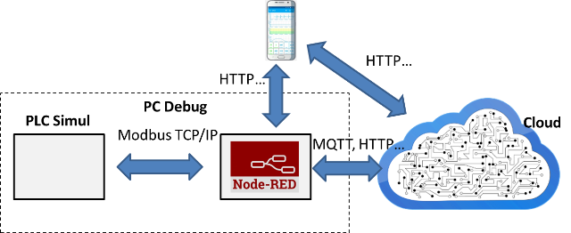 

рис.1.34. Приклад структури рішення IIoT з використанням Raspberry PI та Node-RED.

#### 6.1. Встановлення пакету Modbus 

- [ ] Використовуючи Manage Palette (рис.1.35) встановіть пакет Modbus (node-red-contrib-modbustcp) 

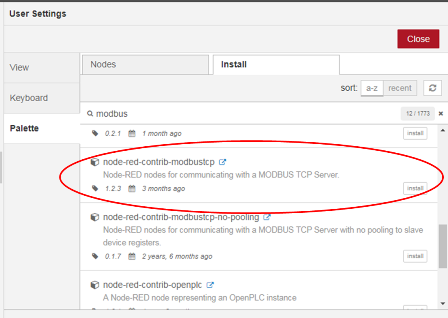 

рис.1.35. Встановлення пакету node-red-contrib-modbustcp.

#### 6.2. Завантаження Modbus PLC Simulator (Mod_RSsim) 

- [ ] завантажте та встановіть Mod_RSsim з [дистрибутиву](https://sourceforge.net/projects/modrssim2/files/latest/download)

#### 6.3. Запуск на виконання Modbus PLC Simulator 

- [ ] Запустіть на виконання Modbus PLC Simulator C:\Program Files (x86)\EmbeddedIntelligence\Mod_RSsim

- [ ] Виставте значення в Prot: Modbus TCP

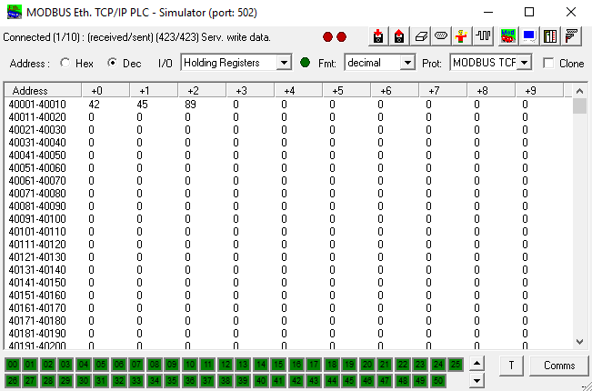 

рис.1.36. Налаштування Mod_RSsim.

#### 6.4.  Ознайомлення з бібліотекою Node-RED

- [ ] Ознайомтеся з [правилами](https://pupenasan.github.io/NodeREDGuidUKR/modbus/) роботи з бібліотекою 

#### 6.5. Вставка та перевірка елементу modbustcp-read

- [ ] З розділу палітри Inputs вставте елемент modbustcp-read, зайдіть в налаштування. Праворуч поля Server натисніть кнопку з олівцем для створення нового серверу (рис.1.37). 

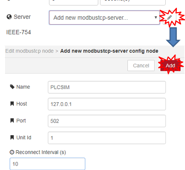

рис.1.37 Створення серверу Modbus TCP/IP.

- [ ] Після створення серверу налаштуйте зчитування десяти Holding регістрів починаючи з 0-го, як це показано на рис.1.38

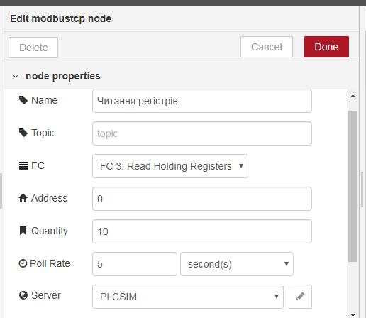  

рис.1.38 Налаштування зчитування по Modbus TCP/IP.

- [ ] Зробіть фрагмент програми, показаний на рис.1.39. 
- [ ] Зробіть розгортання проекту, деактивуйте усі виводи debug окрім останнього. 

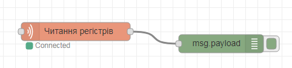  

рис.1.39 Фрагмент програми зчитування.

- [ ] Змініть значення перших десяти регістрів у програмі Mod_RSsim. Активуйте вікно виводу Debug, там повинні виводитися значення регістрів у вигляді масиву. 

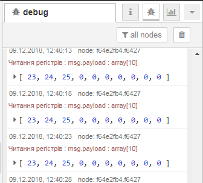  

рис.1.40 Значення зчитуваних регістрів у вигляді масиву.

- [ ] Зверніть увагу, що тепер msg.payload є масивом з десяти елементів (Array[10]), тому для роботи з цими значеннями, наприклад виводу на відображення на ВЕБ-сторінці необхідно їх попередньо обробити. 

#### 6.6. Модифікація програми

- [ ] Модифікуйте програму відповідно до рис.1.41 – 1.45. 
- [ ] Зробіть розгортання та перевірте чи вірно відображаються значення. 

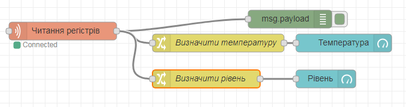 

рис.1.41 Модифікована програма .

 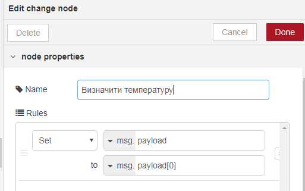

рис.1.42 Налаштування вузла «визначити температуру».

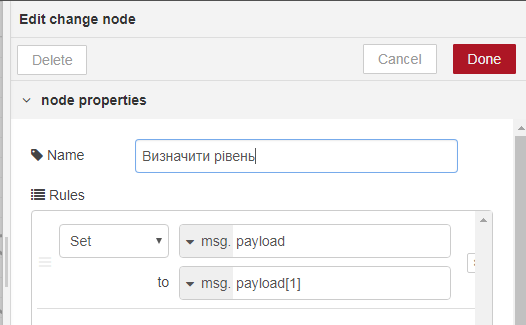  

рис.1.43 Налаштування вузла «визначити рівень».

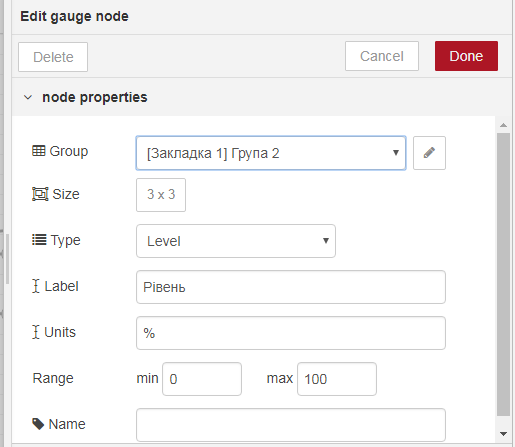 

рис.1.44 Налаштування вузла «температура».


рис.1.45 Налаштування вузла «рівень».

#### 6.7. Використання modbustcp-write

- [ ] Для запису по Modbus використайте вузол modbustcp-write з розділу палітри outputs. Модифікуйте програму відповідно до рис.1.46. 
- [ ] Зробіть розгортання проекту і перевірте чи змінюється значення Holding регістру в Mod_RSsim при зміні його через елемент «Задана температура»  

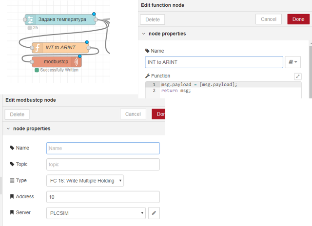 

рис.1.46 Фрагмент програми та налаштування запису по Modbus.

#### 6.8. Використання імітаторів ПЛК в якості джерела даних

Спробуйте в якості імітатора ПЛК використати:

- імітатор Unity PRO з демо-проектом, наприклад з [лабораторних робіт по ЛМІ]( https://drive.google.com/open?id=0B2FfwwwweBSVRWw4eDVreE1Lb1k)
- імітатор Unity PRO або М221 з [проектом керування роботизованою установкою]( https://sites.google.com/site/iasunuft/virtualnij-trenazer-projectprogrammer )

## Питання до захисту

1. Розкажіть що таке Node-RED?
2. На якому рушію працює Node-RED?
3. Розкажіть коротко про основні вузли, які використовувалися в даній лабораторній роботі.
4. Розкажіть про призначення вузла "function".
5. Розкажіть про призначення вузлів "dashboard".
6. Розкажіть про структуру об'єкта MSG.
7. Розкажіть про призначення вузла switch.
10. Розкажіть про роботу вузлів "node-red-contrib-os".
11. Яким чином робиться експорт і імпорт фрагментів програми Node-RED?

 