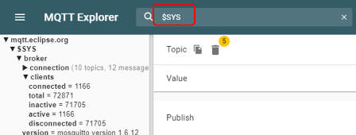
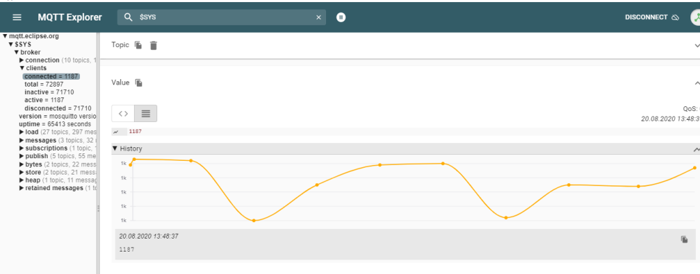
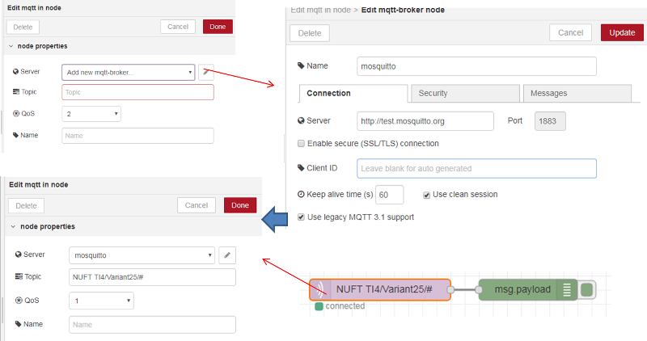
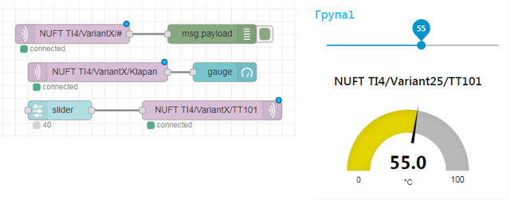
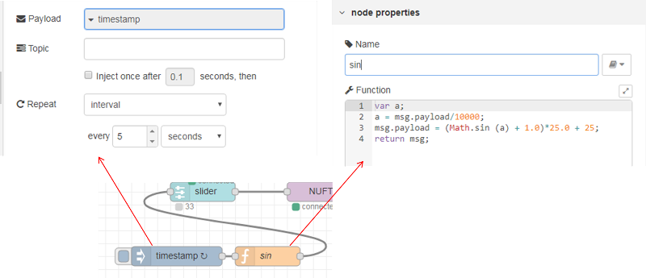

**Розробка і імітаційне моделювання інтегрованих систем керування. Лабораторний практикум. ** Автор і лектор: Олександр Пупена 

# Лабораторна робота №3. Протоколи IoT: MQTT та HTTP API

**Тривалість**: 4 акад. години.

**Мета:** навчитися використовувати протоколи MQTT та HTTP для побудови застосунків IoT   

**Лабораторна установка**

- Апаратне забезпечення: ПК. 
- Програмне забезпечення: Node-RED, утиліти роботи з MQTT та HTTP API

## Порядок виконання роботи 

### 1. Використання тестових клієнтів та брокерів для зв’язку по MQTT

Одна із областей застосування MQTT – це обмін між пристроями та програмами, що підключені до Інтернет.  У даному лабораторному занятті використовується загальнодоступні брокери,  наприклад `test.mosquitto.org` або `mqtt.eclipse.org`. Слід звернути увагу, що їх використання є безкоштовним, але вони не гарантують безперебійну роботу сервісу, тому їх не слід використовувати для реальних рішень, що потребують надійних з’єднань та цілодобового використання. За необхідності використання надійних сервісів, слід користуватися іншими брокерами власними, або хмарними.

Також в роботі використовуються тестові клієнти:

- <http://www.hivemq.com/demos/websocket-client>
- <http://mqtt-explorer.com/>

#### 1.1.Завантаження, встановлення та запуск MQTT Explorer

- [ ] Завантажте та встановіть [MQTT Explorer](http://mqtt-explorer.com/)
- [ ] Запустіть на виконання MQTT Explorer
- [ ] Виберіть наперед-сконфігуроване з'єднання `mqtt.eclipse.org`, подивіться на налаштування і натисніть `Connect`.
- [ ] Якщо з'єднання не працює, перевірте аналогічно наперед-сконфігуроване з'єднання `test.mosquitto.org` 


рис.3.1. Налаштування MQTT Explorer

Після з'єднання Ви побачите усі теми, які публікуються на брокері.   

- [ ] Введіть фільтр `$SYS` для відображення тільки системних повідомлень 



рис.3.2. Фільтрування системних повідомлень на брокері

- [ ] Зробіть огляд гілок та значень в `$SYS`
- [ ] Знайдіть і виберіть тему `clients/connected`, який показує кількість підключених клієнтів. У деталізації `History` Ви побачите перелік усіх повідомлень, які були отримані з початку сеансу а також їх значення у вигляді графіку.   



рис.3.3. Деталізація переліку повідомлень 

- [ ] Натисніть `Disconnect`. Зайдіть в налаштування `Advanced`. Подивіться налаштування: у списку тем вказано фільтр підписки на усі теми. На кожну тему підписка вказана з `QoS=0`
- [ ] Перевірте підключення до `test.mosquitto.org` 

#### 1.2. Робота з HiveMQ Вебсокет-клієнтом

- [ ] У браузері зайдіть на <http://www.hivemq.com/demos/websocket-client>
- [ ] На сторінці Вебсокет-клієнта в полі Host введіть:
  - **mqtt.eclipse.org** 
  - в полі Port **80** (over WebSocket), 
- [ ] Якщо **mqtt.eclipse.org**  не працює, на сторінці Вебсокет-клієнта в полі Host введіть:
  - [ ] **test.mosquitto.org**
  - [ ] в полі Port **8080** (over WebSocket), 
- [ ] після чого натисніть кнопку Connect. Повинен з’явитися напис Connected.
- [ ] Натисніть `Add New Topic Subscription` і в полі `Topic` задайте  

```
$SYS/broker/clients/connected
```

- [ ] Тепер у полі Messages виводимуться повідомлення з даної теми

У випадку відсутності зв’язку з брокером зробіть перевірку на `test.mosquitto.org`. 

#### 1.3. Публікація і підписка для власного повідомлення 

- [ ] На онлайновому клієнті HiveMQ створіть нову тему для публікації:

```
myname/device1/val
```

де `myname` - це якесь придумане ім'я, яке має бути унікальне в адресному просторі брокера

- [ ] задайте QoS=1, виставіть опцію Retain
- [ ] в поле `Message`пишіть якесь числове значення 
- [ ] зробіть публікацію
- [ ] відкрийте MQTT Explorer, в Advanced налаштуйте фільтр на ваші публікації, які задаються полем `myname` 
- [ ] знайдіть це повідомлення і передивіться його значення
- [ ] в HiveMQ ще кілька раз введіть різні значення і зробіть публікацію

#### 1.4. Відкриття сторінки з варіантом на тестовому сервері

- [ ] Перейдіть на <http://edu.asu.in.ua:1880/ui/#/0> (надалі, **тестовий сервер**) виберіть вкладку і групу елементів **з вашим варіантом**.

- повзунок для керування клапаном
- тренди температури, позиції клапану, та секундної пилоподібної кривої (0-100)  
- круговий індикатор температури 

 

рис.3.4. Вигляд сторінки з варіантом на тестовому сервері

#### 1.5.  Перевірка підключення до тестового варіанту

- [ ] У MQTT Explorer відключіться від брокера
- [ ] Виберіть брокер `test.mosquitto.org`
- [ ] Зайдіть в налаштування `Advanced`, де:
  - [ ] видаліть усі теми
  - [ ] добавте нову тему для підписування `NUFT TI4/#`
  - [ ] вкажіть QoS=0
  - [ ] натисніть ADD
  - [ ] натисніть `Back` 
- [ ] Натисніть `Connect` для підключення до брокера
- [ ] На тестовому сервері (<http://edu.asu.in.ua:1880/ui/#/0>) змініть якісь значення повзунків
- [ ] У MQTT Explorer  мають з'явитися відповідні записи 

#### 1.6.  Зміна даних на тестовому сервері через MQTT 

- [ ] У MQTT Explorer на панелі Publish в полі Topic впишіть “NUFT TI4/Variant**X**/TT101”, де **X** – номер вашого варіанту. 
- [ ] QoS задайте рівним 0, 
- [ ] Виберіть тип повідомлення `RAW`
- [ ] У полі Message введіть значення від 10.5, натисніть `Publish`. 
- [ ] Перейдіть на тестовий сервер, подивіться як змінюється значення на круговому індикаторі. 
- [ ] Зробіть поступове введення 30, 75, 50, з періодичністю 5 секунд, після кожного натискайте Publish. Подивіться як змінюється значення на тренді. 

### 2. Зв’язок Node-RED з іншими пристроями по MQTT

#### 2.1. Налаштування отримання даних по MQTT

- [ ] Відкрийте Node-RED. 
- [ ] Створіть нову вкладку з іменем `MQTT` та деактивуйте існуючі. 
- [ ] З розділу палітри `Network` вставте вузол `MQTT In`. В налаштуваннях Server добавте новий брокер MQTT з назвою `mosquitto` і адресою серверу http://test.mosquitto.org   

 

рис.3.5. Налаштування брокеру в MQTT

- [ ] У полі Topic вузла `MQTT in` введіть `NUFT TI4/VariantX/#` де **X** – номер вибраного варіанту. Це значить, що цей вузол підписується на всі теми з даної гілки. 
- [ ] Використайте вузол Debug для виведенню повідомлень. Зробіть розгортання, дочекайтеся коли вузол «MQTT in» покаже статус «Connected».   

У випадку відсутності зв’язку з брокером зробіть спробу пізніше.

#### 2.2. Тестування отримання даних по MQTT

- [ ] Активуйте на боковій панелі режим відображення повідомлень відлагодження. Змініть значення на тестовому сервері для клапану зі свого варіанту. 
- [ ] Використовуючи MQTT Explorer задайте значення температури. Зробіть аналіз виведених повідомлень на бічній панелі. 

#### 2.3. Тестування відправки даних по MQTT

- [ ] Використовуючи вузли «Slider» з Dashboard та «MQTT out» самостійно реалізуйте зв'язок локального графічного інтерфейсу з віртуальним приладом на тестовому сервері, що показує TT101 для вашого варіанту. 
- [ ] Використовуючи вузли «gauge» і «MQTT in» самостійно реалізуйте зв'язок локального графічного інтерфейсу з повзунком завдання ступені відкриття клапану на тестовому сервері для вашого варіанту. 

Програма та зовнішній інтерфейс матиме вигляд приблизно як на рис. 3.6. Для відображення підписів використовуйте теми а для формату відображення чисел ангулярні фільтри. 

 

рис.3.6. Фрагмент програми в Node-RED для роботи з MQTT

#### 2.4. Генерування синусоїди

- [ ] Модифікуйте програму так, як це показано на рисунку нижче. Перейдіть на тестовий сервер, подивіться результат. 

  

рис.3.7. Фрагмент програми для генерування синусоїди

- [ ] Зробіть копії екранів з графіками синусоїди

#### 2.5. Реалізація "коротко-замкнутого" з'єднання видавця і абонента в Node-RED 

Для тестування можливостей MQTT в Node-RED рекомендується зав'язати видавця з абонентом у тому самому потоці але з різними підключеннями.    

- [ ] У Node-RED створіть новий потік (вкладку).
- [ ] Реалізуйте там наступний фрагмент програми, при умові що:
  - [ ] в налаштуваннях сервера вибираєте існуюче підключення і змінюєте його налаштування `Messages`
  - [ ] слово `pupenasan` змінюєте на власну унікальну назву типу `myname` , який був вибраний Вам в п.1.3
  - [ ] Для `MQTT-in` та `MQTT-out` пропишіть різні підключення `Client1` та `Client2`
  - [ ] Обов'язково вкажіть унікальні ідентифікатори для клієнтів
  - [ ] Періодичність оновлення верхнього потоку (властивість `Inject`) задайте рівним 10 секунд


рис.3.8. Реалізація "коротко-замкнутого" з'єднання видавця і абонента в Node-RED

- [ ] Програма функції має наступний вигляд:

```js
let rad = context.get ("rad") || 0;
rad = (rad>6.28) ? 0 : rad + 0.1;
msg.payload = (Math.sin (rad)+1)/2*100; 
context.set ("rad", rad);
return msg;
```

- [ ] запустіть потік на виконання, перевірте що повідомлення відображаються на бічній панелі
- [ ] У MQTT Explorer у налаштуваннях підключення Advanced, підпишіться на гілку `myname/#` з QoS1
- [ ] перевірте що тема `myname/device1/random` оновлюється
- [ ] перевірте що статус `myname/client1/status` рівний `online`

#### 2.6. Перевірка роботи LWT-повідомлення

У налаштуваннях підключення вказане повідомлення останньої волі LWT. Воно відправиться тільки при некоректному обриву з'єднання. Для імітації такого обриву можна тимчасово відключити мережу, після чого завершити роботу Node-RED, щоб при появі мережі він не обновив статус. Саме після підключення мережі при вимкнутому Node-RED за допомогою MQTT Explorer можна буде визначити, повідомлення останньої волі, яке має бути рівним `offline (break)`. Слід зауважити, що після останнього відправленого вузлом `MQTT-out` повідомлення повинно пройти щонайменше 1,5 часу `Keep alive time`, який дорівнює 60 секунд.

- [ ] вимкніть підключення до компютерної мережі, щоб Node-RED не міг відправляти дані
- [ ] зупиніть виконання Node-RED (наприклад через комбінацію `CTRL+C` в консолі, з якої він запускався)
- [ ] включіть мережу
- [ ] за допомогою MQTT Explorer подивіться статус  `myname/client1/status`, десь через хвилину-півтори він повинен стати в значення `offline (break)`  
- [ ] запустіть Node-RED дочекайтеся, коли він запуститься
- [ ] `myname/client1/status` повинен знову стати `online`

#### 2.7. Перевірка роботи черги повідомлень для QoS=1

При знятій опції `Use Clean Session` , що значить `Persisten connection`, а також QoS>=1 і постійному ID-клієнта, повідомлення що не були отримані абонентом під час його відключення, зберігаються в буфері брокера. Після повторного підключення він повертає їх клієнтові.

- [ ] Зайдіть в налаштування конфігураційних вузлів, знайдіть вузол `MQTT-broker` що відповідає з 2-ге підключення (до якого підключений `MQTT-in`) і деактивуйте вузол (відключіть `Enable`)
- [ ] Зробіть розгортання проекту, очистіть усі повідомлення на бічній панелі
- [ ] Дочекайтеся десь хвилини, активуйте знову конфігураційний вузол, і зробіть розгортання. 
- [ ] Повинно пройти кілька повідомлень одразу. Проаналізуйте їх зміст. Спробуйте пояснити чому саме такі повідомлення прийшли.  

### 3. Зв’язок MQTT-клієнта з мобільного телефону 

**Даний пункт виконується за бажанням.**

Для виконання даної частини практичного завдання необхідно мати пристрій з Андроїдом або iOS. Даний пристрій буде використовуватися як мобільний клієнт MQTT. 

#### 3.1. Встановлення MQTT Client для мобільного телефону

- [ ] Встановіть безкоштовний додаток MQTT Client 
  - [ ] Приклад для Андроїд  “IoT MQTT Panel” [завантажити тут ](https://play.google.com/store/apps/details?id=snr.lab.iotmqttpanel.prod&hl=en_US)
  - [ ] Приклад для iOS «MQTTool» [завантажити тут](https://itunes.apple.com/us/app/mqttool/id1085976398?mt=8)

#### 3.2. Добавлення з'єднання з MQTT брокером

- [ ] Запустіть на виконання. 
- [ ] Добавте з’єднання з MQTT брокером (MQTT Host). 

Наприклад, для застосунку “IoT MQTT Panel” це робиться в розділі Connection, де означуються ті самі налаштування, що і в попередніх пунктах. Додатково також треба добавити Device.

#### 3.3. Добавлення та тестування інтерфейсу користувача

- [ ] Створіть інтерфейс користувача шляхом добавлення графічних елементів та означте для них теми (Topic) відповідно до вибраного варіанту. 
- [ ] Перевірте роботу, змінюючи значення клапану на тестовому сервері. 

### 4. Використання відкритого HTTP API 

Багато застосунків в Інтернеті мають відкритий API інтерфейс для доступу до різних ресурсів як сервісів чи даних. Більшість з них є платними і надаються за підпискою. Деякі з них мають можливість обмеженого користування на певний період чи на певну продуктивність. 

Node-RED  може представляти як бік клієнта так і сервера HTTP. У більшості випадків на рівні Edge він представляє бік клієнта. Дана частина практичного завдання призначена для побудови в Node-RED WEB-клієнта для доступу через API до інших застосунків. 

**Увага! Більшість ресурсів є захищеними та потребують автентифікації, шифрування і т.п. У цій роботі усі інтерфейси є відкритими, тому не можуть в чистому вигляді використовуватися в промислових умовах!**  

#### 4.1. Знайомство з сервісами IPAPI

У якості прикладу серверного Веб-застосунку використовуватиметься  [IPA-PI](https://ip-api.com/), який дає можливість визначити деталі місця розташування за IP адресою. Це можна зробити через сторінку Веб-інтерфейсу, або через відкритий API-інтерфейс. Повний опис API з форматом JSON доступний за [посиланням](https://ip-api.com/docs/api:json).

- [ ] Зайдіть на сторінку за посиланням https://ip-api.com. 
- [ ] Ознайомтеся зі змістом сторінки. Зверніть увагу на ту інформацію, яка надається по IP-адресі, а також на значення Вашої білої адреси IP, вірніше від якої Ваш пристрій спілкується в Інтернеті. 

Слід розуміти, що у більшості випадків видима IP-адреса – це одна з адрес провайдера, що надає послуги Інтернету, тому координати будуть саме цього провайдера. 

- [ ] Подивіться на приклад запиту і відповіді в форматі JSON. 
- [ ] Зайдіть на сайт https://www.myip.com/, подивіться яка інформація там надається.
- [ ] Ознайомтеся з API-сервісом https://www.myip.com/api-docs/. 

#### 4.2. Робота з онлайн утилітами для API-тестування

Для тестування API Ви можете користуватися будь якою утилітою, наприклад <https://reqbin.com/> (у відео використовується <https://apitester.com> який застарів)

- [ ] Відкрийте сторінку однієї з утиліт наприклад <https://reqbin.com/>  
- [ ] Для перевірки роботи API  https://www.myip.com введіть в поле адреси https://api.myip.com у метод – «GET», і натисніть «SEND» або "TEST" в залежності від вибраного програми. 
- [ ] Проаналізуйте відповідь
- [ ] Повторіть те саме з адресою <http://ip-api.com/json/8.8.8.8/> . 
- [ ] Повторіть те саме зі своєю білою IP-адресою, або просто відправивши http://ip-api.com/json/. Порівняйте отримані результати з тими, що показані на сторінці https://ip-api.com 

#### 4.3. Створення клієнту для IPAPI в Node-RED 

- [ ] Запустіть Node-RED, створіть нову вкладку з назвою `IPAPI`. 
- [ ] самостійно реалізуйте програму, яка буде використовуючи вузол “Http request” для витягування інформації про білий IP, використовуючи сервіси <https://www.myip.com>.   
- [ ] Аналогічно зробіть для сервісів <http://ip-api.com/json/>. Зверніть увагу, що **IP-API може повернути негативну відповідь** - це може бути спричинено обмеженим використанням безкоштовного сервісу. 

Зверніть увагу, що **IPAPI може повернути негативну відповідь. Подивіться поля заголовків** https://reqbin.com/  в запиті, і заповніть їх аналогічно у вузлі `headers` 

     

рис.3.9. Фрагмент програми клієнту для IPAPI в Node-RED

- [ ] Зробіть копію фрагменту екрану виводу у вікні відлагодження і збережіть для звіту.

## Питання до захисту

1. Розкажіть про принципи функціонування протоколу MQTT.
2. Які можливості утиліти MQTT Explorer використовувалися в даній лабораторній роботі?
3. Які можливості сервісу HiveMQ Вебсокет-клієнту використовувалися в даній лабораторній роботі?
4. Розкажіть про принципи публікації і підписки в MQTT. Як це налаштовується в клієнтах?
5. Розкажіть про принципи використання  MQTT в Node-RED.
6. Розкажіть про принципи функціонування сервісу LWT в MQTT. Як цей сервіс використовувався в лабораторній роботі?
7. Розкажіть про призначення QoS.
8. Розкажіть про принципи функціонування HTTP API та REST.
9. Які відкриті сервіси HTTP API і як використовувалися в даній лабораторній роботі?