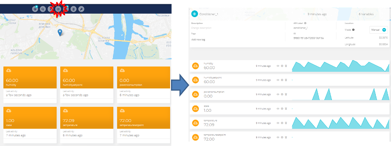
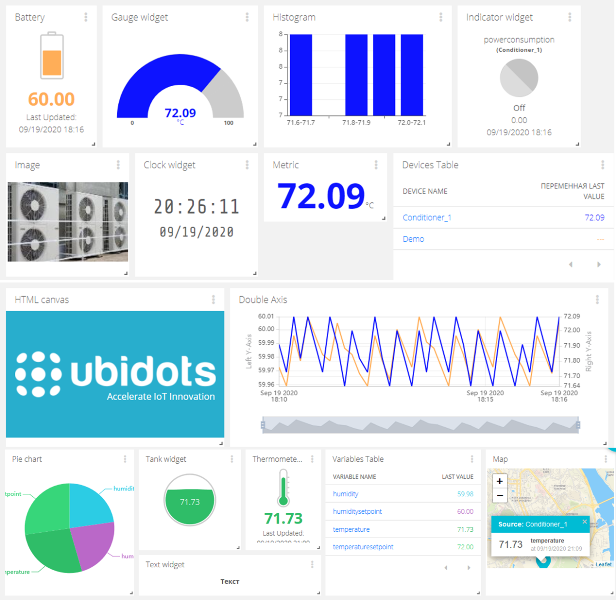
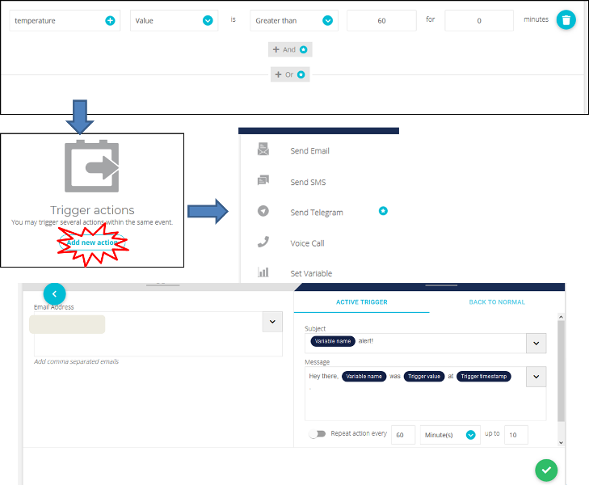

**Розробка і імітаційне моделювання інтегрованих систем керування. Лабораторний практикум. ** Автор і лектор: Олександр Пупена 

# Лабораторна робота №4. Робота з платформою Ubidots 

Для виконання завдань лабораторного заняття слід підготувати дані для надсилання. Як об'єкт контролю буде використовуватися імітаційна модель кондиціювання, реалізована на OPC UA сервері. 

### 1. Інсталяція та перевірка тестового OPC UA сервера та клієнта

Даний пункт необхідно виконувати, якщо не виконувалась лабораторна робота по OPC.

- [ ] Інсталюйте тестовий [OPC UA C++ Demo Server](https://www.unified-automation.com/downloads/opc-ua-servers.html) , якщо ще не інстальовано
- [ ] Інсталюйте тестовий OPC UA Client [UaExpert](https://www.unified-automation.com/downloads/opc-ua-clients.html), якщо ще не інстальовано
- [ ] Запустіть OPC UA C++ Demo Server та OPC UA Client, з'єднайте їх та перевірте взаємодію
- [ ] Інсталюйте модуль node-red-contrib-opcua, якщо він ще не інстальовано

### 2. Імпорт та перевірка роботи потоку для збору даних

- [ ] на локальному ПК запустіть Node-RED
- [ ] створіть новий проект
- [ ] скачайте [файл експорту потока](https://drive.google.com/file/d/1sG11-TY4EOX3Sk9N1mJyQCGGNj01NExx/view) збору даних та імпортуйте


- [ ] зробіть розгортання потоку, переглядаючи та змінюючи значення змінних за допомогою OPC UA Client UaExpert перевірте, що у глобальному контексті "RTDB" дані оновлюються
- [ ] перегляньте та проаналізуйте вміст потоку

### 3. Реєстрація на платформі Ubidots

Обмеження безкоштовної ліцензії описано [тут](https://help.ubidots.com/en/articles/639806-what-is-the-difference-between-ubidots-and-ubidots-stem)

- [ ] Зайдіть на сайт  <https://ubidots.com/manufacturing/>
- [ ] Натисніть "Sing up" або перейдіть [за посиланням](https://industrial.ubidots.com/accounts/signup_industrial/)
- [ ] Натисніть "Take Me To Ubidots Stem"
- [ ] Вкажіть реєстраційні дані та "Sign Up For Free"

### 4.Створення та налаштування нового пристрою

- [ ] Зайдіть у розділ "Devices"
- [ ] Натисніть "+", щоб створити новий пристрій
- [ ] У списку типів виберіть "Blank Devices"
- [ ] Дайте ім'я пристрою "Conditioner_1"
- [ ] Вкажіть розташування, яке відповідає поточному вашому за допомогою "set location"

### 5.Створення програми в Node-RED для відправки даних

- [ ] На локальному ПК запустіть Node-RED, якщо він не запущений
- [ ] Встановіть бібліотеку [ubidots-nodered](https://flows.nodered.org/node/ubidots-nodered) після чого перезапустіть Node-RED
- [ ] Створіть потік з ім'ям "ubidots"
- [ ] Реалізуйте в потоці наведену нижче програму, зверніть увагу, що в полі `Token` потрібно вставити скопійований з однойменного поля в Devices. Оновлення поставте раз/хвилину, при частому оновленні швидко закінчиться денний ліміт точок. Обмеження безкоштовної ліцензії описано [тут](https://help.ubidots.com/en/articles/639806-what-is-the-difference-between-ubidots-and-ubidots-stem)    

   

```js
let cond = global.get ("RTDB.ns=3;s=AirConditioner_1");
let ob = {};
//https://ubidots.com/docs/hw/#introduction
for (const tag in cond){
    ob[tag] = {
        "value":cond[tag].val,
        "timestamp":cond[tag].ts,
        "context": { "key1": "value1", "key2": "value2"}, 
        "created_at": cond[tag].ts
    };
}
msg.payload = ob;
return msg;  
```

- [ ] Зробіть розгортання потоку

### 6.Перегляд змінних на платформі 

- [ ] Перейдіть на платформу, відкрийте пристрій, оновіть сторінку, якщо вона була відкрита. Ви повинні побачити змінні у вигляді їх поточних значень

- [ ] Використовуйте кнопку "Toggle View" для зміни формату відображення

 

- [ ] Виберіть змінну температуру для її детального аналізу 


- [ ] Виставте властивості:
  - [ ] масштаб "Allowed range" (0-100)
  - [ ] одиниці виміру  (°С)
  - [ ] колір (клацнути по пензлику)
- [ ] Налаштуйте кольори для інших змінних  

### 7.Створення та налаштування Dashboard 

- [ ] Перейдіть в Dashboards
- [ ] У верхньому лівому куті відкрийте меню і створіть новий Dashboard з ім'ям "Conditioner1"


- [ ] Налаштуйте, щоб на Dashboard відображалися останні 10 хвилин інформації

### 8.Додавання різних віджетів

- [ ] Самостійно додайте різні віджети на Dashboard з прив'язкою до різних змінних. Зверніть увагу, що деякі віджети вимагають однієї змінної, інші - кількох. Поки що додайте наступні віджети
  - [ ] HTML Canvas
  - [ ] Manual input
  - [ ] Slider
  - [ ] Switch



- [ ] Додавання віджету Canvas  [по прикладу Simple text with an Image](https://help.ubidots.com/en/articles/754634-html-canvas-widget-examples)

### 9.Модифікація програми зміни завдання

- [ ] Додайте фрагмент програми з підпискою на зміну завдання з вологості та температури


### 10. Додавання віджетів для зміни завдання

- [ ] Додайте віджет Manual Input і налаштуйте його на зміну завдання заданої та поточної температури
- [ ] Змініть за допомогою цього віджету завдання на температуру та вологість
- [ ] Проведіть таку саму операцію з віджетом "Slider"
- [ ] Використовуйте віджет "Switch" для формування завдання для 2-х вставок температури, наприклад 15 (ON) та 25 (OFF) градусів

### 11.Генерування події 

- [ ] Перейдіть на сторінку налаштування подій Data->Events
- [ ] Натисніть "Create Event"
- [ ] Налаштуйте подію на надсилання поштового повідомлення, якщо температура перевищує 60



- [ ] Встановіть завдання на 65 градусів, після перевищення 60 градусів має надіслати повідомлення на вказану пошту 

### 12.Створення доступу  

- [ ] Перейдіть до налаштувань Dashboard і згенеруйте посилання для спільного доступу


- [ ] Перевірте, що посилання відкривається в іншому браузері


Альтернативною платформою для виконання лабораторної роботи може бути https://thingsboard.io/ 