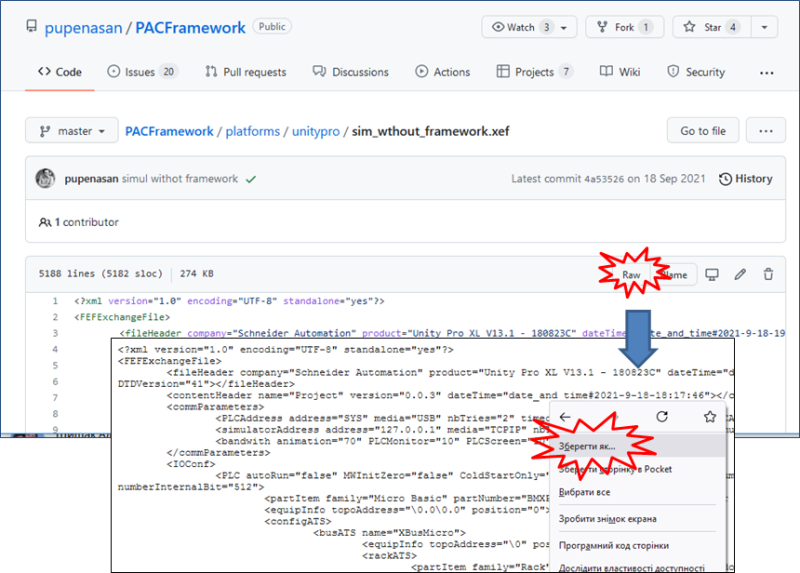
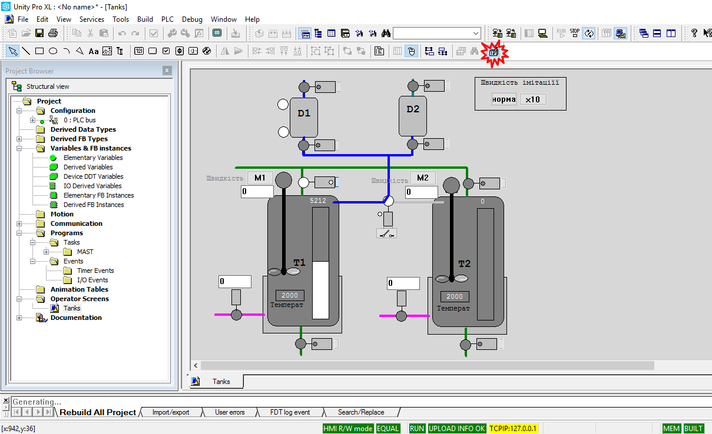
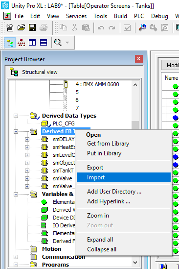
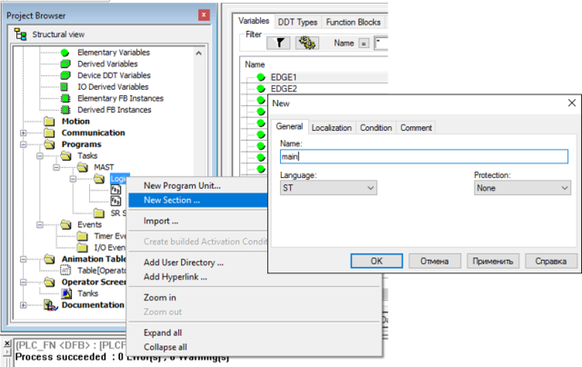
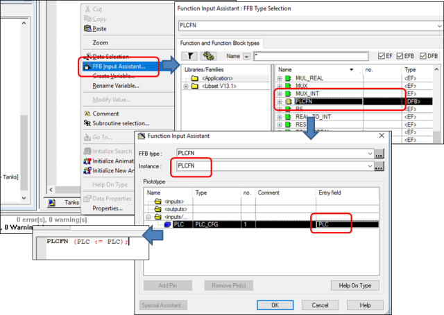

**Розробка і імітаційне моделювання інтегрованих систем керування. Лабораторний практикум. ** Автор і лектор: Олександр Пупена 

# Лабораторна робота №9. Розробка системи керування з використанням каркасу

**Тривалість**: 4 акад. години.

**Мета:** Навчитися розробляти застосунки для програмованих контролерів з використанням каркасу PACFramework

**Лабораторна установка**

- Апаратне забезпечення: ПК
- Програмне забезпечення: UNITY PRO V>=7.0 або Control Expert, Node-RED, хмарні застосунки Google Sheet, сервіси Telegram

## Порядок виконання роботи 

У цій лабораторній роботі необхідно розробити базові рівні керування для ПЛК з використанням каркасу PACFramework. 

**Увага!** Для виконання лабораторної роботи необхідне встановлене ПЗ [Unity PRO](https://schneider-electric.app.box.com/s/lgd27nur1rin1hs4x822g8lr6tlr2y82/folder/50504496333) або [Control Expert](https://schneider-electric.app.box.com/s/lgd27nur1rin1hs4x822g8lr6tlr2y82/folder/101662336138). За наведеними посиланнями знаходяться пробні версії з ключом активації на 60 діб. Після завершення терміну дане ПЗ більше не буде запускатися навіть після перевстановлення. Тому рекомендується встановлювати його на віртуальну машину. Мінімальна версія потрібного [UnityPro_XL_V7.0](https://schneider-electric.app.box.com/s/lgd27nur1rin1hs4x822g8lr6tlr2y82/folder/50505220340) у цьому документі використовується [Unity PRO 13.1](https://schneider-electric.app.box.com/s/lgd27nur1rin1hs4x822g8lr6tlr2y82/folder/71210166883)

## 1. Підготовка програми імітації об'єкту

###  1.1. Завантаження експортного варіанту проекту з імітацією

- [ ] Завантажте на диск файл `sim_wthout_framework.xef` за [цим посиланням](https://github.com/pupenasan/PACFramework/blob/master/platforms/unitypro/sim_wthout_framework.xef)

Рис.9.1. Завантаження проекту імітатора з репозиторію

- [ ] Запустіть на виконання середовище UNITY PRO. 
- [ ] Використовуючи меню `File->Open` та вказавши формат `Unity PRO Application Exchange`, відкрийте проект  `sim_wthout_framework.xef` . 
- [ ] Перейдіть в режим імітації ПЛК: `PLC -> Simulation Mode`
- [ ] Зробіть компіляцію проекту `Build -> Rebuild All Project`.
- [ ] Збережіть проект у форматі STU на диску для наступного його використання.
- [ ] З'єднайтеся з імітатором ПЛК: `PLC->Connect`. У результаті повинен запуститися імітатор ПЛК.
- [ ] Завантажте проект в імітатор ПЛК: `PLC->Transfer Project to PLC`
- [ ] Запустіть на виконання програму в імітаторі: `PLC->RUN`. 

### 1.2. Ознайомлення з імітатором об'єкту керування  

Для швидшої розробки навчального проекту пропонується використовувати заздалегідь підготовлений проект з імітацією установки приготування продукту в ємностях (надалі **установка приготування**). Проект включає операторський екран UNITY PRO для відображення/керування відділеннями (рис.9.2).

Технологічна установка приготування складається з наступних елементів (рис.3):

1) танки Т1 та Т2, в яких готовляться продукти за різними рецептами; танки обв’язані наступними засобами КВПіА:

- запірні клапани набору та зливу, кожний з датчиками кінцевого положення "закритий" та "відкритий";
- регулюючий клапан (0-100%) подачі теплоагента у теплообмінний кожух танку (далі по тексту клапан нагрівання);
- датчик рівня (0-100%) в танку;
- датчик температури в танку (0-100°С);
- привід мішалки танку 

2) дозатори (мірні ємності) D1 та D2, які забезпечують подачу дози компоненту; дозатори обв’язані наступними засобами КВПіА:

- сигналізатор нижнього і верхнього рівнів;

- запірні клапани набору та зливу, кожний з датчиками кінцевого положення "закритий";

3) 3-ходовий клапан перемикання трубопроводу подачі з дозаторів на танки T1 та T2; в нормальному стані положення "на Т1"; має датчики кінцевого положення "Т1" та "Т2".

Рис.9.2. Зовнішній вигляд програми вікна керування 

### 1.3. Перевірка роботи імітованого об'єкту 

- [ ] Перейдіть в розділ `Operator Screens->Tanks`
- [ ] Натисніть на вільному місці екрану,  викличте в меню в меню `Services->Enable write variable ` (див.рис.9.2)

- [ ] перевірте роботу усіх клапанів:
  - запірних, натискаючи на кнопку біля клапану  
  - регулюючих (подача теплоагента), вказуючи в поле для вводу біля клапану ступінь відкриття у % і натискаючи `Enter`
- [ ] Подивіться на реакцію датчиків положення та імітацію роботи об’єкту керування. Зверніть увагу на те, що деякі клапани мають два датчика положення, а деякі тільки один. 
- [ ] Виділіть усі об'єкти (Ctrl+A), викличте контекстне меню (права кнопка миші) і виберіть пункт `Initialize Animation Table`
- [ ] Подивіться до яких змінних прив'язані об'єкти

### 1.4. Опис функцій та алгоритму задач керування установкою 

- [ ] Ознайомтеся з наведеним нижче описом функцій та задач керування установкою.

Передбачається що в демонстраційному проекті будуть виконуватися наступні функції.  

1) Виконання задачі приготування відповідно до наведеного нижче опису;

2) У будь який момент часу система має можливість переходу в початковий стан (крок) за допомогою команди "Ініціалізація кроків". 

4) Типові функції передбачені каркасом.

Передбачається що в демонстраційному проекті будуть виконуватися наступні задачі.  

Керування дозаторами та танками розв’язане одне від одного (але координоване), оскільки дозатори можуть бути використані в інших процесах. Дозатори в стані очікування завжди наповнені. 

Керування процесом приготування відбувається за таким алгоритмом (вбудована процедура технологічної комірки):

1) У початковому стані (старті ПЛК) клапани набору та зливу танків Т1 та Т2 закриваються. Закритість клапанів контролюється кінцевими датчиками положення. Після цього система керування установкою приготування переходить в стан очікування.

2) Оператор повинен задати рецепт продукту для приготування в Т1 та Т2. Рецепт включає наступні поля:

- кількість доз компоненту з D1;

- кількість доз компоненту з D2;

- температуру попереднього нагрівання;

- час витримки;

3) Після натискання оператором кнопки "Пуск" відкривається клапан набору танку Т1.

4) Після досягнення рівня 50% паралельно з набором включається дозування компонентів D1 та D2 відповідно до рецепту. 

5) При досягненні рівня 80%, відкривається клапан набору танку Т2.

6) Коли клапан набору Т2 повністю відкрився (по датчику положення "відкритий"), клапан набору Т1 закривається, і паралельно з приготуванням продукту в Т1 йде наповнення і приготування продукту в танку Т2.

7) При досягненні рівня 50% в Т2 паралельно з набором включається дозування компонентів D1 та D2 відповідно до рецепту. Якщо дозатор в цей час використовується при дозуванні Т1, необхідно дочекатися закінчення роботи дозаторів.

8) При досягненні рівня 80%, закривається клапан набору танку Т2.

9) Після закриття клапану набору в танку Т1 (в наступних пунктах для Т2 аналогічно) і закінченні дозування, відкривається повністю клапан подачі теплоагента; 

10) Рідина в танках нагрівається до вказаного в рецепті значення, після чого клапан залишається відкритий на 10% протягом вказаного в рецепті часу;

11) Після витримки відкривається клапан зливу і рідина зливається з танку;

12) Через 5с після досягнення рівня менше ніж 1% клапан зливу закривається;

13) Коли обидва танки Т1 та Т2 порожні, система переходить в початковий стан.

За необхідності передбачається використання Batch Control з можливістю динамічного створення своїх процедур. 

## 2. Розгортання PLCFN та створення програми користувача

У цьому розділі необхідно розгорнути в проекті PLCFN.

### 2.1. Ознайомлення та завантаження PLCFN

- [ ] Ознайомтеся з призначенням та принципами функціонування  PLCFN за [даним посиланням](https://github.com/pupenasan/PACFramework/blob/master/cm/2_plcfn.md)
- [ ] Завантажте експортний варіант функціонального блоку `plcfn.xdb` за [цим посиланням](https://github.com/pupenasan/PACFramework/blob/master/platforms/unitypro/plcfn.xdb)
- [ ] Завантажте експортний варіант операторського екрану  

### 2.2. Імпорт PLCFN та створення змінної

- [ ] Імпортуйте завантажений DFB `plcfn.xdb`

Рис.9.3. Імпорт DFB

- [ ] Перегляньте, разом з DFB імпортується також структура PLC_CFG
- [ ] Створіть змінну `PLC` типу `PLC_CFG`

рис.9.4. Створення змінної PLC

### 2.2. Створення основної секції

- [ ] Створіть секцію `Main`

Рис.9.5. Створення секції Main

- [ ] В секцію в Main помістіть виклик DFB `PLCFN` однойменного типу 

Рис.9.6. Виклик DFB (та його створення) PLC в секції Main.

Зверніть увагу, що автоматично буде створено екземпляр функціонального блоку `PLCFN`.

### 2.3. Імпорт операторського екрану

## 3. Розгортання рівня каналів

- [ ] Завантажте файл експорту екземплярів функціональних блоків `chfns.xsy` за цим посиланням
- [ ] 

chfns.xsy

## Питання до захисту

1. Навіщо в лабораторній роботі створювався сервісний аккаунт Google? Поясніть чому не можна користуватис