# Тема 10. Використання хмарних сховищ в інтегрованих системах керування

## Сховища в IIoT

У інфраструктурі промислового інтернету речей дані необхідно не тільки обробляти, але і зберігати. Враховуючи що в типову трирівневу структуру IIoT входять різні типи пристроїв та ПЗ, можна виділити кілька місць (сховищ), де дані можна зберігати.      

- **IoT Device.** Нагадаємо, що під IoT Device ми розуміємо будь який пристрій, що надає доступ до даних по цифровому інтерфейсу (ПЛК, ПК, розумні польові пристрої, розумні датчики і т.ін). Дані можуть зберігатися на таких пристроях у вигляді файлів або окремих записів в пам'яті. Наприклад, це може бути файл журналу подій або осцилограми на карті ПЛК. Або в даному контексті це може бути навіть ціла база даних трендів SCADA/HMI. Таким чином ретроспективні дані можна витягувати прямо зі сховища.
- **Edge Gateway.** Дані можна також зберігати в Edge Gateway. Це можна робити для можливості буферизації даних перед відправкою в хмару, або для можливості обробки ретроспективних даних безпосередньо за місцем (Edge обрахунки або туманні обчислення), або для виконання функцій доступу до трендів або журналів через веб за місцем.   

- **Хмарні сховища або виділені сервери в Інтернет.** Збереження даних в Інтернеті передбачає можливість їх використання в різноманітних сервісах з доступом 24/7 та збереженням на великі періоди часу. 

В такій системі, одні і ті самі дані можуть зберігатися в кількох місцях. Припустимо дані журналів можуть розміщуватися на  IoT Device але при цьому їх треба дублювати в сховищі Edge Gateway для буферизації або/та для відображення в локальних засобах WEB-доступу (з мобільних застосунків) і в той же час записувати в хмарні сховища для їх подальшої обробки в аналітичних сервісах. У цьому випадку виникає питання їх синхронізації.  

В залежності від представлення даних та їх призначення сховища можуть мати зовсім різний формат.  За призначенням можна в тому числі виділити наступні дані (див. [DigTwin](2_twin.md)):

- квазістатична інформація про актив, такі як опис пристрою, серійний номер, конфігураційні параметри пристрою, тощо; ця інформація змінюється рідко або взагалі не змінюється    

- часово-базисна інформація: записи трендів та журнали; ці дані постійно змінюються і важливо знати що саме змінилося і коли; 

- різноманітні файли: допомоги, графіка, образи завантажень і т.п., які зберігаються і надаються у атомарному вигляді без аналізу змісту  

Для різних даних за призначенням можна використовувати зовсім різні формати сховищ. Розглянемо їх нижче.

## Реляційні СКБД (SQL-подібні) 

У якості сховищ можуть використовуватися реляційні базах даних, в яких усі дані представлені у вигляді таблиць, які пов'язані відношеннями (рис.10.1). Ці БД та СКБД які їх обслуговують відомі з інших курсів. На      сьогоднішній день вони найбільш популярні і можуть використовуватися як на рівні Edge так і на рівні платформи. У якості мови обробки запитів та маніпулювання даних для таких БД використовується мова SQL, тому такі БД та СКБД прийнято називати SQL-подібними БД.


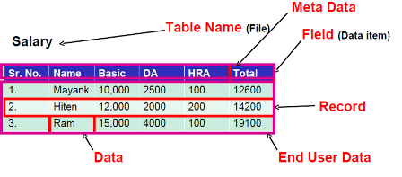

рис.10.1. Представлення даних у реляційних БД.

Реляційні СКБД звісно можна розгортати на віртуальних машинах, але такі СКБД у великій кількості присутні у якості хмарних сервісів. Серед таких сервісів є DB2, який присутній в IBM Cloud. Для хмарних сервісів IBM, DB2 є сховищем даних для різноманітних функцій статистики. Однак варто зауважити, що згідно останніх тенденцій, багато провайдерів переходять на інші типи сховищ для пришвидшення обробки. Розглянемо принципи використання хмарних сервісів SQL сховищ на прикладі DB2.    

DB2 можу використовуватися як на Edge рівні так і на Cloud, з можливістю репліації. У DB2 бази даних організовані як Shema (Схема). Для кожної Схеми є окреме вікно конфігурування (рис.10.2) 

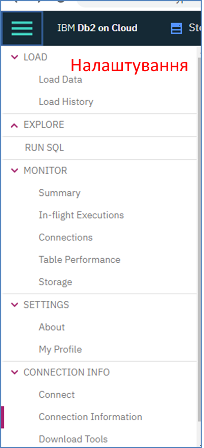

рис.10.2. Вікно конфігурування DB2

Перед використанням DB2 необхідно налаштувати користувача на користування сервісів. Адміністратор за замовченням може створювати бази даних (схеми) але не може маніпулювати ними. Тому спочатку йому необхідно надати дозволи. Для цього на відповідній сторінці  `Manage -> Access IAM -> Users` надається доступ для вибраного користувача (рис.10.3) шляхом визначення прав в `Access Polices -> Assign Access`. 

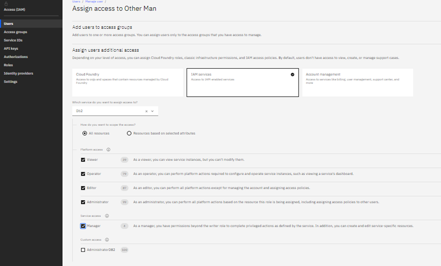

рис.10.3. Надання доступу користувачу до схеми DB2

Для доступу до схеми необхідно створити сервіс (рис.10.4) та облікові дані для нього (Service Credential рис.10.5) 

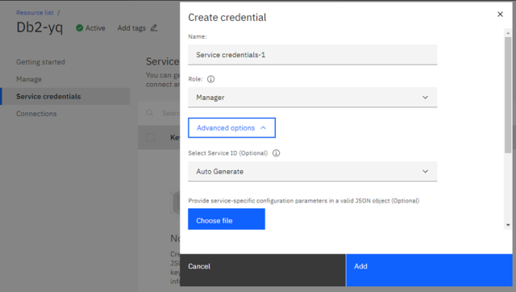

рис.10.4. Створення сервісу для DB2

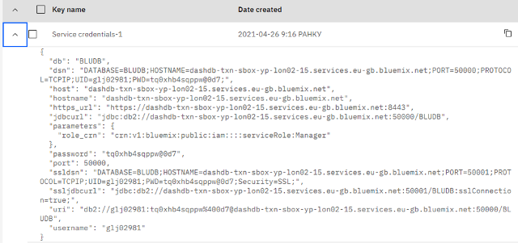

рис.10.5. Приклад створення облікових даних для доступу до сервісу

Далі безпосередньо у консолі (Manage->Open Console) можна проводити різноманітні маніпуляції з даними, такі як створення інших схем, таблиць, записів та інші маніпуляції в т.ч. через SQL запити.   

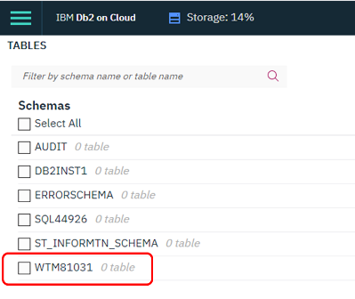

рис.10.6. Робота з консоллю DB2

З рівня Edge до хмарних сервісів DB2 можна доступитися через різноманітні утиліти, які надають можливість у зручному вигляді переглянути та змінити дані без необхідності роботи з часто незручними та повільними ВЕБ-консольними сервісами хмари. Наприклад в утиліту DBeaver для цього достатньо на клієнтську машину завантажити пакет драйверів JDBC (рис.10.7). Після цього в налаштуваннях зв'язку вказується дані, що були задані в облікових даних для доступу до сервісу.  

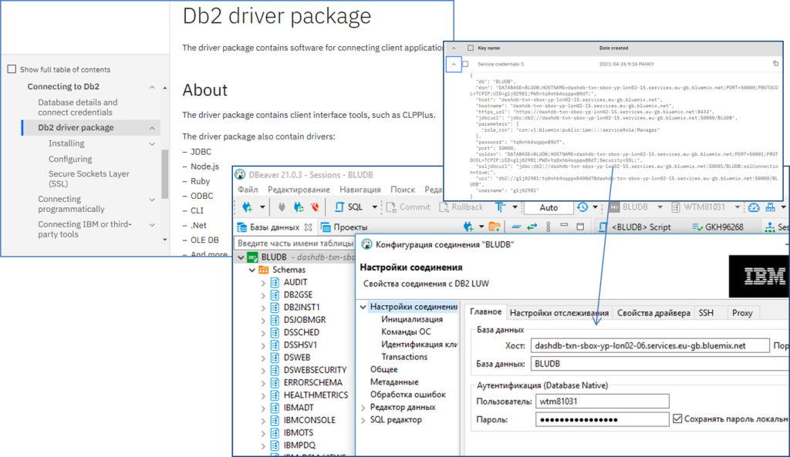

рис.10.7. Приклад налаштування зв'язку з DB2 в DBeaver.

За необхідності підключення інших застосунків можна скористатися драйверами ODBC. Драйвер ставиться з IBM DB2 driver package і доступний в налаштуваннях ODBC (рис.10.8)

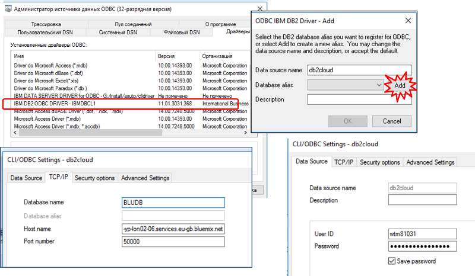

рис.10.8. Налаштування драйверу ODBC для IBM DB2

Далі цей драйвер можна використовувати для різних застосунків, що сумісні з ODBC.

## NoSQL СКБД (document-oriented)  

У багатьох випадках для рішень IoT реляційні бази даних в якості сховища не є вдалим варіантом. Причин на це кілька, зокрема:

- таблиці передбачають заздалегідь відому структуру даних, тому якщо дані змінюють свою структуру, вони можуть бути тільки як змінюване поле таблиці, що не зручно при необхідності аналізу зміста поля
- для сховища на базі часу зі збільшенням кількості даних пропорційно збільшується час для пошуку
- реляційні бази даних погано масштабуються вшир, тобто тяжко реалізувати розподілену БД      

Тому для різних завдань використовують різні нереляційні сховища, зокрема так звані NoSQL бази даних, Object Storage та Time Series Database. У даній лекції розглядають перші два типи, в наступній лекції - TSDB.

Серед NoSQL БД окремим класом виділяються так звані документо-орієнтовні БД. Основною атомарною одиницею в таких БД є документ. Документ можна порівняти з записом в таблицях реляційної бази даних. Але на відміну від останніх документ може мати довільну структуру. Кожен документ має унікальний в межах БД ідентифікатор - ключ (рис.10.9). У документо-орієнтованих БД зміст документів також аналізується.  

Таким чином в таких БД інформація зберігається в напівструктурованому вигляді:

- база даних не потребує попередньо означеної схеми, яка потребується для реляційних БД, оскільки кожен документ створюється за необхідності і може мати довільну структуру
- можна доступитися до частини документу (наприклад за полем)
- з документу можна вилучити інформацію для індексації для пошуку за змістом
- БД може включати метадокументи для організації індексів, захисту та інших налаштувань

- документи в БД можуть групуватися, будуватися залежності

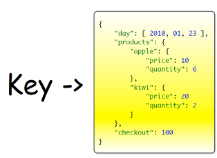

рис.10.9. Принцип побудови документо-орієнтованої БД

Така організація даних дає певні переваги порівняно з реляційними БД:

- краща продуктивність для великих об'ємів даних

- не потребує схеми

- легше масштабуються, можуть бути децентралізовані

- можна зберігати неструктуровану інформацію

- простий інтерфейс

Одним із представників документ-орієнтованої СКБД, яка багато використовується в системах IoT є Couch DB ([https://couchdb.apache.org](https://couchdb.apache.org/)). Це безкоштовне ПЗ, яке ставиться на різні платформи (різні ОС в тому числі на ARM-based), а отже може використовуватися в IoT як на рівні Edge так і на рівні платформи.  

Для конфігурування та маніпулювання даними може вкиористовуватися як вбудований ВЕБ-інтерфейс, який називається Fauxton так і REST API. БД будується на базі документів в форматі JSON. Самі СКБД між собою можуть синхронізувати документи у будь-якому напрямку (реплікація master-master) що робить розподілену систему, побудовану на базі неї дуже гнучкою. 

Адміністрування Couch DB на Fauxton досить просте (рис.10.10). Для цього необхідно зайти на сторінку адміністрування, наприклад за локальною адресою це буде [http](http://127.0.0.1:5984/_utils/)[://127.0.0.1:5984/_utils/#](http://127.0.0.1:5984/_utils/)[login](http://127.0.0.1:5984/_utils/). Там можна робити конфігурування, різні операції з БД, документами, індексами, реплікаціями і т.п

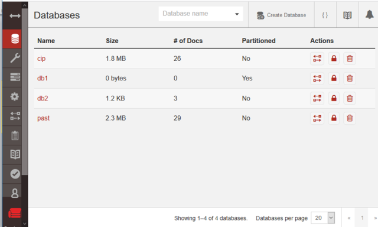

рис.10.10. Зовнішній вигляд консолі CouchDB 

Доступні хмарні реалізації CouchDB, зокрема в IBM Cloud він доступний як сервіс IBM Cloudant. Є певні особливості в налаштуваннях та функціонуванні сервісу, але основні принципи залишаються такими ж (рис.10.11)  

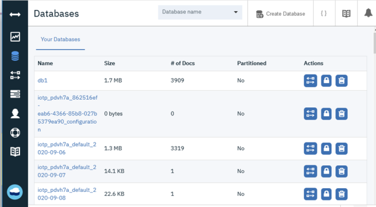

рис.10.11. Реалізація CouchDB в Clouds - IBM Cloudant

Для маніпуляції та адміністрування REST API надає наступні типи операцій:

- Server

- Databases

- Documents

- Replication

Так, наприклад, доступ до кореневого документу серверу повертає відповідь в форматі JSON з загальною інформацією про СКБД (рис.10.12).

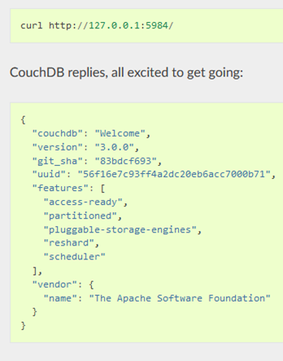

рис.10.12. Відповідь на запит до кореневого документу

Якщо доступ передбачає обмеження то в url задається ім'я користувача та пароль, відповідно до правил базової автентифікації HTTP (рис.10.12). Для створення БД достатньо відправити http запит з методом PUT та іменем створюваної БД (рис.10.12)  

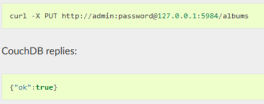

рис.10.13. Запит на створення бази даних  

Ось кілька популярних запитів:

- `GET http://127.0.0.1:5984/_all_dbs` - отримати список баз даних
- `PUT http://127.0.0.1:5984/DB_name` - створити базу даних
- `GET http://127.0.0.1:5984/DB_name` - видалити базу даних

Кожен документ має унікальний в БД текстовий ID, який записується окремим спеціальним полем `_id`. Це поле створюється при створенні документу і не може змінюватися (рис.10.14) бо це є назвою документу. Її можна задати довільно або отримати унікальний з СКБД унікальний ідентифікатор UUID (GUID). Зміна документа відбувається шляхом його повної заміни. Для того щоб відслідковувати зміни, зокрема з метою реплікації окрім `id` записується також версія в поле `_rev` (рис.10.15).  

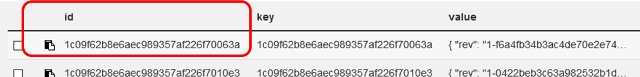

рис.10.14. Перелік документів

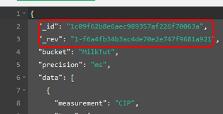

рис.10.15. Обов'язкові поля для документів

Для створення документу використовується запит `PUT http://127.0.0.1:5984/dbname/docname 'documentcontent'` . Для отримання UUID  `GET http://127.0.0.1:5984/_uuids`. Для отримання документу `GET http://127.0.0.1:5984/dbname/docname`.

У розподілених системах (рис.10.16) БД обмінюються документами для їх синхронізації. Механізм синхронізації баз даних на одному або різних ПК називається реплікацією. Для налаштування реплікації вказується source (звідки) і target (куди). Якщо в target старіша або відсутня версія ніж в source, буде документ буде замінений. 

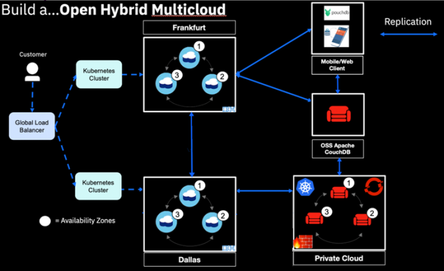

рис.10.16. Розподілена архітектура 

За допомогою реплікації в системах IIoT можна синхронізувати локальні документи в IoT Gateway з відповідними документами на хмарі.

Є можливість зробити реплікацію на постійній основі або за запитому, наприклад відправивши відповідний запит (рис.10.17).  

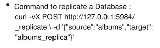

рис.10.17. Запит на реплікацію документу 

Для доступу до документу вказується його індекс. Для пошуку документів є спеціальний ресурс REST API `find`, який забезпечує пошук необхідних документів за вказаними параметрами: 

```http
POST /{db}/_find
```

Пошук може відбуватися за критеріями подібно як це робиться в SQL (рис.10.18):

- `selector(json)` – який забезпечує пошук документу за обєктом JSON в якому вказуються критерії пошуку
-  `limit (number()` – максимальна кількість повернених документів 

- `skip (number)` – відміна перших  ‘n’ результатів  

- `sort (json)` – масив JSON з вказівкою сортування 

- `fields (array)` – масив JSON з полями результату 

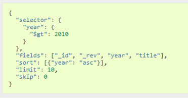

рис.10.18. Доступ до даних за індексом

Наприклад на рис.10.19-10.20 показаний запит на вибірку документів що мають поле `startdate` рівним вказаній даті.

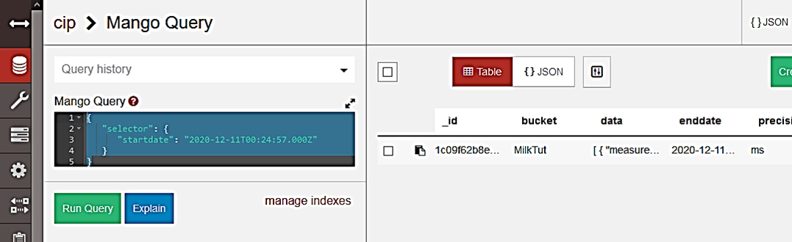

рис.10.19. Приклад використання Mango Query

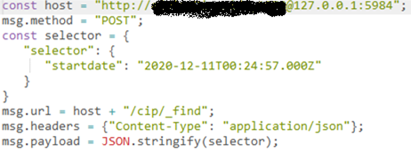

рис.10.20. Приклад запиту за селектором

Для пришвидшення пошуку CouchDB надає механізми індексації. Вбудовані механізми передбачають створення індексу, який заповнюється після першого пошуку для пришвидшення виконання подальших запитів на пошук. 

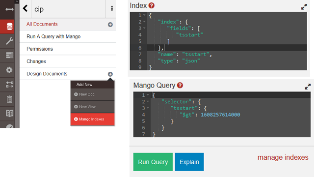

рис.10.21. Створення індексного документу

Є додаткові механізми індексованого пошуку, наприклад `search indexes`, які доступні в плагінах (в Cloudant вже вбудовані). 

Для роботи с CouchDB в Node-RED доступні вузли Cloudant, які наразі включають в себе дещо обмежений функціонал, тому у більшості випадків варто працювати безпосередньо через REST API. 

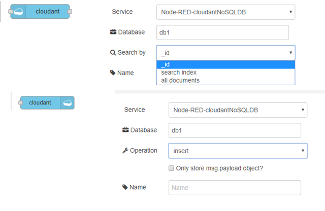

рис.10.22. Налаштування доступу з Node-RED

Альтернативою для CouchDB може стати MobgoDB для яких також є хмарний сервіс atlas https://www.mongodb.com/atlas/database , або Cassandra. На рис.10.23 показані основні відмінності СКБД CouchDB  та MobgoDB .

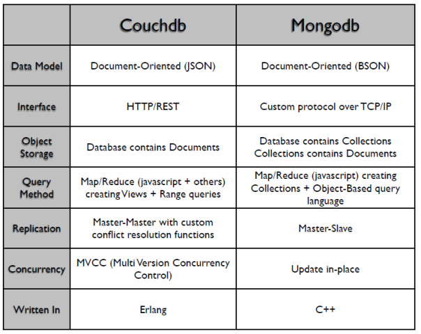

рис.10.23. Порівняння CouchDB з MongoDB

## Cloud Object Storage

Коли необхідно зберігати об'єкти як атомарні одиниці варто використовувати  спеціалізовані бази даних саме такого типу. Об'єктні сховища подібні до файлової системи, за відміною того, що про фізичне розміщення об'єкту користувачу невідоме, і воно може бути на різних носіях (рис.10.24). Доступ до них відбувається через API з вказівкою ідентифікатору. 

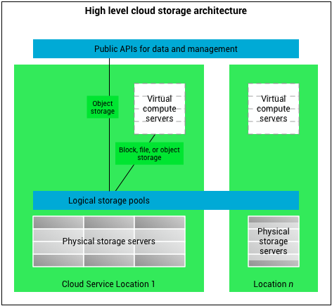

рис.10.24. Архітектура Cloud Storage

Прикладом такого хмарного сховища є IBM Cloud Object Storage (COS). Файли (об'єкти) в COS є неструктурованими даними (blob), тому можуть мати будь який формат. Доступ до них відбувається через REST API і керується через API-key. Об'єкти можуть бути дуже великими (>10Тб).

Організація даних відбувається через означення bucket (відро), яке є контейнером для об'єктів. Об'єкти в bucket аналогія файлів в папках. Дані зберігаються з використанням шифрування та хешуються. Для пришвидшення пошуку об'єкти тегуються. 

Об’єктами COS можна користуватися як з сервісів IBM Cloud, так і поза ними. Для того, щоб мати можливість користуватися цими об’єктами поза межами IBM Cloud (через HTTP API) необхідно налаштувати доступ. 

Для Node-RED існує готовий модуль інтеграції `node-red-contrib-cos`. Вузол `cos get` забезпечує доступ для читання. У налаштуваннях вказується Service credentials для екземпляра COS (рис.10.25) які копіюються з відповідного JSON файлу.  

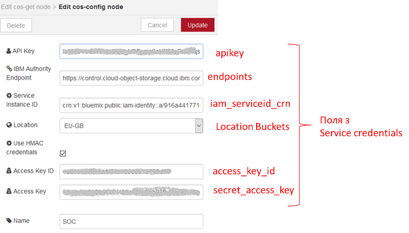 

рис.10.25. Налаштування доступу до COS

## Запитання для самоперевірки

1. Для чого використовуються сховища в інфраструктурі IIoT? На яких засобах вони можуть бути розміщені?
2. Наведіть приклади використання реляційних хмарних СКБД в структурі інтегрованої системи керування.
3. Поясніть що таке NoSQL СКБД.
4. Поясніть що таке документ-орієнтована БД.
5. Як дані організовані в CouchDB?
6. Поясніть як функціонують REST API запити на створення та доступ до БД та документів.
7. Як в CouchDB організована реплікація?
8. Як в CouchDB організований пошук документів за їх змістом?
9. Розкажіть про механізми індексації документів в CouchDB.
10. Як можна користуватися сервісами CouchDB в Node-RED?
11. Розкажіть про призначення сховищ Cloud Object Storage. Наведіть приклад їх використання.   

[Частина 1](https://youtu.be/XCwH850KbDg)

[Частина 2](https://youtu.be/Y_54-XnjjCU)
