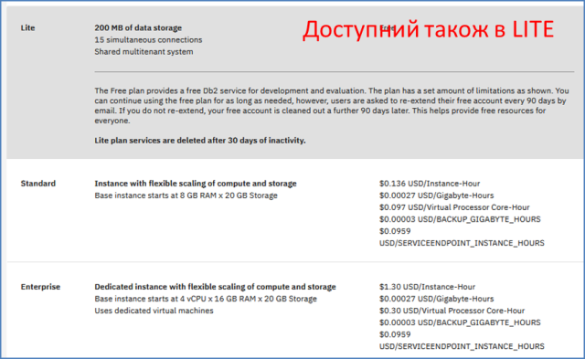
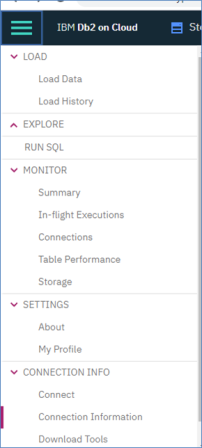
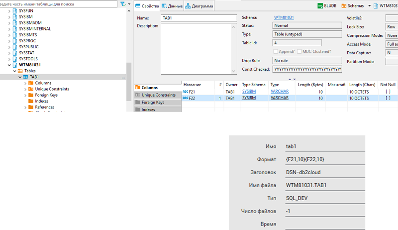
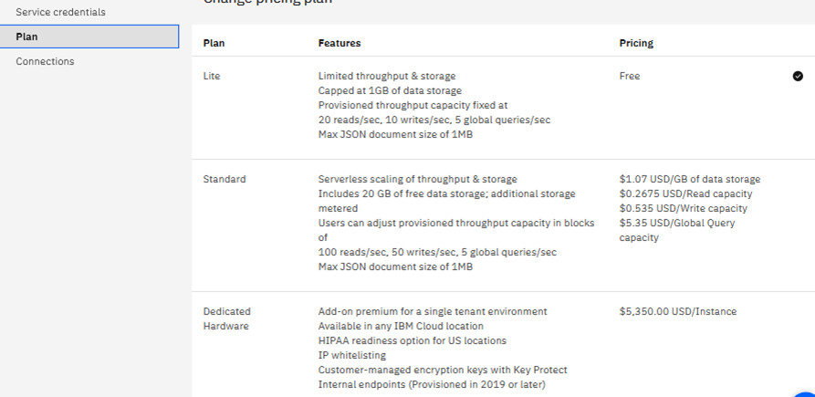
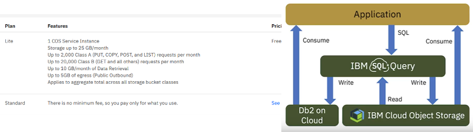

# 10. Використання хмарних сховищ в інтегрованих системах керування

Сховища в IIoT

•місце збереження інформації:

•IoT Device

•Edge Gateway 

•Cloud

•необхідність синхронізації

•різні формати в залежності від призначення

•призначення (див. DigTwin):

•квазістатична інформація про актив

•історія (часово-базисна)

•файли (допомоги, графіка, образи завантажень…)

•….

**Реляційні СКБД (****SQL****-подібні)** 

**Реляційні хмарні БД**

•є сукупністю таблиць, пов'язаних відношеннями

•на сьогоднішній день найбільш популярні

•у великій кількості присутні у якості хмарних сервісів, наприклад в IBM – DB2 on Cloud

**Реляційна хмарна** **DB2**

•в LITE дозволяє використовувати тільки одну Shema (БД), таку як ім'я користувача 

**Налаштування користувача на користування сервісів** **DB2**

•Manage -> Access IAM -> Users

•вибрати свого користувача

•Зайти в Access Polices -> Assign Access: добавити усі дозволи до DB2

**Створення сервісу хмарної** **DB2**

•створити сервіс

•у Service Credential створити Credential

•запустити консоль Manage->Open Console 

**Робота з консоллю** **DB2**

•в LITE створюється Shema (БД), таку як ім'я користувача 

**Зв'язок з "землею"** **DB2** **(Утиліти)**

за необхідності на клієнтську машину завантажити пакет драйверів

**Зв'язок з "землею"** **DB2** **(клієнти** **ODBC****)**

•драйвер ставиться з IBM DB2 driver package

**Приклад клієнти** **ODBC** **-** **Citect**

**NoSQL****:** **document-oriented**  

**document-oriented**

•документ - атомарна одиниця:

•аналогія запису в реляційних БД

•має унікальний ідентифікатор (ключ) в межах БД

•напівструктурована інформація:

•не потребує схеми

•можна доступитися до частини документу (наприклад за полем)

•з документу можна вилучити інформацію для індексації – пошук за змістом

•може включати метадокументи для організації індексів, захисту та інших налаштувань

•документи можуть групуватися, будуватися залежності

**Переваги** **Document oriented** **перед реляційними** 

•краща продуктивність для великих об'ємів даних

•не потребує схеми

•легше масштабуються, можуть бути децентралізовані

•можна зберігати неструктуровану інформацію

•простий інтерфейс

**Couch DB**

[https://couchdb.apache.org](https://couchdb.apache.org/)[/](https://couchdb.apache.org/)

•безкоштовне ПЗ

•ставиться на різні платформи

•інтерфейси:

•Fauxton (WEB-консоль)

•REST API

•документи JSON

•реплікація master-master

**Couch DB** **Адміністрування****:** **Fauxton**

•[http](http://127.0.0.1:5984/_utils/)[://127.0.0.1:5984/_utils/#](http://127.0.0.1:5984/_utils/)[login](http://127.0.0.1:5984/_utils/) – веб застосунок

•конфігурування, операції з БД, документами, індексами, реплікаціями і т.п

**Реалізація в** **Clouds** **–** **IBM** **Cloudant**

**REST API**

•**Server**

•**Databases**

•Documents

•Replication

**Documents**

•кожен документ має унікальний в БД ID (string)

•спеціальне поле "_id"

•формується при записуванні

•можна отримати з БД унікальний ідентифікатор UUID (GUID) для цього

•зміна документа шляхом його повної заміни

•при заміні змінюється версія документа, записується в поле "_rev"

