# Тема 11. Використання сховищ часових рядів для інтегрованих систем керування

## Historian

Для засобів SCADA/HMI збирання даних з пристроїв потрібен тільки для виконання функцій цього підрівня АСКТП, зокрема супервізорного контролю та керування, архівування та інших додаткових функцій. На сьогодні ж дані можуть надавати значно більше інформації, ніж це можуть забезпечити засоби SCADA/HMI. Це принаймні пов’язано з кількома причинами.

1. Засоби SCADA/HMI, як правило, призначені тільки для функцій диспетчеризації технологічних процесів однієї ділянки, а не збирання й архівування даних для всього виробництва. Звичайно можна будувати ієрархічні системи, але їх призначення – диспетчеризація, а не централізоване ведення бази даних реального часу та архіву виробництва. Іншими словами, за необхідності доступу до певних даних буде створено запит на конкретний сервер. Якщо ж потрібні дані з усього підприємства, то запитів буде кілька і їх потрібно узгоджувати. Це зрештою можливо, але складно і не завжди відповідає показникам продуктивності. Навантаження централізованого збирання та архівування всього виробництва засоби SCADA/HMI не витримають, інакше вони переходять в інший клас ПЗ.       

2. Засоби SCADA/HMI, як правило, не мають розвинутих можливостей оброблення даних при вибірці. Тобто якщо, скажімо, на сервер трендів прийде запит на вибірку даних за рік, то він перешле усі дані за цей період. Це ж може бути сотні тисяч значень; чи зможе, скажімо, переглядач трендів відобразити ці дані? А скільки часу це займе? Якщо ж вибірку оптимізувати під запит, це завдання вирішується.  

3. Засоби SCADA/HMI, як правило, не можуть зберігати дуже великий обсяг часово-базисних даних з можливістю швидкого доступу до них для читання. Сервери SCADA з такою метою не розробляються. 

4. Сервери SCADA мають обмежені можливості щодо підключення сторонніх клієнтів. Це, як правило, інтерфейси OPC Server (DA, UA), рідко – ODBC чи OLE DB. Сучасні застосунки для роботи з даними поряд зі стандартизованими інтерфейсами доступу до баз даних повсякмісно використовують HTTP API, яких немає в більшості засобів SCADA/HMI.  

5. З точки зору безпеки рекомендується, щоб сервери SCADA не мали прямого доступу з бізнес-застосунків.   

Слід розуміти, що ці причини можуть не стосуватися конкретного програмного продукту SCADA/HMI і конкретного завдання. Для невеликих виробництв деякі SCADA/HMI можуть забезпечити необхідний функціонал. Крім цих причин, виникає ряд завдань, які потребують додаткового збирання та оброблення даних, для яких не призначені  SCADA, наприклад:

‒ Інтегрування АСКТП з рівнем MOM значно полегшує наявність єдиної інформаційної платформи виробництва, що базується на єдиному сховищі даних (централізованому або розподіленому). Засоби MOM можуть постачатися такими сховищами, але часто вони мають обмежене застосування для глибокого аналізу даних; 

‒ Велика кількість даних із пристроїв не збирається засобами SCADA/HMI і навіть ПЛК, оскільки не потребуються в завданнях АСКТП, але потрібні в завданнях MOM та глибокому аналізі даних. Наприклад, у перетворювачах частоти є велика кількість даних про плинний стан двигуна, статистиці тривог і т. п. Для ПЛК та SCADA/HMI ця інформація надлишкова, бо не використовується через необхідність статистичного аналізу, який на цьому рівні відсутній. Але ці дані могли б бути використані в інших типах застосунків для аналізу ефективності устатковання та предиктивного обслуговування.   

Таким чином, є необхідність у спеціалізованих системах керування базами даних, які, з одного боку, поєднували б функції серверів введення/виведення, трендів та тривог, а з іншого – надавали стандартизовані інтерфейси для інших застосунків (клієнтів) від різних виробників, при цьому були б високопродуктивними і, в ідеалі, не мали обмежень на глибину архіву та кількість клієнтів. Такі типи застосунків прийнято називати ***Historian*** (також відомий як Data Historian, Plant Historian, Process Historian) – це система архівування даних, призначена для збирання, зберігання, оброблення та надання часово-базисної інформації з різних джерел даних великого обсягу та з високою швидкістю. Наближений переклад цього терміна – "Історичний Сервер" або, "Сервер Історичних Даних", однак надалі по тексту будемо використовувати термін Historian, як це прийнято в спільноті українських користувачів. 

Виділимо такі основні функції Historian:

1) збирання даних з різних джерел АСКТП у реальному часі: засобів SCADA/HMI, ПЛК, засобів DCS, інтелектуальних датчиків та приводів (перетворювачі частоти, сервоприводи тощо), різних інтелектуальних пристроїв, лабораторного устатковання,  файлів, інших систем, параметрів роботи ПК (частота та температура процесора, розподіл оперативної пам’яті, кількість підключень і т. п.);

2) збирання даних із засобів автоматизації рівня АСКВ (MOM): LIMS, АСКОЕ (Автоматизована система комерційного обліку електричної енергії), АС контролю витрат інших енергоносіїв, облікових цехових систем, екологічного моніторингу і т. ін; 

3) можливість ручного введення даних;  

4) можливість збирання різного типу даних: числових (цілі, дійсні), дискретних, строкових, бінарних блоків (Blob); 

5) базове оброблення даних: фільтрація (очистка), компресія (наприклад, алгоритмом "SwingingDoor"),  агрегація (сумарне, середнє, відхилення і т. ін), інтерполяція та ін.;

6) проведення складних розрахунків на основі прийнятих необроблених даних, які дають можливість в реальному часі створювати з них аналітичні часові ряди; 

7) перевірка на достовірність (вихід за межі вимірювання, за межі нормального діапазону, втрата зв’язку) 

8) збирання тривог з нижнього рівня;

9) формування тривог для клієнтів верхнього рівня (наприклад, за обмеженнями або за аналітичними розрахунками); 

10) накопичення даних *великого обсягу* в *часово-орієнтованому форматі* з можливістю фіксації з точністю до мілісекунд або навіть мікросекунд

11) надання *швидкого доступу* до накопичених даних та даних реального часу через різноманітні відкриті інтерфейси, зокрема OPC (OPC HDA, OPC UA), SQL, REST API, OLE DB, .NET;

12) можливість резервного збереження даних, резервування сервера, резервування зв’язку із джерелами даних; 

13) синхронізація часу з іншими підсистемами.

У загальній архітектурі керування сервер Historian умовно знаходиться між рівнями АСКВ АСКТП або на рівні АСКВ. Типові джерела даних знаходяться на рівні АСКТП, а також в інших засобах рівня керування виробничими операціями. Таким чином, Historian слугує в якості інтеграційної платформи усього виробництва і використовується як для вертикальної (АСКТП<->АСКВ<->АСКП) так і горизонтальної інтеграції (різні застосунки АСКВ).  

Аналіз даних, що зберігаються в Historian, як правило, не входить до його функцій або ж ці функції обмежені кількома типовими рішеннями. Historian є лише сервером, який має швидко оперувати великою кількістю даних (записувати, робити вибірку) та надавати поширені способи первинного оброблення. Користувачами цих даних є різнорідні клієнтські застосунки. Типовими клієнтами для Historian можуть бути зокрема:

‒    системи звітності та візуалізації даних;

‒    системи рівня MOM;

‒    системи рівня ERP;

‒    спеціалізовані застосунки типу EAM, SCM, тощо;

‒    надбудови (add-on) для офісних та інших застосунків, наприклад для Excel; 

‒    аналітичні застосунки, що використовують засоби машинного навчання.

Доступ до даних клієнтських застосунків повинен забезпечувати режими отримання даних без складних засобів аналізу інформації. Тобто певне оброблення даних повинна відбуватися на сервері Historian, що значно спрощує завдання клієнта. Для операцій доступу до збережених даних можуть бути доступні налаштування за обсягом даних (за тегами та часовим діапазоном або вибірки за кількістю записів), за режимом запиту (не оброблені або статистично оброблені дані), за відбором записів (усі з указаного діапазону, з певним інтервалом, за критеріями). Можуть бути доступні функції співвідношення даних з різними часовими подіями, такими як початок/завершення виробничої зміни, партії сировини чи продукту і т. п. 

Використовуючи спеціалізовані клієнтські застосунки разом з Historian, можна, наприклад, вирішувати такі завдання:

‒    контролювати пристрій, щоб підтримувати його функціонування та визначати необхідність калібрування, ремонту чи заміни;

‒    контролювати процес, набір устатковання, щоб змусити його працювати в рамках набору специфікацій процесу;

‒    проводити моніторинг виробництва партії, порівнюючи її параметри з найкращою ("золотою") партією;

‒    контролювати якість продукції в межах можливостей процесу;

‒    контролювати виробничу лінію для досягнення максимальної експлуатаційної ефективності та мінімальних витрат;

‒       контролювати всі аспекти діяльності підприємства для оптимізації попиту та споживання ресурсів;

‒    одночасно контролювати декілька однотипних об'єктів для порівняльного аналізу;

‒    прогнозувати відмову устатковання за даними реального часу та історичними даними. 

На рис. 11.1 показано приклад використання даних Historian для відображення статистичного розподілу 20-ти найчастіших тривог (типи показано кольором) для визначення їх причин. 

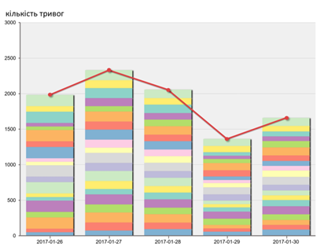 

*Рис. 11.1.* Приклад використання клієнта Historian для аналізу тривог

А на рис. 11.2 показано приклад онлайн-звіту по тривогах, який дає змогу інженерам робити висновок щодо ефективності устатковання. У звіті показано тривоги в кінці зміни, найпопулярніші тривоги за кількістю, блоковані оператором тривоги та тривоги калібрування в кінці зміни, середній показник кількості тривог за зміну, розподіл частот тривог кожного типу.  Натиснувши один із кольорових кружечків на "тепловій карті", можна перенести користувача до звіту про вибраний тип тривоги, який попередньо фільтрується на потрібний день. Користувач може продовжувати поглиблення до тих пір, поки в кінцевому підсумку не з'являться вихідні сигнали тривоги та події, які можуть бути використані для аналізу першопричини та відображення відфільтрованих подій до, під час та після аварійної тривоги.

Ці приклади показують можливості клієнтів, що дозволяють будувати подібні онлайн-звіти. Ці дані стосуються всієї виробничої ділянки, на якій знаходиться велика кількість польових засобів та HMI. У даному випадку наявність Historian значно спрощує поставлене завдання.   

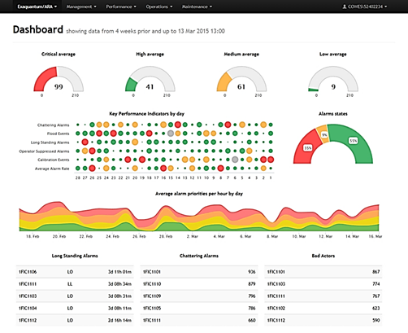 

*Рис. 11.2.* Приклад використання клієнта Historian для аналізу причин тривог

Хоч Historian може бути застосований самостійно в одному або декількох виробничих відділеннях, він дійсно може показати свою цінність тоді, коли застосовується для всього виробництва. Часто його називають ***Операційний Historian (Operational Historian***), і він, як правило, розміщується на виробничому майданчику, оскільки там знаходяться джерела даних і основні клієнти. Однак для багатьох виробничих підприємств характерна наявність кількох виробничих майданчиків, і є необхідність сформувати єдиний Historian для всіх виробництв. Їх називають ***Корпоративним Historian*** (***Enterprise Historians***), і вони розташовуються в центральному офісі, центрі оброблення даних або в іншому місці, відмінному від виробничого об'єкта. 

Корпоративний Historian – це постачальник даних набагато ширшої бази користувачів, ніж Операційний Historian. Ці терміни досить умовні, оскільки багато, якщо не всі дані Операційного Historian можуть також з’являтися в Корпоративному, особливо в ситуаціях, коли використовується багаторівнева (каскадна) конфігурація. Багато організацій у Корпоративний Historian збирають дані також з інших джерел, окрім оперативних. В основному Операційні Historian використовуються на рівні операторів виробництва, а Корпоративні – на рівні бізнесу для планувальників, проектантів, менеджерів та інших зацікавлених сторін. База користувачів Корпоративного Historian дуже велика, а результати значно вимогливіші, ніж потребуються для Операційних. З іншого боку, вимоги до реального часу для Операційних Historian значно жорсткіші, ніж для Корпоративних, а останні можуть забирати лише підмножину даних. Тому ці ролі можуть виконувати як однакові програмні засоби, так і різні, і базуватися на різних архітектурних підходах. 

Класичною схемою взаємодії є каскадна – при ній Корпоративний Historian знаходиться на верхньому рівні керування підприємством, а Операційний є для нього джерелом даних. Не виключена схема, при якій збирання даних обома Historian проводиться паралельно. Класичними клієнтськими застосунками для Корпоративного Historian є системи ERP, EAM, SCM та інші застосунки рівня АСКП. Окрім функціонального призначення, наявність кількох Historian може слугувати для побудови зон DMZ, що зрештою підсилює кіберзахист підприємства і розділяє зони відповідальності різних підрозділів. У ряді випадків застосовують структури, в яких функції Операційного та Корпоративного Historian виконуються на одному сервері. 

Сучасні Historian можуть пропонувати різні варіанти структур: централізовані, каскадні або розподілені. Крім того, з розвитком промислового Інтернету речей (IIoT)  Historian можуть знаходитися як на рівні Edge-шлюзів, так і на хмарних платформах.  Завдяки хмарним платформам, IIoT та відкритим інтерфейсам історичні дані можуть бути доступні для будь-якої програмної системи. Їх можна переглядати як локально, так і віддалено. Ця можливість, наприклад, дає змогу інженерам у центральній локації компанії стежити за умовами на виробничих майданчиках по всьому світу або інженерам одного заводу бачити аналогічні дані подібної установки на іншому. Наприклад, використовуючи показники якості роботи ПІД-регуляторів, статистики тривог та подій однакових установок різних виробничих майданчиків можна налаштувати їх за показниками кращого екземпляра. До того ж користувачі не обмежуються доступом до історичних даних через локальний ПК, їх можна переглянути на будь-якому смартфоні чи планшеті, підключеному до корпоративної інтрамережі або Інтернету.

Як і для засобів SCADA/HMI, внутрішня структура та конфігурування серверів Historian різних виробників можуть сильно відрізнятися. Вони можуть базуватися на тегах або точках, для яких означуються джерела даних та параметри записування. Але основна відмінність криється в реалізації сховища. Внутрішня структура може базуватися як на стандартних реляційних баз даних (наприклад SQL-сервері), так і не реляційних, які також прийнято називати NOSQL. 

## Бази даних часових рядів

 Для завдань Historian найбільше підходить формат *** бази даних часових рядів*** (***TSDB***) – програмної системи, яка оптимізована для зберігання та обслуговування часових рядів через пов'язані пари полів "відмітка часу"-"значення". У багатьох випадках сховища даних часових рядів для ефективного керування даними використовують алгоритми стиснення та фільтрування. Зокрема, наприклад, можна зберігати дані тільки при їх зміні, подібно до того, як це роблять сервери трендів SCADA. 

База даних часових рядів зазвичай відокремлює набір фіксованих, дискретних характеристик від динамічних, безперервних значень тегів/точок. Прикладом може слугувати зберігання даних для моніторингу використання продуктивності процесора: фіксовані характеристики (метадані) включатимуть назву "Викорис­тання процесора", одиниці вимірювання "%" та діапазон "0 до 1"; а динамічні значення зберігатимуть відсоток використання та відмітку часу. Розділення призначене для ефективного зберігання та індексації даних для цілей застосунків, які можуть шукати набір тегів інакше, ніж їх значення, індексовані часом. 

Беручи до уваги, що організація бази даних впливає на його характеристики, рішення вибору типу бази даних (SQL або TSDB) для Historian або інших сховищ має враховувати три основні показники: витрати на зберігання (storage costs), масштабовність (scalability) та швидкість (speed).

\-    *Витрати на зберігання* все зменшуються, особливо з появою хмарних рішень та більшими дисковими просторами на серверах, однак різниця в розмірах реляційних та часових рядів може бути надзвичайно великою. Слід зважити вартість не лише значного додаткового дискового простору, що використовується в реляційних базах даних, а й вартість захисту (резервного копіювання, дзеркального відображення на диску) за конкретні, часто регульовані періоди часу. 

\-    *Масштабовність* може бути і вертикальною (scaling up, надання можливості одній машині зберігати більше даних), і горизонтальною (scaling out, що дає можливість зберігати дані на кількох машинах), що також треба враховувати. 

\-    *Швидкість записування та читання* є одним із обмежень, які можуть стати ключовими при виборі рішення. Необхідно врахувати залежність швидкості від обсягу збережених даних та величини вибірки. Як правило, TSDB значно швидше проводять записування та вибірку, оскільки вони адаптовані саме під часові ряди і можуть використовувати алгоритми компресії як при записуванні так і при читанні. Наприклад, при запиті на дані за значний період часу сервер може надати значно меншу кількість записів, передаючи стиснені дані, що вплине на швидкість передачі та відображення. Слід врахувати, що кешування даних в оперативній пам’яті для TSDB також потребує значно меншого обсягу, тому можна побудувати обмін даними реального часу (останні дані, що були прочитані з джерел) значно швидше.  

Зрештою, для того щоб надати повну функціональність Historian, у них суміщають бази даних часових рядів та SQL, що дає можливість використовувати їх як для швидкого читання/записування даних реального часу, так і для даних, що потребують збереження у вигляді реляційних таблиць.

Корисною властивістю часових рядів є  також можливість аналізу даних для виявлення трендів або навіть прогнозування  значень у майбутньому.  Основними алгоритмами, що використовуються для визначення трендів є лінійна регресія, метод Вінтер-Хольца та інші.

У загальному бази даних часових рядів дозволяє:

- зберігати часові ряди з різною дискретністю (секунди, мікросекунди, наносекунди).
- робити запити щодо часових рядів
- використовувати аналітичні функції для аналізу часових рядів (пошук медіани, середнього, максимального значень, та інші)

Як правило, tsdb працюють за клієнт-серверною моделлю, де  дані зберігаються на централізованому сервері, а клієнти - розподілені.  За методом збирання даних з клієнтів бази даних часових рядів поділяють  на:

- Pull модель, коли сервер tsdb має повний список клієнтів, що містять дані, і опитує їх з певним інтервалом. Недоліком цього методу є  неможливість (або надлишкова складність)  роботи з динамічною кількістю  клієнтів. Перевагою є те, що клієнт може не мати ніяких знань щодо  серверу tsdb і лише повинен мати можливість відображати вимірювані  значення через певний протокол. Приклади: Prometheus, Cortex
- Push модель, коли клієнт підключається до серверу і надсилає  вимірювані дані через певних протокол. Недоліком цього методу є  необхідність додаткової конфігурації клієнта - адреса серверу tsdb,  параметри підключення і так далі. Перевагою є те, що клієнту достатньо  встановити з'єднання з сервером для передачі даних, додаткові знання щодо клієнта серверу не потрібні. Приклади: InfluxDB, OpenTSDB, Graphite

## InfluxDB

InfluxDB - база даних часових рядів з відкритим кодом. Написана на Go і оптимізована для швидкого запису та отримання даних часових рядів в галузях моніторингу операцій, метрик програмного забезпечення, даних датчиків інтернету речей та аналітики в реальному часі. 

InfluxDB входить до так званого TICK Stack - набору пов’язаних технологій, об’єднаних для забезпечення платформи для зберігання, збору, моніторингу та  візуалізації даних часових рядів. Технології, які входять до складу TICK, перераховані нижче і формують саму абревіатуру.

- **Telgeraf** – збір даних з відмітками часу із низки джерел, включаючи пристрої Інтернету речей. Це керований плагінами серверний агент для збору показників і звітування. Плагіни Telegraf отримують різні показники безпосередньо з систем, на яких він працює, витягуючи показники зі сторонніх API, або прослуховуючи показники навіть через споживчий сервіс Kafka і StatsD. Він також містить вихідні плагіни для надсилання метрик до низки інших сховищ даних, черг повідомлень і служб, включаючи Graphite, InfluxDB, Datadog, OpenTSDB, Librato, Kafka, NSQ, MQTT та багато інших.

- **InfluxDB** – ефективне та високопродуктивне сховище баз даних для обробки великих обсягів даних часових рядів.

- **Chronograf** –  це механізм візуалізації та адміністративний інтерфейс користувача стека. Це дає можливість швидко й просто налаштувати та підтримувати оповіщення та моніторинг всієї інфраструктури. Використання chronograf є досить простим і включає шаблони та бібліотеки, які дозволяють швидко створювати інформаційні панелі з візуалізацією даних у реальному часі та легко створювати правила автоматизації та сповіщень.

- **Kapacitor** – моніторинг і оповіщення на основі переглядів даних InfluxDB та аномалій, які містяться в цих представленнях. Це вбудований механізм обробки даних, який здатний обробляти як потокові, так і пакетні дані з InfluxDB. Kapacitor дозволяє підключати власну логіку або визначені користувачем функції для обробки сповіщень з динамічними порогами, обчислення статистичних аномалій, відповідності метрик для шаблонів і виконання конкретних дій залежно від цих попереджень, наприклад, динамічного перебалансування навантаження. Kapacitor інтегрується з OpsGenie, HipChat, Alerta, Sensu, Slack, PagerDuty та іншими додатками.

  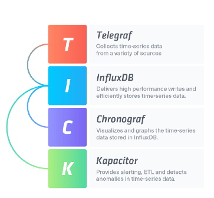

рис.11.3. TICK стек

Розглядаючи аспект збору даних, TICK Stack працює за моделлю push. Компонент InfluxDB — це  база даних часових рядів, яка є серцем TICK Stack. Починаючи з версії 2.0 платформа InfluxDB 2.0 об'єднує InfluxDB, Chronograf і Kapacitor, які були в стеку  в єдине пакетне рішення з додатковими функціями та гнучкістю: 

- [InfluxDB OSS 2.0](https://docs.influxdata.com/influxdb/v2.0/get-started/): рішення платформи з відкритим кодом в одному бінарному файлі
- [InfluxDB Cloud](https://docs.influxdata.com/influxdb/cloud/get-started/): комерційне хмарне рішення 
- [Telegraf](https://docs.influxdata.com/platform/#telegraf): збір даних

Крім того 2-га версія використовує в якості мови запитів власну мову Flux, замість SQL-подібної мови InfluxQL, яка була раніше.

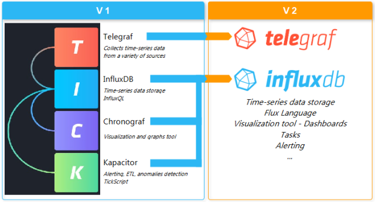

рис.11.4. Зміна в 2-й версії Influx DB.

Інфраструктура системи з Influx DB може також включати інші компоненти, наприклад застосунки аналітики, візуального аналізу (наприклад Grafana), та бібліотеки (рис.11.5). 

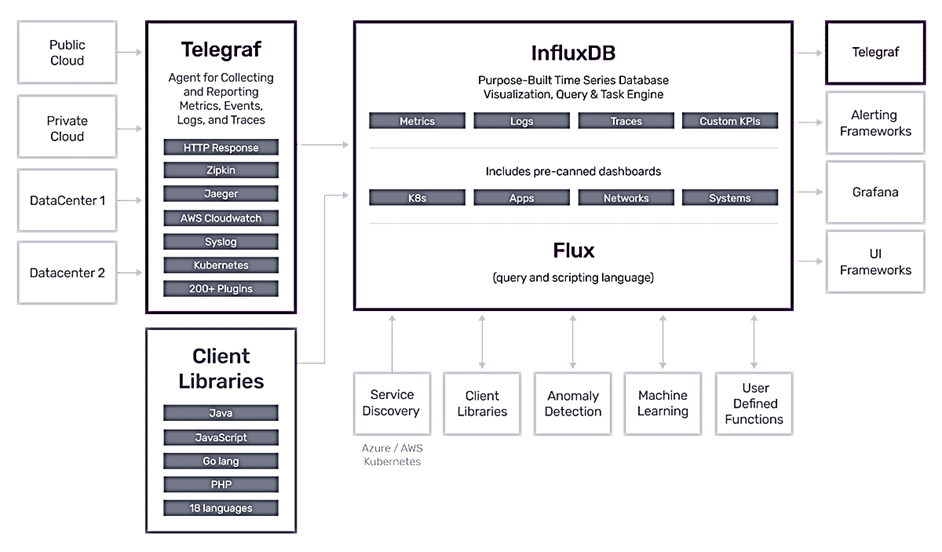

рис.11.5. Інфраструктура InfluxDB V2.

Для організації часово-орієнтованих даних в InfluxDB використовуються наступні [терміни]([https://docs.influxdata.com/influxdb/cloud/reference/key-concepts/data-elements](https://docs.influxdata.com/influxdb/cloud/reference/key-concepts/data-elements/)[/](https://docs.influxdata.com/influxdb/cloud/reference/key-concepts/data-elements/) ): 

- timestamp
- field key
- field value
- field set
- tag key
- tag value
- tag set
- measurement
- series
- point
- bucket
- organization

Дані організовуються в об'єднання типу баз даних, які у версії 2 називаються Bucket (рис.11.6).   Bucket поєднує поняття бази даних та періоду зберігання (retention period - тривалість часу для кожної точки даних). Bucket у свою чергу належить організації — це робоча область для групи користувачів. Усі інформаційні панелі, завдання, сегменти та користувачі належать організації. Додаткову інформацію про організації.

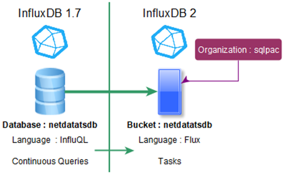

рис.11.6. Організація даних в InfluxDB різних версій.

Усі дані, що зберігаються в InfluxDB, мають стовпець `_time`, який зберігає мітки часу. Мітки часу  записуються у наносекундному форматі (**Unix** **Epoch**) і представляється користувачу у форматі [RFC3339](https://tools.ietf.org/html/rfc3339) UTC.

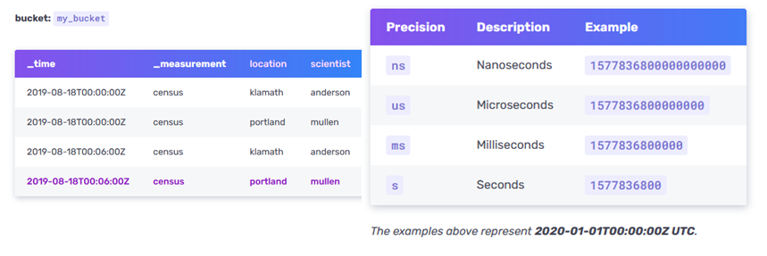

рис.11.7. Відмітка часу.

Дані групуються у вимірювання -  `_measurement`  (ресурс даних), наприклад для кожного вимірювального параметру, і асоціюється з певним набором даних. Вимірювання є контейнером для `tags`, `fields` та `timestamps` в межах `bucket`

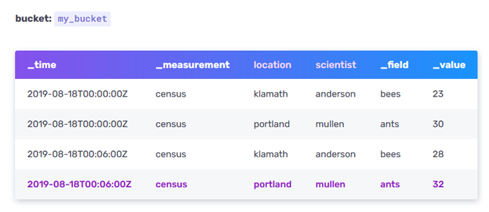

рис.11.8. Елементи даних  InfluxDB

Записи в вимірюваннях включають  `_field` – назва поля, `_value` – значення поля. Записи що мають однакову відмітку часу формують один `Field set` – набір `field key-value` з однаковою відміткою часу. Поля в записах використовуються як правило для числових значень, над ними проводять розрахунки. Вони  не індексуються, за ними не роблять пошук.

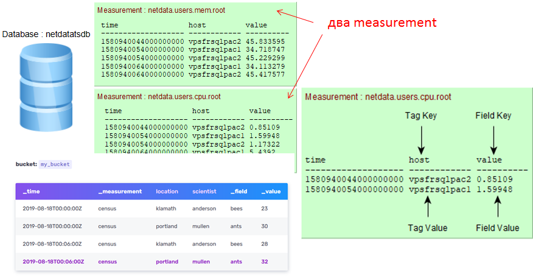

рис.11.9. Організація полів

Для індексації та пошуку використовується `tag key`, та `tag value`.  `tag set` – це набір однакових наборів `tag key-value`. Якщо треба проводити пошук по значенню – використовується `tag` а не `_field`

`series key` – ключ для набору точок, що мають спільні measurement, tag set і field key. `series` включають `timestamps` та `field values` для вказаного `series key`. `point` включає `series key`, `field value` і `timestamp`. 

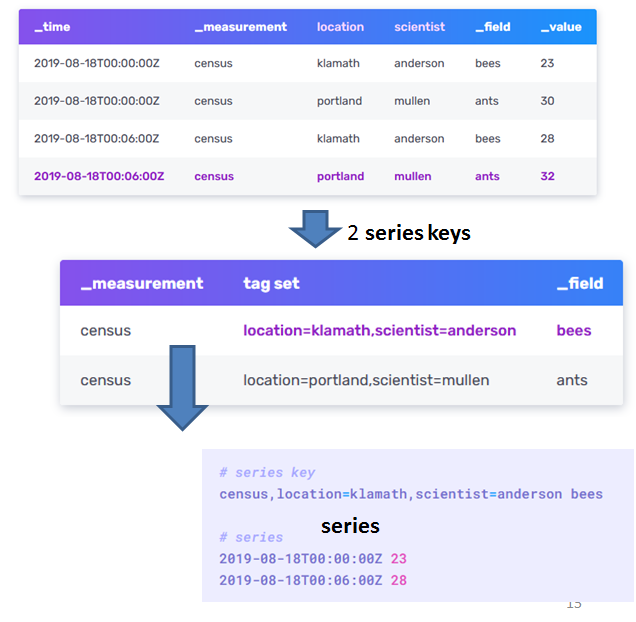

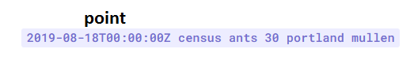

рис.11.10. Послідовності та точки

Теги індексуються, а поля не індексуються. Запити повинні означити, що зберігається як тег, а що як поле. Варто зберігати дані у тегах, якщо це метадані або якщо ви плануєте використовувати їх у запитах групування. Значення тегів завжди інтерпретуються як strings, якщо треба числові вирази – треба використовувати значення полів. Варто зберігати дані у полях, якщо вони використовуються з розрахунковими функціями. Не можна використовувати однакові назви для тегу та поля. Не варто кодвати дані в іменах вимірювань та значеннях тегів

Елементи даних InfluxDB зберігаються в файлах:

- time-structured merge tree (TSM) 

- time series index (TSI) 

При вибірці:

- забезпечує tabular data schema для:

  - відображення "сирих даних"

  - повернення в форматі csv

- Annotation rows - описують властивості колонок
- Header row – означують мітки для опису колонок (table, _time, _value, _field, _measurement, tag key names)

- Data rows – дані для кожного Header

- Other columns – опціональні (annotation, result, table)

- Group keys – описує вміст таблиці при запиті, список стовпців, в якому кожен рядок має однакове значення

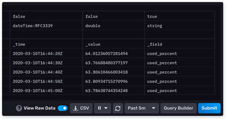

рис.11.11. Групування даних при запитуванні

## Запитання для самоперевірки

1. Поясніть необхідність використання серверів Historian.
2. Поясніть що таке Historian.
3. Які основні функції Historian?
4. Яку роль відіграє Historian в інтегруванні систем АСКТП, MOM та ERP?
5. Які можливості надає Historian для клієнтських застосунків? Наведіть приклади.
6. Розкажіть про можливу організацію ієрархії кількох Historian.
7. Розкажіть про організацію ведення бази даних часових рядів. Які їх переваги порівняно з реляційними БД.
8. Розкажіть про TICK Stack в Influx DB. Яке призначення кожного компоненту стеку?
9. Поясніть що таке Bucket в Influx DB.
10. Поясніть що таке measurement в Influx DB.
11. Для чого потрібні поля (field) і теги (tag) в записах Influx DB?   
12. Розкажіть про організацію пошуку даних в Influx DB.
