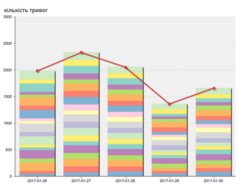

# Тема 12. Аналітичні сервіси в інтегрованих системах керування та IIoT

## Призначення аналітичних сервісів123 

У минулій лекції розглядалися сервіси зберігання даних у вигляді часових рядів. Але самі збережені дані не представляють цінності без їх обробки репрезентації. Дані можуть бути використані для машинного навчання та подальшого аналізу на предмет виявлення аномалій та їх причин, прогнозувати відмову устатковання за даними реального часу та історичними даними, робити повідомлення операторам та т.ін. Ці способи аналізу є предметом інших дисциплін. Більш простим способом є візуалізація даних, у цій лекції розглянемо саме ці можливості.   

Використовуючи спеціалізовані клієнтські застосунки разом з Historian/TSDB, можна, наприклад, вирішувати такі завдання:

- контролювати пристрій, щоб підтримувати його функціонування та визначати необхідність калібрування, ремонту чи заміни;

- контролювати процес, набір устатковання, щоб змусити його працювати в рамках набору специфікацій процесу;

- проводити моніторинг виробництва партії, порівнюючи її параметри з найкращою ("золотою") партією;

- контролювати якість продукції в межах можливостей процесу;

- контролювати виробничу лінію для досягнення максимальної експлуатаційної ефективності та мінімальних витрат;

- контролювати всі аспекти діяльності підприємства для оптимізації попиту та споживання ресурсів;

- одночасно контролювати декілька однотипних об'єктів для порівняльного аналізу;

На рис. 12.1 показано приклад використання даних Historian для відображення статистичного розподілу 20-ти найчастіших тривог (типи показано кольором) для визначення їх причин. 

 

*Рис. 11.1.* Приклад використання клієнта Historian для аналізу тривог

А на рис. 12.2 показано приклад онлайн-звіту по тривогах, який дає змогу інженерам робити висновок щодо ефективності устатковання. У звіті показано тривоги в кінці зміни, найпопулярніші тривоги за кількістю, блоковані оператором тривоги та тривоги калібрування в кінці зміни, середній показник кількості тривог за зміну, розподіл частот тривог кожного типу.  Натиснувши один із кольорових кружечків на "тепловій карті", можна перенести користувача до звіту про вибраний тип тривоги, який попередньо фільтрується на потрібний день. Користувач може продовжувати поглиблення до тих пір, поки в кінцевому підсумку не з'являться вихідні сигнали тривоги та події, які можуть бути використані для аналізу першопричини та відображення відфільтрованих подій до, під час та після аварійної тривоги.

 

*Рис. 11.2.* Приклад використання клієнта Historian для аналізу причин тривог

Аналогічно можна використовувати різноманітні застосунки для підключення до різноманітних TSDB. На сьогодні для цього є багато програмних пакетів для керування звітами. Останнім часом в область інтегрованих систем керування заходять IT продукти, і для підсистем звітності це не є виключенням. Серед популярних пакунків варто виділити Grafana, який на сьогодні займає лідируючу позицію.   

## Grafana

**Grafana** - це програмне забезпечення для візуалізації та аналітики з відкритим кодом, яке дозволяє запитувати, візуалізувати, попереджати та досліджувати показники незалежно від того, де вони зберігаються.

Нижче розглянемо вбудовані можливості Grafana.  

### Explorer

Перед побудовою панелей dashboard можна скористатися функцією Explore, за допомогою якої можна досліджувати дані за допомогою спеціальних запитів та динамічного відновлення. Це дає можливість зосередитися на формування запитів та аналізу отриманих результатів. Explore відображає результати як у вигляді графіку, так і таблиці, що дозволяє одночасно бачити тенденції в даних та більше деталей. 

Розділений вигляд забезпечує простий спосіб порівняти графіки та таблиці поруч або переглянути спільні дані на одній сторінці. Можна вибрати інше джерело даних для нового запиту, яке, наприклад, дозволяє порівняти один і той же запит для двох різних серверів або порівняти проміжне середовище із виробничим середовищем. У розділеному поданні підбирачі часу для обох панелей можна пов’язати (якщо змінити одну, зміниться і інша), натиснувши одну з кнопок синхронізації часу, прикріплену до вибору часу. Пов’язування часових інструментів допомагає синхронізувати час початку та закінчення запитів розділеного подання. 

Щоб допомогти з налагодженням запитів, Explore дозволяє досліджувати запити та відповіді на запити, а також статистику запитів за допомогою інспектора запитів. 

### Попередження (Alerts)

Якщо ви використовуєте попередження Grafana, тоді ви можете надсилати сповіщення через багато різних відправників сповіщень, включаючи PagerDuty, SMS, електронну пошту, VictorOps, OpsGenie або Slack.

Якщо ви віддаєте перевагу іншим каналам зв'язку попереджувальні хуки (Alert hooks) дозволяють створювати різні сповіщувачі з використанням фрагментів коду. Візуально визначте [правила попередження](https://grafana.com/docs/grafana/latest/alerting/) для найважливіших показників.

### Анотації (Annotations)

Анотуйте графіки до насичених подій з різних джерел даних. Наведіть курсор на події, щоб переглянути повні метадані та теги подій.

Ця функція, яка відображається як графічний маркер у Grafana, корисна для кореляції даних на випадок, якщо щось піде не так. Ви можете створювати анотації вручну - просто клацніть на графіку та вводьте текст, натискаючи клавішу Control, або ви можете отримувати дані з будь-якого джерела даних.

### Змінні інформаційних панелей (Dashboard variables)

Змінні шаблону дозволяють створювати інформаційні панелі, які можна використовувати повторно для багатьох різних випадків використання. Ці шаблони не мають жорсткого кодування, тому, наприклад, якщо у вас є робочий і тестовий сервери, ви можете використовувати одну і ту ж інформаційну панель для обох.

Шаблонування дозволяє детально переглянути ваші дані, скажімо, від усіх даних до даних Північної Америки, до даних Техасу та не тільки. Ви також можете ділитися цими інформаційними панелями між командами у вашій організації - або якщо ви створюєте чудовий шаблон інформаційної панелі для популярного джерела даних, ви можете внести його в цілу спільноту для налаштування та використання.

### Конфігурування Grafana

Якщо ви адміністратор Grafana, то вам захочеться досконально ознайомитися з [Параметри конфігурації Grafana](https://grafana.com/docs/grafana/latest/administration/configuration/) та [Grafana CLI](https://grafana.com/docs/grafana/latest/administration/cli/).

Конфігурація охоплює як файли конфігурації, так і змінні середовища. Ви можете встановити порти за замовчуванням, рівні реєстрації, IP-адреси електронної пошти, безпеку тощо.

### Імпортування інформаційних панелей та плагіни (Import dashboards and plugins)

Відкрийте для себе сотні [інформаційних панелей](https://grafana.com/grafana/dashboards) та [плагінів](https://grafana.com/grafana/plugins) в офіційній бібліотеці. Завдяки пристрасті та імпульсу членів спільноти щотижня додаються нові.

### Автентифікація

Grafana підтримує різні методи автентифікації, такі як LDAP та OAuth, і дозволяє зіставляти користувачів із організаціями. Для отримання додаткової інформації зверніться до [Огляд автентифікації користувача](https://grafana.com/docs/grafana/latest/auth/overview/).

У Grafana Enterprise ви також можете зіставити користувачів із командами: Якщо ваша компанія має власну систему автентифікації, Grafana дозволяє вам зіставити команди у вашій внутрішній системі з командами в Grafana. Таким чином, ви можете автоматично надати людям доступ до інформаційних панелей, призначених для їхніх команд.

Зверніться до розділу [Grafana Enterprise](https://grafana.com/docs/grafana/latest/enterprise/) для отримання додаткової інформації.

### Налаштування сценаріїв розгортання (Provisioning)

Незважаючи на те, що створення єдиної інформаційної панелі модна через "drag and drop", досвідчені користувачі, які потребують багатьох інформаційних панелей, захочуть автоматизувати налаштування за допомогою сценарію. Ви можете писати будь-що на сценарії Grafana.

Наприклад, якщо ви створюєте новий кластер Kubernetes, ви також можете автоматично створити Grafana за допомогою скрипта, який має правильний сервер, IP-адресу та джерела даних, попередньо встановлені та заблоковані, щоб користувачі не могли їх змінити. Це також спосіб отримати контроль над багатьма інформаційними панелями.

Для отримання додаткової інформації зверніться до [Provisioning](https://grafana.com/docs/grafana/latest/administration/provisioning/) .

#### Дозволи (Permissions)

Коли в організаціях є одна Grafana та кілька команд, вони часто хочуть мати можливість тримати речі окремо та спільно використовувати інформаційні панелі. Ви можете створити групу користувачів, а потім встановити [дозволи](https://grafana.com/docs/grafana/latest/permissions/) для папок, інформаційних панелей і аж до [рівня джерела даних](https: // grafana.com/docs/grafana/latest/enterprise/datasource_permissions/), якщо ви використовуєте [Grafana Enterprise](https://grafana.com/docs/grafana/latest/enterprise/).

### Grafana Cloud

Grafana Cloud - це високодоступна, швидка, повністю керована платформа реєстрації та метрики OpenSaaS. Там все, що вам подобається в Grafana, але Grafana Labs пропонує це для вас і вирішує всі головні болі.

[Дізнайтеся більше про Grafana Cloud](https://grafana.com/cloud/) або спробуйте [швидкий старт хосту Grafana Cloud Linux](https://grafana.com/docs/grafana-cloud/quickstart/).

### Grafana Enterprise

[Grafana Enterprise](https://grafana.com/docs/grafana/latest/enterprise/) - комерційне видання Grafana, що включає додаткові функції, яких немає у версії з відкритим кодом.

Спираючись на все, що ви вже знаєте і любите про Grafana, Grafana Enterprise додає корпоративні джерела даних, розширені параметри автентифікації, додаткові засоби контролю дозволів, підтримку 24x7x365 та навчання від основної команди Grafana.

[Дізнайтеся більше про Grafana Enterprise](https://grafana.com/enterprise). Щоб придбати Enterprise або отримати пробну ліцензію, зверніться до Grafana Labs [Команда продажів](https://grafana.com/contact?about=support&topic=Grafana Enterprise).

