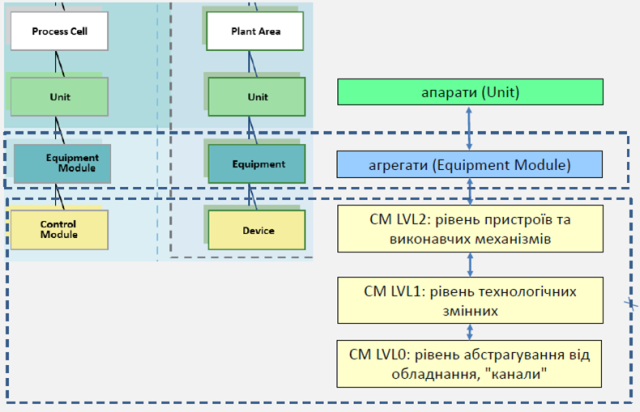
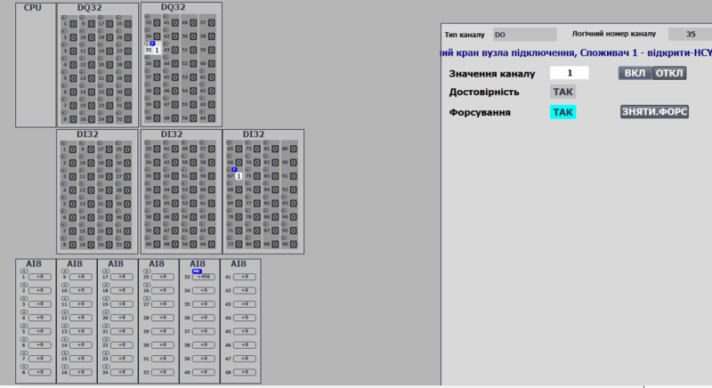
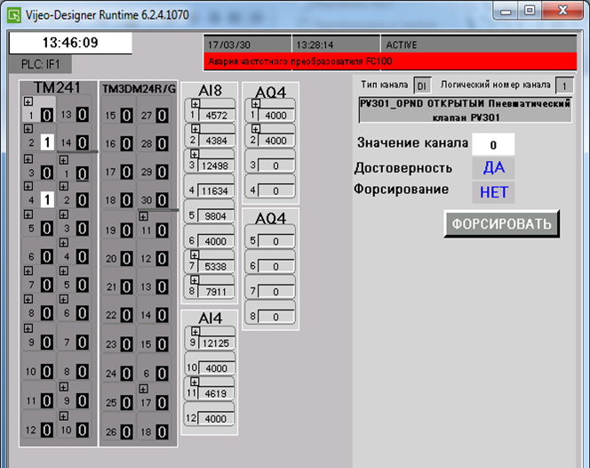
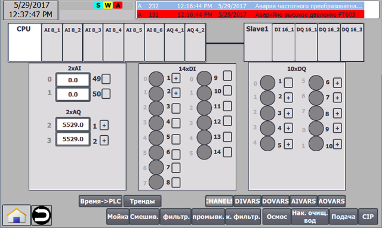
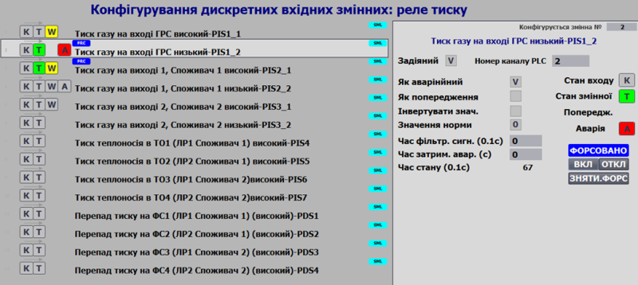
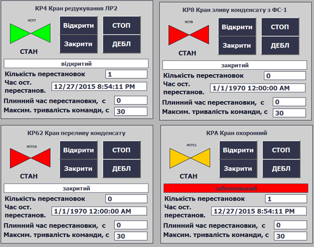
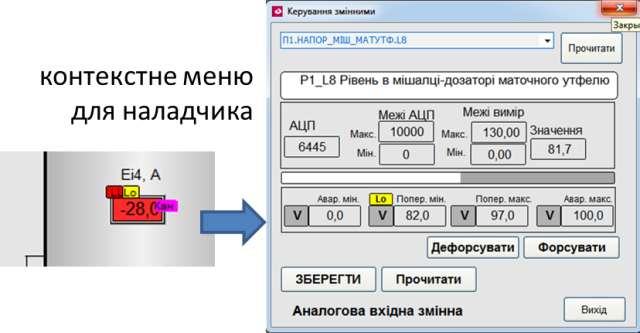

# Тема 14. Об'єктно-орієнтовані каркаси для побудови рівня АСКТП в інтегрованих системах керування

## Про програмні каркаси

Для розробки великих програмних застосунків у світі ІТ часто використовують **каркаси** (**Framework**). Згідно Вікіпедії **Фреймворк** ([англ.](https://uk.wikipedia.org/wiki/Англійська_мова) *Framework*, каркас, платформа, структура, інфраструктура)  — інфраструктура програмних рішень, що полегшує розробку складних систем. Спрощено дану інфраструктуру можна вважати своєрідною комплексною [бібліотекою](https://uk.wikipedia.org/wiki/Бібліотека_програм), але при цьому вона має ряд обмежень, що задають правила створення структури проєкту та написання коду. Програмний фреймворк ([англ.](https://uk.wikipedia.org/wiki/Англійська_мова) *software framework*) — це готовий до використання комплекс програмних рішень, включаючи  дизайн, логіку та базову функціональність системи або підсистеми.  Відповідно — програмний фреймворк може містити в собі також допоміжні  програми, деякі бібліотеки коду, скрипти та загалом все, що полегшує  створення та поєднання різних компонентів великого програмного  забезпечення чи швидке створення готового і не обов'язково об'ємного  програмного продукту. Побудова кінцевого продукту відбувається,  зазвичай, на базі єдиного [API](https://uk.wikipedia.org/wiki/API). Одна з головних переваг, при використанні каркасних [застосунків](https://uk.wikipedia.org/wiki/Застосунок), полягає в тому, що такі програми мають стандартну структуру. Каркаси  застосунків стали популярними з появою елементів інтерфейсу, які мали  тенденцію до реалізації стандартної структури для застосунків. З їх  використанням стало набагато простіше створювати засоби для  автоматичного створення графічних інтерфейсів, оскільки структура  внутрішньої реалізації коду програми стала відома заздалегідь. Для  забезпечення каркаса, зазвичай, використовують підходи  об'єктно-орієнтованого програмування, наприклад, частини програми можуть успадковуватися від базових класів фреймворку. 

Отже серед переваг використання каркасів можна виділити:

- швидкість розробки, що зумовлено наявністю готових конструкцій які враховують базовий комплект необхідних вимог та можливістю автоматизації рутинної роботи
- менша кількість помилок при створенні застосунку, за умови, що каркас відлагоджений
- стандартизація коду, що в свою чергу веде до наступних переваг:
  -  спрощується сумісна робота над одним проектом
  - спрощується супроводження, менша залежність від стилю програмування конкретної особи
  - менше помилок
  - простіше тиражування рішень

## Необхідність програмних каркасів в розробці АСКТП 

Розроблення ПЗ для АСКТП на базі каркасів зумовлено рядом додаткових причин. Серед них варто виділити типові проблеми розроблення АСКТП, які пов'язані з відсутністю передачі кращих практик та стандартів між спеціалістами, зокрема:

1.  проблеми інтеграції з MES/MOM та іншими підсистемами;

2.  низька спостережність роботи об'єкта навіть при достатній кількості вимірювальних даних;

3.  «статична» діагностика процесу без прив'язки до типу продукції та особливостей умов (характерно для Batch-процесів);

4.  погана реалізація самодіагностики та неврахування відмов в самій системі АСКТП;

5.  недостатньо продуманий механізм функціонування тривог та подій;

6.  складність, значні затрати часу на налагодження системи;

7.  складність, значні затрати часу на вияв факту несправності та усунення причин;

8.  складність, значні затрати ресурсів на навчання персоналу;

Розглянемо ці проблеми та можливі способи їх вирішення через каркас більш детально.

### Інтеграція з MES/MOM та іншими підсистемами

Проблеми інтеграції з засобами рівня MES/MOM та іншими підсистемами перш за все лежать не в площині комунікаційного обміну (зараз ці проблеми вирішується, наприклад, шляхом використання стандартних протоколів, OPC, технологій EDDL, FDT/DTM, FDI і т.п) а у функціональному представленні сутностей (об'єктів) нижнього рівня для верхнього та взаємної координації засобів одного рівня. У багатьох існуючих рішеннях на верхній рівень АСКТП (SCADA/HMI) передається \"сирі\" дані, які попередньо необхідно оброблювати. У зв'язку з недостатньою кількістю інформації (наприклад про дані що не відображаються) та порівняно невеликою швидкістю обміну між контролерами та SCADA/HMI, деякі важливі KPI (Key performance indicators, ключові показники ефективності) та статистичні чи агреговані дані на 2-му рівні, які потребуються 3-му (MES/MOM) важко обрахувати, або їх значення не може бути забезпечено з заданою точністю.

Додатковою проблемою також є відсутність (як правило) інформації про достовірність даних. Так, наприклад, ігнорується відмова каналу ПЛК при відображенні на SCADA/HMI та передачі недостовірних даних на верхні рівні MES/MOM.

У той же час, обчислювальні ресурси засобів керування, зокрема промислових контролерів, значно виросли. Тому попередню обробку даних варто робити безпосередньо в засобах автоматизації рівня керування процесом чи машиною (та навіть польового рівня). У той же час, існують стандарти, які передбачають представлення ресурсів, наприклад модель ієрархії обладнання зі стандартів ISA-88/95/106 та RAMI4.0 (німецька референтна модель Industry 4.0). Відповідно до яких, інформація по кожному обладнанню представляється своїм набором структур в пристрої, що керує/контролює цим обладнанням. Використання каркасу, який базується на цих стандартах може дати можливість робити розрахунки саме за місцем проведення вимірювань та керування конкретним обладнанням а також може зробити систему більш гнучкою стосовно варіантів функціонального розподілення. 

Також можна використати принцип функціонального розподілення (IEC TR 62390), який передбачає розділення всього застосунку (Application) на функціональні блоки і може бути використаний в різних парадигмах керування (централізована або децентралізована IEC 61131 та розподілена IEC 61499). Прикладом такого підходу є використання структур та функцій, що відповідають за керування двигуном, безпосередньо в системах керування електроприводами (PDS, частотні перетворювачі) за профілями CiA402, ProfiDrive, тощо.

Для реалізації ідей, покладених у основу вищезазначених стандартів інтеграції необхідна підтримка їх на рівні програмно-технічних засобів рівня контролерів та нижче. Як показує практика, підтримка наведеного в стандартах функціоналу в конкретних засобах SCADA/HMI сильно відрізняється. Це приводить до того, що більшу частину функціоналу приходиться реалізовувати самостійно, що найпростіше і гнучкіше зробити в самому програмованому контролері, якщо використовується парадигма IEC 61131 або гібридна.

### Спостережність роботи об'єкта (ситуаційна обізнаність)

Сучасні дослідження в області побудови та експлуатації людино-машинних інтерфейсів в АСКТП показали необхідність формування контексту для кращої ситуаційної обізнаності. Іншими словами, відображення числового значення часто не супроводжується його контекстом (місцезнаходження в межах норми, порівняння з середнім і т.п.) що погано впливає на спостережність об'єкта.

Супроводження контекстною інформацією вимагає використання структурованих а не \"плоских\" змінних, які би містили усю необхідну у будь-якому місці інформацію про технологічну змінну. Для прикладу -- це стан технологічного параметру (наявність тривог різного рівня, достовірність значення, стан обслуговування і т.п), межі норми, мінімум/максимум величини і т.п. Контекст може використовуватися як на засобах ЛМІ, так і в функціях обробки програм контролера.

У той же час, є велика кількість невикористаних ресурсів пристроїв усієї системи. Стрімке впровадження перетворювачів частоти та інших інтелектуальних засобів в АСКТП разом з тотальним розповсюдженням промислових мереж (польових шин) дає можливість отримувати велику кількість додаткових даних про стан процесу без додаткових витрат. Це дає можливість аналізувати проходження процесу на більш високому рівні.

Наприклад, з перетворювача частоти можна отримати інформацію в реальному часі про споживану потужність, момент, напруги та струми в даний час, та розраховувати KPI, за яким можна судити про його ефективність роботи. Незначні несправності, як правило, не проявляються в процесі роботи, однак збільшують енерговитрати та, зрештою, все одно приводять до нештатних зупинок. Розрахунок KPI та порівняння його з нормою дає можливість звернути увагу на несправність ще до аварійної зупинки.

Можливе збільшення ситуаційної обізнаності використання порівняння з еталонною моделлю. Наприклад, баланс за рівнем в ємності та витратами, або порівняння тиску з напірною характеристикою насосу при вказаних обертах. При інтеграції пристрою керування з хмарними сервісами, контекст може формуватися на базі хмарних обчислень, а ті в свою чергу, можуть використовувати існуючий контекст змінної.

Наведені вище можливості можна порівняно легко реалізувати при використання принципів об'єктно-орієнтованого програмування та розробки загальної гнучкої концепції.

### Діагностика процесу (Alarm Management) та обладнання і усунення несправностей

#### Тривогова підсистема.

Проблеми невдалої розробки тривогової підсистеми та способи боротьби з ними добре описані в ANSI/ISA--18.2. Зокрема найбільш типовими є затоплення повідомленнями (alarm flooding) викликане несправним обладнанням або невірними налаштуваннями тривогової підсистеми. Реалізація функцій тривогової підсистеми сильно залежить від можливостей SCADA/HMI. Так, типовим невикористаними можливостями пакета SCADA/HMI (або відсутністю такої можливості взагалі) є тимчасове виведення тривоги з обслуговування. Це нерідко приводить до нівелювання функцій підсистеми тривог взагалі. Можливість виведення каналу з експлуатації значно б спростило обслуговування системи, так як несправний канал не приводив би до обробки тривог. Крім того, факт виведення каналу може оброблятися в інших частинах програми, наприклад обробка керування клапаном з кінцевим вимикачем, який тимчасово виведений з експлуатації.

Додатковою проблемою є узгодження підсистеми тривог SCADA/HMI та керування світлозвуковою сигналізацією. Враховуючи велику залежність реалізації тривогової підсистеми від можливостей SCADA/HMI є сенс винести більшість функцій обробки тривог на рівень контролера, в якому як правило більше можливостей щодо реалізації алгоритмів. Додатковим аргументом до цього є необхідність використання функцій блокування на рівні ПЛК та означення додаткового стану поведінки логіки керування.

Для періодичних багато-рецептурних виробництв, характерне простоювання обладнання між виробничими періодами та зміна вимог до проходження процесу в залежності від рецепту. Тобто класичний підхід для АСКТП неперервних процесів, в якому формування уставок для технологічних тривог проводиться під час розробки ПЗ (та навіть в процесі налаштування) не підходить для даного випадку. Наприклад, контроль значення температури на виході теплообмінника повинен проводитися тільки під час проходження процесу нагрівання/охолодження продукту (не під час простою чи мийки), а аварійні та попереджувальні значення залежать від типу продукту. Для вирішення цієї задачі, підсистема тривог повинна адаптуватися під вимоги в залежності від типу продукту, стану обладнання та процесу, що у більшості випадків простіше зробити на рівні контролеру, аніж SCADA/HMI. Враховуючи, що для керування періодичними виробництвами розроблений та неодноразово перевірений стандарт ISA-88, є сенс базуватися на його базисах.

#### Діагностування обладнання

\"Плоский\" (неструктурований) простір змінних, які використовувалися в ПЛК ще 20-му столітті, нерідко є базою для програмного забезпечення і по сьогодні, хоч сучасні засоби дають можливість використовувати елементи об'єктно-орієнтованого програмування. \"Плоскі\" змінні вміщують тільки значення технологічного параметру, однак для правильного керування процесом необхідно мати весь його контекст. Як зазначалося вище, дуже важливою властивістю технологічної змінної є достовірність даних, яка визначається рядом показників, серед яких є відмова каналу. Сучасні ПЛК дають доволі багато можливостей програмної діагностики, тим не менше, значні затрати (не передбачені на початку життєвого циклу) на написання програми додаткової обробки достовірності в функціях керування у більшості випадків приводять до нехтування цими можливостями і відсутністю програмної діагностики взагалі. Це не стосується АСКТП для функціонально-небезпечних процесів.

Достовірність можна відобразити в статусі кожного каналу та змінної, яка пов'язана з цим каналом. Передаючи статус достовірності разом зі значенням в усі частини АСКТП, додатково до процесних станів можна ввести стан \"недостовірності\" (наприклад відмова каналу), в якому можна прописати окрему логіку обробки. Це цілком відповідає усім сучасним реалізаціям автомату станів в пристроях автоматизації процесів. Слід зазначити, що обробка недостовірності проводиться в тих самих програмних блоках, де обробляється технологічна змінна. Наприклад, якщо використовується функція стабілізаційного регулювання температури на виході теплообмінника, то при відмові каналу її значення може перейти в крайні положення, або (що ще гірше) залишитися без змін. При наявності властивості недостовірності, буде згенерована окрема тривога саме для цього параметру (наприклад, \"Відмова каналу вимірювання температури теплообмінника\") а функція стабілізації переведе клапани в безпечний для цього випадку стан. Слід відмітити, що така структура програми вимагає стано-орієнтованого підходу навіть для функцій регулювання.

#### Усунення несправностей

Відсутність контекстної діагностики процесу, обладнання та системи керування приводить до значної затрати часу на вияв факту та причини несправності. Наприклад, при обриві вхідного аналогового каналу може формуватися тривога надмірно низького рівня. При цьому елементарний програмний аналіз міг би дати результат, що канал є недостовірним. Треба відмітити, що такий рівень часто присутній в сучасних АСКТП. Тим не менше, несправність каналу може бути викликана рядом причин: наприклад несправністю вимірювального каналу до ПЛК, чи несправністю електроніки каналу в самому ПЛК. Сучасні ПЛК, надають можливість глибокої програмної діагностики каналів, з виявленням причин несправності. Ця додаткова інформація дає можливість набагато швидше усунути несправність.

Іншою проблемою є усунення дефектних частин ПЛК та заміна технічних засобів з одними характеристиками на інші. Наявність в складі підприємства запасних модулів контролерів, як правило, характерна тільки для найбільш критичних позицій. Іншими словами, для усунення несправності інколи необхідно очікувати новий модуль протягом кількох місяців, що недопустимо для всіх процесів. Враховуючи, що часто виходять з ладу канали (або групи каналів) а не весь модуль, а при цьому в ПЛК є наявні вільні (невикористані) канали такого ж типу, доречним би було надати можливість \"перекидання каналів\". Зміна технічних засобів нерідко потребує зміни діапазону вимірювання, що також необхідно передбачити в АСКТП.

### Налагодження системи

При налагодженні системи виникають ряд труднощів, пов'язаних з реалізацією АСКТП. Налагодження програми та системи в цілому потребують забезпечення виконання наступних вимог:

1)  необхідність зміни стану вхідної змінної незалежно від значення фізичного каналу для перевірки роботи алгоритму;

2)  необхідність швидкої реакції імітованих сигналів датчиків при перевірці роботи алгоритму без наявного процесу (наприклад датчики кінцевого положення клапанів, при їх відкритті);

3)  необхідність зміни значення вихідного каналу, незалежно від стану програми при перевірці вихідних каналів.

Для виконання перших 2-х вимог за класичного підходу до налагодження програми (покрокова перевірка виконання дій, оформлених в таблиці, тощо) потребується велика кількість рутинної роботи, що виконується постійно. У світі комп'ютерного програмування використовують для цього програмні тести, однак в АСКТП ці механізми недостатньо пророблені. Третя вимога потребує участь розробника ПЗ для контролерів для виконання операцій форсування, зміни значення невикористаного каналу, тощо. Допомогти в цьому може програмна імітація та форсування, які повинні бути доступні з засобів ЛМІ.

### Навчання персоналу

Нерідко навчанню персоналу взагалі не приділяється увага. Проблема пов'язана з необхідністю навчання роботи персоналу безпосередньо на реальному об'єкті. При цьому, більшість ситуацій неможливо змоделювати вручну, так як вони цілком залежать від проходження реального процесу. Критичні ситуації змоделювати на реальному об'єкті взагалі не дозволяється.

Як варіант подолання цих обмежень є використання імітаційного моделювання безпосередньо в програмі контролеру, що дасть можливість також простіше робити налагодження програмної частини системи без наявного об'єкту. Крім того, в складі програмних пакетів для розробки ПЗ контролерів великої та середньої складності як правило є імітатори ПЛК, що дає можливість \"розгорнути\" систему управління у будь якому місці. 

## Основні ідеї PACFramework

На сьогоднішній день нам невідомі готові відкриті каркаси. Деякі організації розробників інструментального ПЗ пропонують свої варіанти, які базуються виключно на певному типі обладнання. Свої каркаси розробляють інтегратори, але вони як правило закриті і/або не описані. Співробітниками кафедри АКТСУ НУХТ розроблений власний відкритий каркас **PACFramework**, який враховує описані вище особливості. Опис каркасу доступний на ГітХаб за посиланням <https://github.com/pupenasan/PACFramework>. В цій лекції розглядаються тільки основні ідеї.

Запропоновані концепції мають за мету швидку розробку прикладного ПЗ для контролерів АСКТП з урахуванням максимальної кількості типових вимог до функціональності та можливої інтеграції з іншими підсистемами.

Каркас передбачає:

-   використання єдиних принципів розробки ПЗ для програмованих контролерів IEC 61131 (і не тільки) для різних типів об'єктів середньої (порядку \>100 каналів) та великої канальності та алгоритмічної складності;

-   використання єдиних підходів до організації ієрархії керування;

-   узгоджений набір типів даних, класів функцій/функціональних блоків для будь-яких об'єктів;

Каркас може бути реалізований на будь-яких апаратних та програмних засобах і мовах програмування, які мають можливість та ресурси для його реалізації. Запропоновані інтерфейси та структури за необхідності можуть бути змінені та доповнені не порушуючи загальної ідеології.

Каркас PACFramework базується на об'єктній моделі устатковання ISA-88/95, яка описана в попередній лекції. Рівень модулів керування є характерним для всіх типів виробництв, тому він пророблений в каркасі найкраще. Устатковання для інших рівнів використовується за необхідності. 

### Ієрархія устатковання рівня CM

#### Ієрархія CM

ISA-88 та ISA-95 дозволяє включати модулі керування (CM) в інші модулі керування. У каркасі, незалежно від типу технологічного процесу, яким керує АСКТП, на рівні модулів керування (Control Module) пропонується виділяти типові апаратурні об'єкти 3-х рівнів або шарів (див. рис.14.1):

-   0-й (LVL0) канали контролеру - для діагностики каналу, прив'язки логічних каналів до фізичних, форсування входів/виходів:

    -   DICH - дискретні входи,

    -   DOCH - дискретні виходи,

    -   AICH - аналогові входи,

    -   AOCH - аналогові виходи,

    -   COMCH -- комунікаційні канали

-   1-й (LVL1) - технологічні змінні для повної обробки інформації з процесу, включаючи прив'язку до каналу, фільтрацію, масштабування, інверсію і т.п.; для зручності відлагодження процесу; для функцій імітаційного моделювання; для функцій технологічної сигналізації;

    -   AIVAR - аналогові вхідні,

    -   AOVAR - аналогові вихідні,

    -   DIVAR - дискретні вхідні,

    -   DOVAR - дискретні вихідні:

-   2-й (LVL2) - для зручності налагоджування процесу; для функцій імітаційного моделювання; для функцій технологічної сигналізації; для ведення статистики:
-   виконавчі механізми (запірні клапани, регулюючі клапани, двигуни, насоси);
    
-   контури регулювання та управління: для функцій керування зі зворотним зв'язком;

Рис.14.1. Ієрархія CM.

Усі наведені вище елементи з точки зору ISA-88 є Модулями керування (CM, Control Module), а з точки зору ISA-106 -- Пристроями (Device). Для уніфікації назв ми користуємося термінологією ISA-88, як діючою на сьогоднішній день. Усі CM-ми формують трирівневу ієрархію, що дозволяється стандартом ISA-88.

Трирівнева архітектура передбачає модель взаємодії між рівнями:

-   обробка усіх елементів незалежно від рівня проводиться паралельно, тобто вкладеності виклику POU немає, модель підлеглості реалізовується через механізм заволодівання (Allocation), або звичайними програмними зв'язками;

-   2-й рівень (виконавчий механізм, регулятор) не може взаємодіяти безпосередньо з 0-м (каналом);

-   усі елементи вищого рівня можуть взаємодіяти з будь-якими елементами нижчих, за винятком 0-го рівня (див. попередній пункт)

-   вищий рівень може змінювати стан нижчого: змінювати його значення, переключати в різні режими (форсування, імітація), змінювати налаштування тривог і т.д.

-   елемент 1-го рівня (змінні) може заволодіти (allocation) елементом першого (канали)

-   0-й рівень (канал) знає хто ним володіє

-   1-й рівень (змінна) знає ким він володіє

-   при реалізації об'єктів на різних пристроях (в розподілених системах) механізм взаємодії між ними відбувається через пару СТАН-КОМАНДА (механізм описаний нижче) а при реалізації в тому ж пристрої дозволяється використовувати як безпосередню зміну значення у підлеглого об'єкту (прямий доступ), так і через взаємодію СТАН-КОМАНДА.

#### Канали (LVL0) та карта ПЛК

Найнижчий рівень модулів керування (**канали**) забезпечує абстрагування від конкретики пристроїв (ПЛК, розподілена периферія, тощо). Тобто реалізація цього рівня залежить як від вибраної платформи так і способу реалізації. Елементи CM типу «канали» представляють масиви усіх існуючих каналів контролеру, незалежно від їх розташування (локальне шасі, віддалений ввод/вивід) і задіяння (використання) в процесі. Кожен елемент масиву ідентифікується за унікальним номером, а прив'язка до фізичного каналу відбувається жорстко на програмному рівні. CM-ми типу «канал» прив'язують свої значення до фізичного значення конкретного каналу, а також виконують наступні функції:

-   надають діагностичну інформаціє вищим рівням CM -- як мінімум ознаку достовірності, а за можливості і причину відмови/несправності каналу;

-   передбачають режим форсування значення:

    -   примусова зміна значення вхідного каналу, незалежно від значення входу;

    -   примусова зміна значення вихідного каналу, незалежно від значення, що передається на нього змінною;

-   показують факт прив'язки до каналу технологічної змінної та номер змінної;

На рис.14.2-14.2 показані приклади дисплейних кадрів з реалізацією вказаних функцій на різних платформах з різними ресурсними обмеженнями. Такі мнемосхеми надалі в каркасі звуться **картою ПЛК**. Символом «+» відмічені задіяні в ПЛК канали. Інформація по кожному каналу доступна по натисканню на ньому. На карті ПЛК доступні функції відображення прив'язаного каналу, ознака достовірності, команди форсування. У випадку апаратної помилки канал підсвічується червоним. У реалізаціях з дуже обмеженими можливостями можливо відмовитися від певних функцій, якщо це значно ускладнює систему або вимагає задіювання надмірно великої частини ресурсів.

Рис.14.2 Приклад використання функцій каналів на HMI (варіант з достатніми ресурсами Simatic Comfort Panel: TIA).

Рис.14.3 Приклад використання функцій каналів на HMI (варіант з середніми ресурсами Magelis: VijeoDesigner).

Рис.14.4 Приклад використання функцій каналів на HMI (варіант з обмеженими ресурсами Simatic Basic Panel TIA).

#### Технологічні змінні (LVL1) та карта змінних

СМ-ми першого рівня, типу **технологічні змінні** можуть бути прив'язані до каналу того ж типу (наприклад дискретний вхід до дискретної вхідної технологічної змінної) по їх номеру. Таким чином прив'язка технологічної змінної до каналу є динамічною, що дозволяє змінювати розташування фізичного підключення конкретного датчика/ВМ у випадку виходу з ладу частини системи. Крім того, таке переключення може бути програмним.

Технологічні змінні знаходяться вище за канали по ієрархії керування. Уся діагностична інформація передається від каналів до змінних. Реалізація цього рівня не залежить від апаратних особливостей контролера, так як усі платформо-залежні тонкощі реалізується на рівні каналів, інтерфейс яких є стандартизованим в каркасі. Технологічні змінні забезпечують наступну функціональність:

-   прив'язка до каналу за його номером та типом

-   відключення з обслуговування (деактивація тривог змінної, врахування верхніми рівнями)

-   відслідковування достовірності значення за помилкою прив'язаного каналу, виходу за діапазон вимірювальної величини, тощо;

-   діагностика роботи каналу (передача діагностичної інформації з прив'язаного

каналу на верхній рівень)

-   обробка вхідного/вихідного значення: масштабування (в т.ч. за необхідністю кусочно-лінійна інтерполяція), фільтрування, інвертування (для дискретних змінних);

-   наявність режиму ручної зміни (форсування); відповідно до ISA-88 - «ручний режим»

-   наявність режиму імітації, в якому для вхідних змінних, значення змінюється CM-мами верхнього рівня (або незалежною програмою), а для вихідних змінних, відбувається замороження значень вихідних каналів

-   обробка тривог (ISA 18.2): реагування на порогові значення, врахування затримки на спрацювання (за необхідності межі задаються окремими уставками), гістерезис, формування загального системного біту аварії/попередження, нова тривога (на один цикл);

-   конфігурування обробки тривог (ISA 18.2): налаштування значень тривог, типів тривог (аварія/попередження/відмова каналу), тимчасове зняття тривоги з обслуговування;

Приклад діагностики та конфігурування аналогових змінних на HMI показаний на рис.14.5 та рис.14.6 Вікна де наводяться перелік всіх технологічних змінних в каркасі називається **картою технологічних змінних**.

Рис.14.5 Приклад використання функцій аналогових вхідних змінних на HMI.

Рис.14.6 Приклад використання функцій аналогових вихідних змінних на HMI.

Статуси змінних (тривоги, відмови, форсування) супроводжують відображення змінної на всіх мнемосхемах HMI. На рис.14.7 показаний приклад відображення попередження для змінної PT102 для панелі з обмеженою функціональністю (Simatic Basic Panel).

Рис.14.7 Приклад відображення статусу змінної HMI.

Окремо виділяються технологічні змінні, які:

-   мережні - мають джерело даних на інших вузлах (мережні), адреса якого не може змінюватися в процесі експлуатації

-   розрахункові (внутрішні) - розраховуються на базі кількох інших змінних або каналів

Передбачається, що ці змінні будуть входити як підкласи в AIVAR, AOVAR, DIVAR, DOVAR. У функціях обробки необхідно передбачити особливість обробки цих змінних відповідно до номеру класу (CLSID) або за ID. Для зручності область ідентифікаторів (ID) для змінних також варто виділити окремо.

#### Модулі керування, контури, ВМ (LVL2)

CM-ми 2-го рівня представляють собою виконавчі механізми, регулятори, тощо та включають в себе функції базового керування (згідно термінології ISA-88). Кожний такий CM передбачає двохсторонню взаємодію з «технологічними змінними» як для запису так і для читання. Це дозволяє на даному рівні окрім реалізації специфічного функціоналу для конкретного CM, забезпечувати наступні можливості:

-   враховувати стан технологічної змінної (норма/тривога/достовірність) та діагностичну інформацію при керуванні логікою виконання CM;

-   імітацію роботи CM за допомогою включеного в нього моделюючого алгоритму (за необхідністю) для:

    -   розширеної моделеорієнтованої діагностики процесу;

    -   моделеорієнтованого керування;

    -   роботи в імітаційному режимі для демонстрації/навчання персоналу або налагодження системи;

-   включення в режим імітації CM та всіх пов'язаних з ним CM нижчого рівня;

-   статистичну інформацію (в залежності від типу СМ)

Для кожного апаратурного об'єкту (Equipment Entity) визначається алгоритм роботи функціонального блоку/функції, структури даних (інтерфейс) для обміну з іншими підсистемами/об\'єктами.

Структура даних та поведінка функції/ФБ сумісна з означеною в ISA-88, тобто базується на автоматах станів, режимах та інтерфейсі, означеному в стандарті.

На рис.14.8 показаний приклад конфігурування та діагностики роботи кранів.

Рис.14.8 Приклад конфігурування кранів на HMI.

### Рівень SCADA/HMI 

#### Загальні принципи розробки SCADA/HMI

Каркас передбачає використання певних правил і на рівні SCADA/HMI. Імплементація каркасу для платформ з різними функціональними можливостями показала здатність масштабування та адаптації каркасу для обладнання та ПЗ з різними можливостями. У будь якому випадку концепція вимагає передачі великої кількості даних, що значно здорожує систему у випадку ліцензування SCADA/HMI по кількості тегів вводу/виводу. Для зменшення навантаження на мережу та економії тегів вводу/виводу прийняті наступні принципи:

-   розділення розміщення даних реального часу від конфігураційних даних;

-   пакування бітів в слова, відмова від бітових (булевих) структур;

-   використання буферу для конфігурування однотипних об'єктів

Більш детально наведені принципи описані нижче. Хоч каркас не обмежує використання HMI у цих та всіх інших аспектах, ми рекомендуємо використовувати методики описані в стандартах ISA18.2 та ISA101.

#### Принципи використання буферного обміну

Окрім даних реального часу (RT DATA - значення змінних, статуси) з кожним CM пов'язана велика кількість конфігураційних даних (CFG DATA), які потрібно передавати в/зі SCADA/HMI тільки за необхідністю. Більшість SCADA/HMI ліцензуються за кількістю точок вводу/виводу. Тому для зменшення великої кількості конфігураційних даних що циркулюють між SCADA/HMI та контролером пропонується використовувати **буфер**. Для кожного масиву (набору) однотипних CM рекомендується використовувати свій буфер. Окремі буфери можна застосовувати для всіх об'єктів рівня. Тобто, наприклад, для усіх каналів (LVL0), змінних (LVL1) кранів (LVL2) можна виділити окремі буфери. Кожен CM має унікальний в межах набору ідентифікатор (може використовуватися унікальне поєднання ID та ідентифікатору класу CLSID), за яким можна його зв'язати з буфером (див. рис.14.9). Отримуючи команду на читання (READ\_CFG), CM завантажує свої дані в буфер та пов\'язується з ним (займає/оволодіває ним). Дані реального часу (RT DATA) постійно оновлюються буфері, за цим слідкує реалізація CM в контролері. Це можуть бути не тільки видимі RT DATA, а додаткові відлагоджувальні дані (номер кроку, час кроку, значення інтеграла і т.п.). Конфігураційні дані оновлюються в буфері тільки по команді на читання. Це зроблено для того, щоб оператор міг змінити ці значення в буфері і записати їх в CM за командою (WRITE\_CFG).

Рис.14.9 Приклад конфігурування кранів на HMI.

Не дивлячись на значну економію ресурсів, використання буферу супроводжується рядом обмежень. Найбільш суттєвим обмеженням є неможливість використання буферу з 2-х та більше засобів ЛМІ. При одночасному використанні, буфер \"відбирається\" останнім користувачем. Також в каркасі наразі не пророблений механізм блокування буферу, для унеможливлювання його одночасного використання. Вирішенням може бути використання кількох буферів - для кожного клієнта окрема змінна.

Інший можливий спосіб конфігурування через буфер -- використання принципів REST(*Representational State Transfer*). Буфер не займається об'єктом, а передається окремою змінною. При запиті на читання від клієнта (SCADA/HMI або іншої підсистеми), заповнення відбувається аналогічно до попереднього способу. В змінній буфера передається уся заповнена структура, по ID і CLSID визначається об'єкт, дані про який передаються. Значення з буферу після читання записується у внутрішню змінну клієнта, після чого сеанс завершується. Навіть при одночасному зверненні, клієнт зможе проконтролювати результат запиту на читання. Аналогічно проводиться запис: спочатку проводяться зміни в локальній змінній-буфері клієнта, після чого вміст змінної копіюється в буфер ПЛК. На відміну від механізму займання буферу, оновлення змінних в буфері клієнта може відбуватися тільки постійним формування запиту на читання. Крім того, деякі засоби SCADA/HMI мають обмеження на пере-присвоєння та збереження цілісності структури буферу, що унеможливлює використання такого підходу. Однак такий підхід є кращим при реалізації рішень IIoT з використанням каркасу, так як не передбачає постійний обмін між хмарою (Cloud) та пристроєм за місцем (ПЛК, Edge).

Іншим недоліком обміну конфігураційними даними через буфер є відмова від табличних виглядів карт ПЛК та технологічних змінних. На практиці є рішення, які дозволяють обійти це обмеження, але цей варіант вимагає значних затрат на написання скриптів з боку SCADA/HMI, що не завжди можливо.

Досить зручним на практиці виявився механізм так званого \"**контекстного налаштування**\". У цьому випадку, виклик вікна налаштування (налагодження) відбувається в місці відображення CM на основних мнемосхемах. Це значно пришвидшує налагодження, так як не потребує перехід на карти технологічних змінних задля форсування, зміни налаштувань, тощо. Наразі цей механізм був випробуваний на кількох проектах як зі SCADA так і з HMI. З боку контролеру ніяких додаткових функцій не прописується, так як використовується той самий механізм буферів. З боку SCADA/HMI необхідно передбачити подію для графічних елементів, яка б ініціювала читання в буфер (вибір). Для SCADA це може бути пункт контекстного меню, для HMI -- натискання на частині елементу відображення, тощо.

Рис.14.10 Приклад контекстного налаштування: права кнопка миші -- виклик спливаючого екрану з функціями налаштування (реалізація в SCADA Citect).

#### Панель статусу

На засобах ЛМІ рекомендується використовувати панель статусу для відображення загального стану процесу (наприклад, як на рис.14.11). Це може бути:

-   наявність ручного режиму хоча б на одному з виконавчих механізмів

-   наявність форсування хоча б на одному з CM

-   наявність режиму імітації хоча б на одному з CM

-   наявність хоча б одної тривоги рівня \"попередження\"

-   наявність хоча б одної тривоги рівня \"аварія\"

-   наявність хоча б одної тривоги рівня \"недостовірність\"

-   тощо

Рис.14.11. Можливий вигляд панелі статусу.

Панель статусу миттєво дає представлення про стан системи і нагадує про необхідність зміни режиму. Подібні механізми використовуються в ПЛК, в якому індикаторні лампи показують про стан модуля або усього пристрою. Так, наприклад, в режимі форсування, на ПЛК S7 300 горить відповідний індикатор. Аналогічно для технологічного процесу або установки можуть використовуватися світлосигнальні лампи.
