# Тема 1. Інтегровані системи керування в епоху Індустрії 4.0

Четверта промислова революція була об’явлена до того, як вона відбудеться. Можна казати про епоху 4-ї промислової, але про факт її настання очевидно що ще рано. Словосполучення “Industrie 4.0” – є назвою Німецької програми розвитку цифрового виробництва. У інших передових країнах подібні програми розвитку називаються інакше. Наприклад в США це зветься промисловий Інтернет Речей (Industrial Internet of Things). 

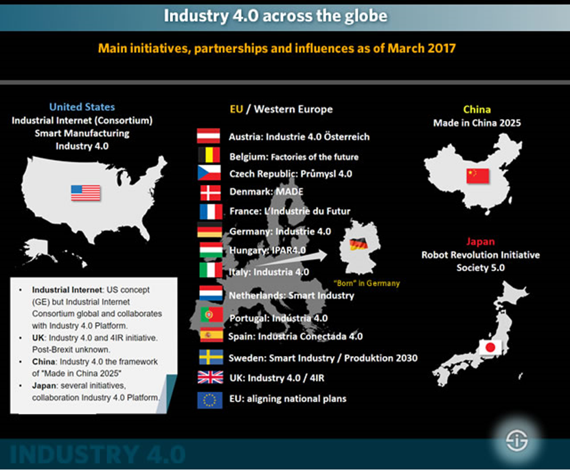 

рис.1.1. Державні програми цифрової трансформації у різних країнах. 

В Україні національної програми наразі немає. Натомість є національний рух "Індустрія 4.0 в Україні" (<https://industry4-0-ukraine.com.ua> ), який об'єднує велику кількість національних компаній для інтенсифікації розвитку та впровадження високих технологій на виробництві.  

Індустрія 4.0 (Industry 4.0) - провідний тренд «Четвертої промислової революції», яка відбувається на наших очах. Зараз розвинуті країни живуть в епоху завершення третьої, цифрової революції, що почалася в другій половині минулого століття. Її характерні риси - розвиток інформаційно-комунікаційних технологій, автоматизація та роботизація виробничих процесів. Характерні риси Індустрії 4.0 - це повністю автоматизовані виробництва, на яких керівництво всіма процесами здійснюється в режимі реального часу і з урахуванням мінливих зовнішніх умов. Визначення `Industrie4.0` можна знайти в стратегії впровадження, представленій німецькою платформою Plattform Industrie 4.0 в квітні 2015 року, керівництво якої перейшло до німецької федеральної адміністрації:

> Термін Industrie 4.0 означає четверту промислову революцію, новий рівень організації та керування усім ланцюжком створення вартості протягом життєвого циклу продукції. Цей цикл орієнтований на все більш індивідуалізовані запити споживачів і тягнеться від концепції, до замовлення, далі до розробки та виготовлення, потім до доставки товару кінцевому споживачеві і аж до процесу переробки, включаючи супутні послуги

Це дає зрозуміти, що ми маємо справу з фундаментальною трансформацією методів промислового виробництва, а не просто зі зміною будь-якої окремої частини цих методів. Що служить основою для цього? Друге речення офіційного означення відповідає на запитання у відповідному розділі стратегії впровадження:

> Основою є доступність усієї відповідної інформації в реальному часі через мережу всіх екземплярів, які беруть участь у ланцюжку створення вартості, а також можливість використовувати дані в будь-який час для отримання оптимального потоку створення вартості. Завдяки підключенню людей, об’єктів та систем створюються динамічні мережі, оптимізовані в режимі реального часу, самоорганізовані та міжкорпоративні створення вартості, які можна оптимізувати відповідно до різних критеріїв, таких як витрати, доступність та споживання ресурсів.

Таким чином, усі компоненти ланцюжка доданої вартості у тому числі сам продукт є активними учасниками виробництва і зв'язуються між собою через їх представлення у цифровому світі. Такі **Кібер-фізичні системи** (**CPS**) створюють віртуальні копії об'єктів фізичного світу, контролюють фізичні процеси і приймають децентралізовані рішення. Вони здатні об'єднуватися в одну мережу, взаємодіяти в режимі реального часу, самоналагоджуватися і самонавчатися. Важливу роль відіграють інтернет-технології, що забезпечують комунікації між персоналом та машинами. Підприємства виробляють продукцію відповідно до вимог індивідуального замовника, оптимізуючи собівартість виробництва.

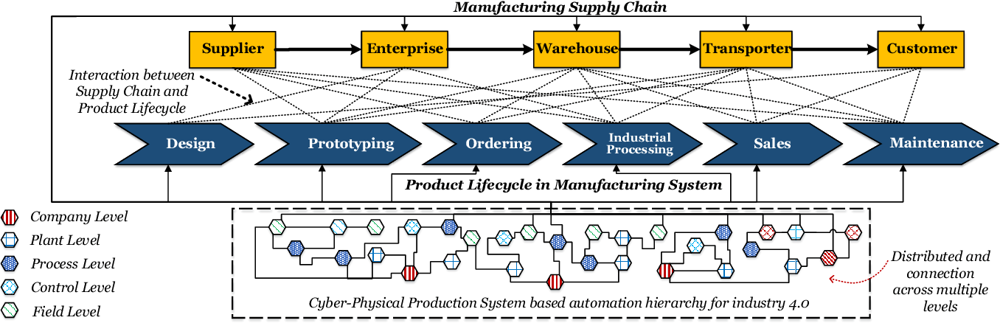

рис.1.2. Кіберфізичні системи у ланцюжку доданої вартості

До впровадження ідей Індустрії 4.0 інтегровані системи керування (ІСК) частково або повністю перекривали функції керування на рівні усього підприємства. Зрештою, її структуру можна було представити у вигляді пірамідальної моделі (рис.1.3). 

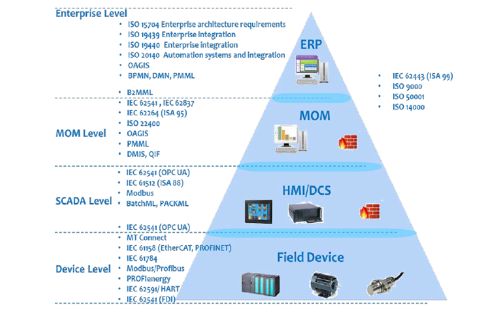

рис.1.3. Піраміда керування промисловим виробництвом

Протягом кількох десятиліть створювалися та розроблялися стандарти, які забезпечували інтеграцію різних рівнів керування. Ці стандарти дали можливість розробляти розумні екосистеми, які забезпечували швидке виготовлення продукції під замовлення з заданими показниками. Такі екосистеми передбачають інтеграцію систем керування за усіма виробничими ланцюжками: продукту, системи виготовлення продукції, замовлення та інших  (рис.1.4)

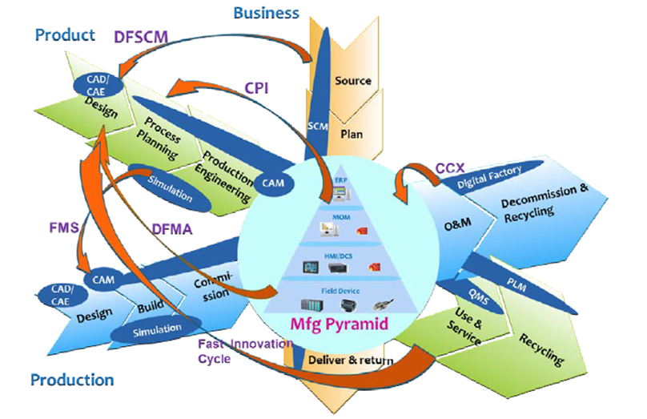   

рис.1.4. Розумна виробнича екосистема 

У продовження такого підходу, в епоху індустрії 4.0 передбачається ряд змін. Зокрема ланцюжок замовлень може початися від кінцевого користувача, а не тільки від проміжного підприємства постачальника. Крім того, враховуючи взаємодію у ланцюжку кількох компаній, інтегровані системи керування повинні передбачати такі зв'язки (рис.1.5). Тобто відбувається прорив за межі підприємства.   

   

рис.1.5. Гнучке промислове виробництво в епоху 4.0

Ланцюжки по всім іншим життєвим циклам також передбачають вихід за межі підприємства. Тепер велика увага приділяється саме активам (Asset), так як кожен з них має свою історію, яка може бути корисною на кожному з етапів життєвого циклу. Це значить що на етапі експлуатації можуть використовуватися ті самі дані, що і на стадіях проектування. У свою чергу операційна діяльність активу може стати в нагоді покращення виробництва нових активів того ж типу. Такі зв'язки передбачають наявність цифрових двійників, які вміщують усі дані та моделі, що пов'язані з активом.      

Обсяг виробничих даних які збираються під час виробництва є дуже великим. Сьогоднішні технології BigData дозволяють робити швидкий аналіз цих даних та формування додаткових результатів по виявленню причин та прогнозування. Це у свою чергу також можливе тільки за умов інтеграції систем керування з хмарними сервісами, що дають можливість це зробити.     

Це тільки частина з тих можливостей, які передбачається впроваджувати в системах в епоху Індустрії 4.0. у будь якому випадку це передбачає по новому розглядати процес розроблення самих інтегрованих систем керування, які також є активами. Для підприємства-розробника (інтегратора, інжинірингової компанії) це є продуктом, а для виробничої екосистеми - інтегрованою системою керування. Метою даного курсу є формування знань з технологій та процесів керування життєвими циклами інтегрованих систем керування в епоху Індустрії 4.0. Дисципліна направлена на вивчення основних принципів розробки інтегрованих систем керування в епоху Індустрії 4.0, цифрових двійників як основи керування життєвим циклом, розгляд реферативних моделей IIC та RAMI4, місце Інтегрованих систем керування в промисловому Інтернеті речей, технічного забезпечення новітніх інтегрованих систем керування на базі промислового Інтернету речей, моделе-орієнтованого проектування інтегрованих систем керування.   

Впровадження Індустрії 4.0 передбачає використання ряду технологій, які з'явилися порівняно недавно. Ці технології великою мірою стосуються IT, і вже використовуються в багатьох як виробничих, так і не виробничих секторах. Частина з цих технологій і є також предметом даної дисципліни.   

## Огляд технологій Індустрії 4.0

Для початку розглянемо усі супутні технології, які спонукали замислу щодо інших підходів до автоматизації виробництва. 

Перші технології які інтенсифікували ці процеси – це мобільні телефони та смартфони. Це один із самих великих драйверів переходу в епоху Індустрії 4.0. Звичайно, сам по собі смартфон, навіть самий потужний немає такої ефективності без Інтернету. Зараз Інтернет є цифровим представленням знань, та великої кількості послуг. Окрім смартфонів і ноутбуків до Інтернету підключено багато різних речей. Об’єднання речей в мережу Інтернет так і стали називати «**Інтернет речей**» (**IoT** **Internet** **of** **Things**).    

Зрештою, перехід від фізичних «нерозумних» речей до «розумних», які ще й спілкуються між собою, відбувається в кілька кроків. Спочатку робиться цифровий двійник цієї речі в Інтернеті. Наприклад десь на хмарній платформі (від Google, Amazon, Microsoft, IBM) з’являється віртуальна копія. Потім відбувається зв’язок цього двійника через фізичну взаємодію з річчю. 

Якщо дуже спрощено, то цифровий двійник – це така собі база даних та програми, які відображають дійсний стан фізичного пристрою у світі. Наприклад, якщо у Вас увімкнений двигун, то в цій базі даних буде відображатися час, коли його включили, яка частота обертів, струм, споживання і т.п. Крім сьогодення, двійник відображає минуле (скільки раз двигун включався та при яких параметрах працював) та майбутнє (наприклад, прогнозування виходу з ладу). А ще там можуть зберігатися багато документів про те, яка його конструкція і як його збирали та моделі, які можна використовувати для прогнозування. У професійному представленні промислового Інтернету речей цифровий двійник це набагато більше ніж просто певне представлення речі у світі, це буде обговорюватися в іншій лекції.

Будь яку річ можна з’єднати з віртуальним світом, користуючись наприклад, однопалатним комп’ютером. Для промислових рішень використовують промислові комп'ютери Industrial PC (iPC), наприклад як показано на рис.1.6. 

 

рис.1.6. Промисловий комп'ютер класу Edge . 

Для мобільних речей, які необхідно ідентифікувати для визначення зв'язку з їх віртуальною сутністю можна використати технологію радіочастотної ідентифікації (RFID) або ідентифікацію за допомогою QR-коду.   

Тому не тільки люди через свої гаджети, а і речі через якісь цифрові інтерфейси можуть спілкуватися, і організовуючи таким чином Інтернет речей. 

Технології Індустрії 4.0 дають можливість максимально кастомізувати продукт під потреби кінцевого замовника. Припустимо, захотілося замовнику купити рюкзак з зображенням улюбленої рок-групи і зі своїм продуманим дизайном. Він може зайти через телефон в Інтернет-магазин і сам спроектувати свій рюкзак. Після натискання кнопки «розрахувати» йому видається терміни і вартість. Далі це замовлення **автоматично** проходить по всьому ланцюжку постачань (обробка, виробництво, постачання) і доставляється замовнику додому. 

Для Індустрії 4.0 речі які виготовляються тобто є продуктом зрештою можуть стати частиною іншого розумного виробництва. Тому виробничий ланцюжок завершується не як споживчий товар, а як частина іншого ланцюжка. Це є частиною розумного виробництва Індустрії 4.0.

Окрім класичних технологій керування все більше потребується програмування. Тому сучасні автоматники сьогодні потребують компетенцій IIoT.  

IoT на виробництві називається промисловим Інтернетом речей (IIoT). Технологія IIoT, що базується на Internet, цифрових двійниках, різноманітних шлюзах і мережних пристроях, та включає автоматизовані системи керування а також інші сучасні технології і є основою Індустрії 4.0. 

До технологій 4.0 відносять з десяток технологій, які тільки зараз знайшли своє відображення в розумному виробництві. Вони описані нижче.       

Отже, існують два взаємопов’язані світи – цифровий (віртуальний) і реальний. Хоч цифровий світ також реальний, речі в ньому віртуальні. Людина перебуваючи у цифровому світі, сприймає його як нереальний. І тут на допомогу приходять технології **Віртуальної реальності** (VR). Одягнувши шлем і спеціальні рукавиці можна походити по віртуальному підприємству, навіть якщо у фізичному світі його ще не існує. Так, цифрові двійники часто з’являються ще до появи фізичних речей. У промисловості віртуальна реальність використовується для навчання, тренування та перевірки моделей. 

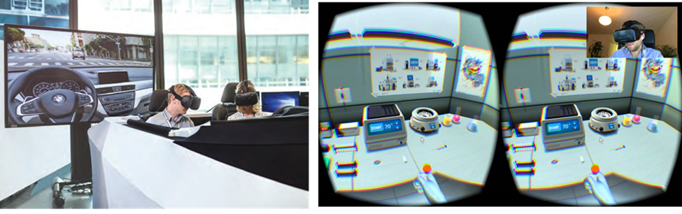 

рис.1.7. Віртуальна реальність. 

Візуальний зв'язок світів можна реалізувати **доповненою реальністю** (**Augmented reality** – AR). На виробництві, доповнена реальність може допомогти при ремонті обладнання, показуючи на реальному обладнанні через наприклад планшет, що необхідно зробити в якому місці. Доповнена реальність також стрімко входить у бортові системи автомобілів, підказуючи, наприклад, як паркуватися або куди повертати показуючи це безпосередньо на лобовому склі. 

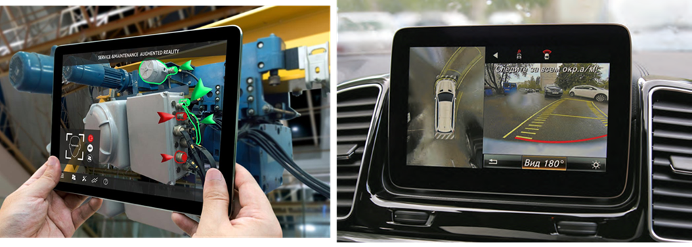 

рис.1.8. Доповнена реальність. 

Окуляри з можливістю відображення та знімання відео, наприклад google glass, є гарним додатком до доданої реальності і поступово впроваджуються в сферу обслуговування обладнання на виробництві.

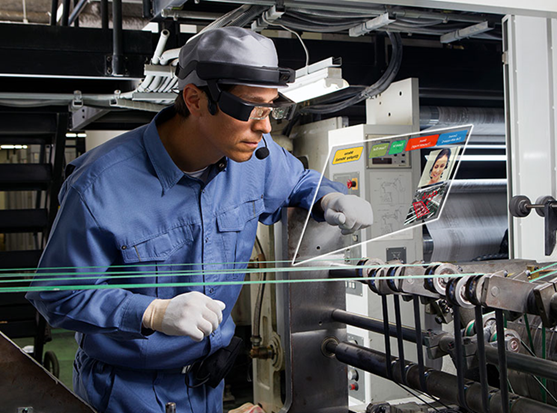 

рис.1.9. Використання окулярів в доповненій реальності. 

Очевидно, що як би там все не автоматизувалося, поки що певну роботу на виробництві виконують люди. Усю рутинну роботу виконують машини, а інколи роботи. Роботи які працюють разом з людиною називають ***коботами***. Коботи працюють таким чином, щоб максимально взаємодіяти з людьми і іншими коботами. При русі кобота через перешкоду, він зупиняється, щоб не зашкодити людині або іншому обладнанню. Таким чином коботи безпечні, а для промислових роботів безпечність треба реалізовувати з використанням спеціального обладнання, наприклад бар'єрів безпеки. Коботи можуть наприклад збирати щити під наглядом людини, або робити певні складальні операції. 

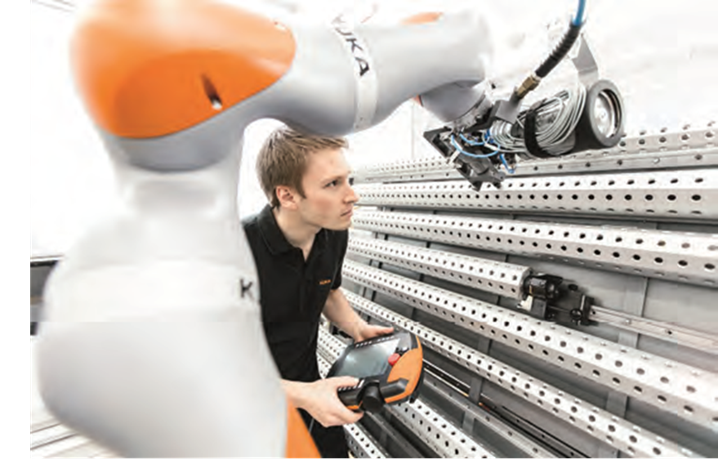 

рис.1.10. Кобот. 

У результаті довгої роботи речей в цифрових двійниках накопичується велика кількість історичних даних. Це велика кількість інформації, на основі якої можна зробити певні висновки і навіть робити прогнозування. Це робиться не простим аналізом таблиць людиною або вибірками зі статистикою, а спеціальними алгоритмами для обробки ***Великих даних*** (**Big Data**). Оскільки великі дані не можуть накопичуватися безпосередньо в речах, вони зберігаються у їх цифрових двійниках в хмарах. Спеціально розроблені а інколи навчені алгоритми, пропускають через себе ці дані і видають рекомендації. 

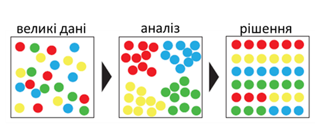 

рис.1.11. Аналіз даних. 

Для обробки великих даних і прийняття рішень на основі них, може знадобитися ***штучний інтелект*** (Artificial Intelligence). Це можуть інтелектуальні системи на базі нейромереж або експертні системи на базі знань. Штучний інтелект дозволяє вирішувати великий спектр задач – від розпізнавання образів до генерування відповідей на складні запитання.   

Зараз виробництво часто використовує ***Адитивні технології*** *(**3D друк***). Він використовується для створення одиничних або малосерійних деталей чи виробів, для виготовлення яких раніше потребувалося б налагоджувати окремі лінії. 

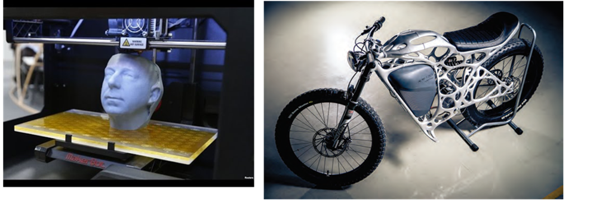 

рис.1.12. 3D-друк.

Окрім коботів в реальному житті масово почали використовуватися ***Роботи-дрони***. Вони використовуються для різних цілей – наприклад доставки або спостереження. 

Наведені вище технології і складають основу Індустрії 4.0, про яку сьогодні усі говорять. Вона включає цілий комплекс взаємопов’язаних технологій і діяльностей. Тому в Індустрії майбутнього задіяно багато виробничих спеціальностей, які сьогодні прийнято відносити до сектору ***ОТ*** (операційних технологій) та спеціалістів інформаційних технологій (ІТ). Містком, який об’єднує ці два світи ІТ та ОТ (або іншими словами кібернетичний і фізичний, віртуальний і реальний), слугують різноманітні інтеграційні технології. 

У рамки цього курсу включені тільки кілька з наведених технологій, а саме Промисловий Інтернет речей, цифрові двійники та імітаційне моделювання.

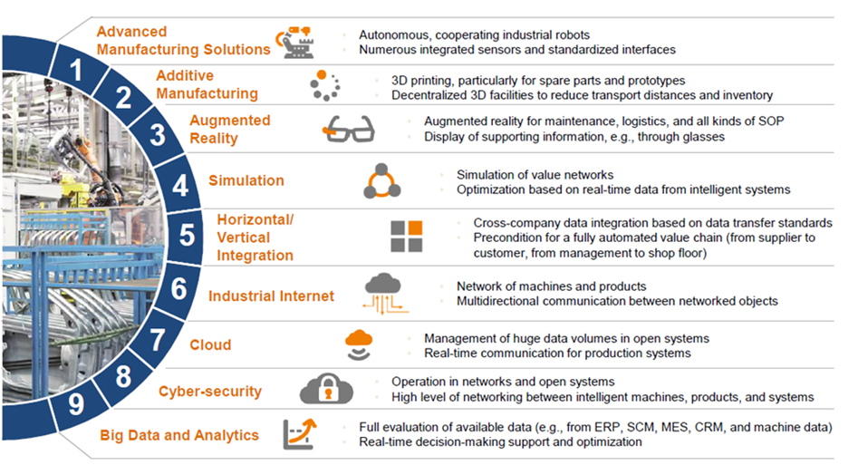 

рис.1.9. Технології Індустрії 4.0.

## Екосистема Інтернету речей

До екосистеми Інтернету речей відносяться усі засоби, сервіси і технології, які використовуються в Інтернеті речей. 

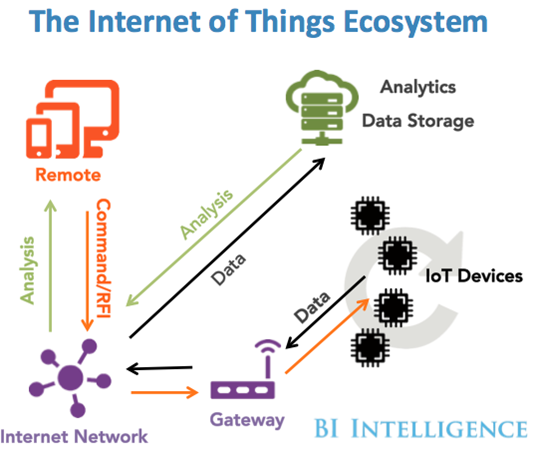

рис.1.10. Екосистема Інтернету речей

До них можна віднести:

–    **sensors (розумні датчики/виконавчі механізми**): вбудовані системи, операційні системи реального часу, джерела безперебійного живлення, мікро-електромеханічні системи (МЕМС);

–    **системи зв'язку з датчиками**: зона охоплення бездротових персональних мереж становить від 0 см до 100 м. Для обміну даними між датчиками застосовуються низькошвидкісні малопотужні інформаційні канали, які часто побудовані не на протоколі IP;

–    **локальні обчислювальні мережі (**LAN): зазвичай це системи обміну даними на основі протоколу IP, наприклад, 802.11 Wi-Fi-мережу для швидкого радіозв'язку;

–    **агрегатори, маршрутизатори** **(routers), шлюзи** **(gateways), пограничні пристрої (**Edge Device) : сюди входять різноманітні засоби які слугують зв'язковими між областю речей, Інтернетом та хмарними сервісами;

–    **глобальна обчислювальна мережа**: оператори стільникового зв'язку, оператори супутникового зв'язку, оператори малопотужних глобальних мереж (Low- Power Wide-Area Network, LPWAN). Зазвичай застосовуються транспортні протоколи Інтернету для IoT і мережевих пристроїв (MQTT, CoAP і навіть HTTP);

–    **хмари**: різноманітні хмарні постачальники та їх сервіси;

–    **сервіси аналізу даних**: спеціалізовані застосунки що дозволяють обробляти величезні масиви інформації, які передаються в хмару;

–    **засоби безпеки (**security): при зведенні всіх елементів архітектури воєдино постають питання кібербезпеки. Безпека стосується кожного компонента: від датчиків фізичних величин до ЦПУ і цифрового апаратного забезпечення, систем радіозв'язку і самих протоколів передачі даних. На кожному рівні необхідно забезпечити безпеку, достовірність і цілісність. У цьому ланцюзі не повинно бути слабких ланок, оскільки Інтернет речей стане головною мішенню для атак хакерів в світі.

## Архітектура Інтернету Речей

Архітектура Інтернету речей відрізняється в залежності від реалізації. Тим не менше вона дещо схожа на архітектуру класичних систем АСУТП і складі інтегрованих систем керування. Один із прикладів архітектури показаний на рис.1.11. 

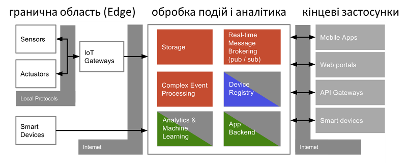

рис.1.11. Приклад архітектури Інтернету Речей.

Взаємодія з «речами» відбувається через датчики (sensors) та виконавчі механізми (Actuators), аналогічно як це робиться в АСУТП для будь якого об’єкту керування. Ці датчики разом з усією інфраструктурою для інтеграції з рівнем обробки подій через мережу Internet формують так звану граничну область (**Edge**). 

Події (дані) що поступають з граничної області зберігаються і обробляються відповідно до задачі (рівень обробки подій і аналітики, **event processing**, **Platform**). На цьому рівні події(дані) зберігаються (storage), обробляються (Event Processing), перенаправляються потрібним додаткам (Real-Time Message Brokering, Stream Processing). Додатково на цьому рівні відбувається адміністрування та керування пристроями з граничної області (Device Registry, Edge Device Management). Події (дані) обробляються з використанням аналітичних сервісів (Analytics) на основі них проводиться машинне навчання (Machine Learning), що дозволяє зробити певні висновки про об’єкт. Цей рівень як правило реалізований з використанням хмарних (Cloud) або туманних (Fog) обчислень. Якщо провести аналогію с АСУТП, то це рівень контролерів та SCADA (за виключенням функцій HMI).     

Отримання результатів, контроль, віддалене керування та адміністрування системи проводиться через кінцеві застосунки з використанням Internet. Цей рівень можна умовно порівняти з HMI в АСУТП.  

##  Туманні і граничні обчислення, аналітика і машинне навчання

При розробці інтегрованої системи керування з використанням IoT необхідно вирішити, що робити з потоком даних, що надходять в хмарний сервіс з граничного вузла (Edge Device). Щоб навчитися правильно оцінювати, як система буде розвиватися і рости, необхідно розібратися у всіх тонкощах і складнощах архітектури хмарних систем, який вплив на IoT-систему робить запізнювання. Крім того, не все треба відправляти в хмару. Пересилання всіх IoT-даних обходиться значно дорожче, ніж їх обробка на кордоні мережі (граничні обчислення, Edge Computing) або включення граничного маршрутизатора в зону, яку обслуговує хмарний сервіс (туманні обчислення, Fog computing). Туманні обчислення також стандартизуються, зокрема є стандарт туманних обчислень, наприклад архітектура OpenFog.

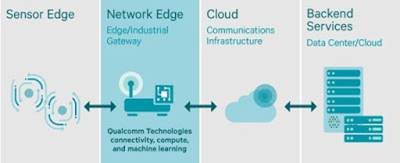

рис.1.12. Потік даних в інтегрованій системі керування з IoT

Дані, які були отримані шляхом перетворення аналогового фізичного впливу в цифровий сигнал, можуть мати велику вагу. Саме тут в гру вступають засоби аналітики і процесори правил IoT-системи. Ступінь складності введення в дію IoT-системи залежить від того, яке рішення проектується. У деяких ситуаціях все досить просто: наприклад, коли на граничний маршрутизатор, який контролює кілька датчиків, потрібно встановити простий процесор правил, що відслідковує аномальні скачки температури. Інша ситуація - величезна кількість структурованих і неструктурованих даних в режимі реального часу передається в хмарне озеро даних, що вимагає високої швидкості обробки (для прогнозної аналітики) і довгострокового прогнозування на базі високотехнологічних моделей машинного навчання, таких як рекурентна нейронна мережа в пакеті аналізу сигналів з кореляцією по часу. Тут є певні проблеми і складнощі аналітики, які вирішуються різними підходами та методами, наприклад складними обробниками подій, байесовськими мережами і формування нейронних мереж.

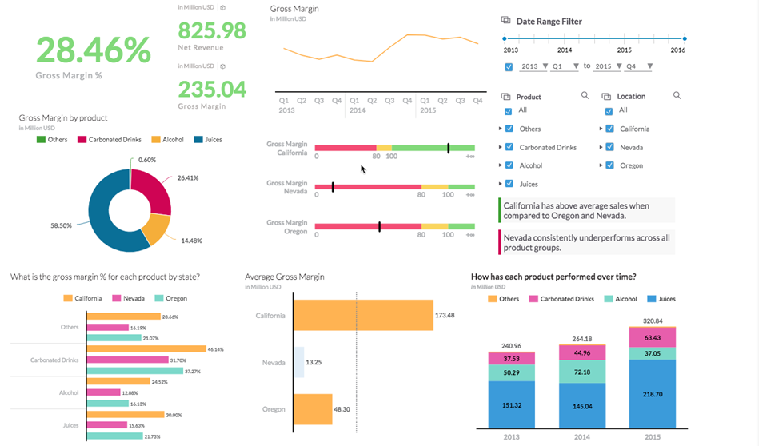

рис.1.13. Приклад аналітичних вікон

**Запитання для самоперевірки**

1. Які державні програми Індустрії 4.0 Вам відомі?
2. Поясніть як Ви розумієте поняття "цифровий двійник".

3. Поясніть що таке "Інтернет речей".

4. Яким чином речі з Інтернету речей з'єднуються з зовнішнім світом?

5. Як можуть допомогти технології Індустрії 4.0 в завдоленні власних потреб споживача?

6. Що таке промисловий Інтернет речей?

7. Розкажіть про технологію віртуальної реальності. Як вона може знадобитися на сучасному виробництві?

8. Розкажіть про технологію доповненої реальності. Як вона може знадобитися на сучасному виробництві?

9. Розкажіть про використання на виробництві коботів. Чим вони відрізняються від промислових роботів?

10. Для чого можуть використовуватися "Великі дані" в інтегрованих системах керування?

11. Для чого в промисловості може використовуватися Штучний інтелект?

12. Для чого в промисловості можуть використовуватися адитивні технології?

13. Наведіть приклад використання роботів-дронів.
14. Що входить до екосистеми Інтернету речей?
15. Розкажіть про основні елементи архітектури Інтернету речей.
16. Що таке туманні та граничні обчислення?
17. У чому проблема аналізу даних за місцем збору?
