# Тема 6. Мережні протоколи в інтегрованих системах керування

## Загальний принцип функціонування обміну між застосунками в мережах

Прикладні програми (застосунки) спілкуються між собою з використанням мереж. Для того щоб потрібна інформація дісталася від одного застосунку до іншого необхідно вирішити ряд завдань. Не достатньо просто передати побітово дані через провідники чи через ефір (бездротова передача), треба забезпечити їх доставку конкретному пристрою (вузлу), та конкретному застосунку на цьому пристрої. Якщо ж пристрої знаходяться в різних мережах, які об'єднані між  собою маршрутизаторами, необхідно також забезпечити маршрутизацію пакетів. Для спрощення цих задач їх вирішують різні протоколи які взаємодіють між собою. Розглянемо це на прикладі функціонування стеку протоколів TCP, IP та Ethernet, взаємодія яких показана на рис.6.1. 


рис.6.1.Функціонування стеку протоколів.

Коли один застосунок відправляє іншому якісь дані він послуговується протоколом транспортного рівня, звертаючись до відповідного драйверу з запитом на відправку даних. У даному випадку показаний протокол TCP, який функціонує умовно на 4-му рівні. Цей протокол не забезпечує доставку даних в мережі, його задача доставити дані від одного застосунку до іншого, у тому числі, якщо вони знаходяться на одному і тому ж пристрою. Для того щоб це зробити, до корисних даних, які треба передати (Upper Layer SDU (Data)) добавляється службова інформація, зокрема адреси застосунку-отримувача та відправника (tcp-порти). Ця інформація передається перед корисними даними разом з ними і називається **пакетом**. Кажуть що пакет TCP включає в себе (**інкапсулює**) дані протоколу верхнього рівня як **корисне навантаження** і має **заголовок** (**header**), в якому передається додаткова службова інформація. Пакет аналізується драйвером пристрою отримувача і за відповідним портом отримувача у заголовку шукає той застосунок, кому призначений даний пакет і віддає йому корисні дані. За необхідності корисне навантаження передається кількома частинами, які називаються сегментами. Тоді драйвер пристрою-отримувача повинен зібрати ці дані разом.

Для того щоб tcp-пакет досяг потрібного пристрою, необхідно вирішити ще кілька задач. По-перше, дані можуть передаватися між пристроями в різних мережах, які об'єднані між собою. Наприклад пристрої можуть спілкуватися через мережу Інтернет. Для цього драйвер TCP, просить передати драйвер IP (3-й рівень) його tcp-пакет конкретному вузлу в об'єднаній мережі. Для драйвера IP цей tcp-пакет інкапсулюється як корисне навантаження, а для його передачі в об'єднаній мережі використовується IP-адреси відправника та отримувача, яка поміщається в заголовок. Про функціонування пакету IP наведено нижче, тут зауважимо, що для передачі IP-пакету по мережі, драйвер IP послуговується послугами драйверу мережного інтерфейсу, наприклад Ethernet чи WiFi.

Задача Ethernet (2-й рівень), забезпечити доставку даних від одного пристрою до іншого (інших), які знаходяться в тій самій мережі. Для цього він інкапсулює IP-пакет в **кадр** (**frame**), який містить заголовок з інформацією про апаратну адресу картки (**MAC-адресу**) відправника та отримувача. Крім того в кінцевику (footer), кадр містить контрольну суму, за допомогою якої контролюється достовірність отримання вмісту кадру. 

Сформований кадр відправляється побітово по мережі (1-й рівень). Всі пристрої прослуховують мережу, і отримавши кадр призначений їм, починають зворотній процес перетворення. За допомогою контрольної суми перевіряють чи кадр прийшов без спотворень. Якщо все гаразд, вилучають корисне навантаження і передають його драйверу IP. За адресою отримувача визначають, чи пакет дійсно призначений їм, якщо ні - очевидно пристрій повинен його відправити на інший порт (див. нижче). Якщо отримувач дійсно цей пристрій, корисне навантаження переправляється драйверу TCP. За адресою tcp-порта той визначає якому застосунку призначене дане корисне навантаження, за необхідністю робить складання сегментів разом і віддає корисне навантаження застосунку. 

У наведеному вище прикладу показаний тільки прямий шлях передач даних між застосунками. Враховуючи, що на кожному етапі перетворення (рівні мережі) в заголовках передається також адреса відправника, застосунок може переслати повідомлення-відповідь до адресату, який ініціював передачу.      

Розглянемо принципи маршрутизації, яка вирішується протоколом IP та засобами рівня 3. Сьогодні є дві версії протоколів IP - `IP v4` (4-байтна адресація) та `IP v6`(16-байтна адресація). У будь якому випадку, адресація передбачає виділення адреси мережі та вузла.  У `IP v4` адреса мережі визначається за маскою, яка задається послідовністю бітів, що виділяє адресу мережі з вказаної адреси. Наприклад в адресі `192.168.1.1` з маскою `255.255.255.0`, перші три байти вказують на адресу мережі. Тобто при такому завданні адреса мережі буде `192.168.1.0` а пристрій буде мати адресу `1`.     


 рис.6.2. Визначення адреси мережі та вузла (пристрою) за маскою

Для маршрутизації пакетів в об'єднаній мережі використовуються **маршутизатори** (**router**). Вони знаходяться в місцях підключень кількох мереж, і забезпечують передачу пакетів з однієї мережі в іншу. Для цього маршрутизатори містять маршрутні таблиці, які містять записи з адресами та портами, куди треба відправляти пакети, якщо їх адреса задовільняє правило маршрутизації. На рис.6.3 показаний приклад маршрутизації. Розглянемо його детальніше.

   

 рис.6.3. Функціонування маршрутизаторів

На пристроях в налаштуваннях драйвера IP вказуються також маршрутні таблиці.  Як мінімум, там повинен бути вказана (або видана автоматично) IP адреса маршрутизатора за замовченням (може називатися "шлюз за замовченням"). Коли драйвер IP повинен відправити пакет за певним призначенням, він спочатку визначає (наприклад за маскою), чи знаходиться цей пакет в цій же мережі. Далі:

- Якщо так, він відправляє цей пакет за відповідно до цієї IP-адреси МАС-адресою
- Якщо ні, він відправляє цей пакет за відповідно до IP-адреси маршрутизатора МАС-адресою    

Для того щоб дізнатися відповідну МАС-адресу до IP-адреси використовуються ARP-таблиці. Ви можете переглянути такі таблиці на вашому пристрої через командний рядок, викликавши команду:  

```bash
arp -a
```

 Ці таблиці як правило формуються автоматично за допомогою протоколу ARP. Це працює наступним чином:

- драйвер IP шукає в ARP-таблиці відповідну до адреси отримувача MAC-адресу
  - якщо запис існує, драйвер IP просить драйвер Ethernet відправити пакет за вказаною  MAC-адресою
  - якщо запису немає: 
    - драйвер IP просить драйвер Ethernet відправити ARP-пакет з широкомовним (усім в мережі) запитом-питанням (у кого такий IP)
    - пристрій з вказаним IP відповідає
    - адреса заноситься в таблицю ARP
    -  драйвер IP просить драйвер Ethernet відправити пакет за вказаною  MAC-адресою 

Слід також зазначити, що є особливі адреси, для яких діють особливі правила адресації. Наприклад `127.0.0.1` - це адреса того самого пристрою, так званий `loopback`.  

Вище описаний дуже короткий принцип функціонування стеку з кількох протоколів.  

## Протоколи TCP та UDP

Як зазначалося вище, протоколи транспортного рівня слугують для забезпечення передачі даних між застосунками. На сьогодні найбільш популярними є протоколи **TCP** (Transmission Control Protocol) та **UDP** - (User Datagram Protocol).

Протокол UDP дуже простий і призначений для доставки пакету до застосунку за вказаним портом udp (рис.4). Він не передбачає контролю доставки, контроль цілісності повідомлення та фрагментацію. За рахунок цього він швидкий, бо не потребує додаткових полів заголовку (які треба обробляти) а найголовніше - додаткового обміну службовою інформацією. Крім того він може використовуватися для широкомовлення (broacast, тобто всім) та мультиадерсної доставки (multicast). Його використовують у тому випадку коли дані повинні надійти швидко, навіть за умови втрати пакетів.


рис.6.4. Порівняння протоколів TCP та UDP

На противагу до UDP протокол TCP призначений для гарантованої доставки даних. Для цього перед обміном даних для застосунків встановлюється сеанс зв'язку, в межах якого буде проводитися обмін. Для встановлення сеансу проводиться домовленість, що передбачає передачу службових повідомлень (потрійне рукостискання), після чого йде обмін пакетами з контролем правильності доставки та підтвердженням отримання. Ці службові пакети роблять передачу надійною, але  набагато повільнішою ніж UDP.    

Обидва протоколи використовують для доставки даних до конкретного застосунку адресацію з використанням номерів портів. Для TCP ініціатор зв'язку називається клієнтом (Client) а застосунок, який очікує з'єднання - сервером (Server). Таким чином, щоб сервер отримав повідомлення від клієнта, клієнту треба вказати в заголовку відправленого пакету, а саме в порті отримувача, той порт, який прослуховує сервер. У свою чергу, сервер зможе відповісти клієнту, використавши з заголовку отриманого пакету адресу порта відправника. Тобто клієнт заздалегідь повинен знати порт, який прослуховує сервер. А серверу інформація про партнера стає відомою після отриманого повідомлення.   

Слід зазначити, що самі по собі протоколи TCP та UDP кінцевими застосунками рідко використовуються, так як не містять інформацію, що тлумачить що значить дані, що передаються. Цими протоколами послуговуються різноманітні протоколи прикладного рівня. Зокрема, дуже відомий протокол HTTP, яким користуються браузери для доступу до WEB-серверів, використовує для доставки запитів та відповідей протокол TCP. Враховуючи популярність протоколів прикладного рівня, для них визначені типові адреси портів, які також називаються **добре відомі** порти (**Well-Known**). Наприклад, за HTTP-сервером закріплений порт `80`. Якщо в браузері не вказати адресу порта (через двокрапку), буде вважатися використання порта 80. Тобто http://example.com та http://example.com:80 будуть доступатися до того ж порту.    


рис.6.5. Номери портів

Клієнтським застосункам при підключенні, як правило виділяються вільні порти, тобто ті, які на даний момент на даному пристрої не використовуються драйвером TCP. Нижче наведений розподіл портів:

- 0-1023 – добре відомі, системні порти (Well-Known, System)
- 1024-49151 – користувацькі (User)
- 49152-65535 – динамічні або приватні порти (Dynamic, Private) 

При побудові власних застосунків з використанням TCP та UDP, як правило користуються бібліотеками, які спрощують обмін з використанням так званих **сокетів** (**Socket**). Сокет - це такий програмний об'єкт, який слугує початковою або кінцевою точкою з'єднання, через який можна передати або отримати дані. Перед обміном даними сокет налаштовується на конкретний мережний інтерфейс та порт (рис.3.6). Таким чином адреса сокету є комбінацією з адреси IP та порту. Клієнтські сокети з'єднуються з серверними з використанням ідентифікатору підключення, який містить протокол, IP адреси та номери портів відправника (src) та отримувача (dst):     

**Protocol** **+** **IPdst** **+** **PORTdst** **+** **IPsrc** **+** **PORTsrc** (5 tuple)


рис.6.6. Принципи роботи сокетів

На рис.6.7. показані етапи роботи сокетів для протоколу TCP. Спочатку в застосунку створюються сокети (примітив `socket`). Далі відбувається зв'язок локальної адреси (IP та порт) з сокетом (примітив `bind`). Серверний сокет вказує на очікування з'єднання від клієнта (примітив `listen`). Клієнтський сокет викликає примітив `connect` для підключення до серверного сокету. В примітиві він вказує адресу серверного сокету. Серверний сокет підтверджує підключення примітивом `accept`, після чого будь який з партнерів може відправляти (`send`) та отримувати (`recv`) дані. Примітив `close`  розриває з'єднання.    


рис.6.7. Етапи роботи сокета

Таблиця 6.1. Примітиви роботи з сокетом.

| **Примітив** | **Призначення**                    |
| ------------ | ---------------------------------- |
| SOCKET       | створити сокет                     |
| BIND         | зв'язати локальну адресу з сокетом |
| LISTEN       | очікувати з'єднання від клієнта    |
| ACCEPT       | підтвердити з'єднання              |
| CONNECT      | підключатися до серверу            |
| SEND         | відправити по каналу               |
| RECEIVE      | отримати з каналу                  |
| CLOSE        | розірвати з'єднання                |

## Робота з TCP та UDP в Node-RED

У Node-RED для роботи з TCP та UDP є відповідні вузли з палітри `Network`, які  встановлюються разом з Node-RED.  У цьому розділі розглянемо їх.

### UDP out 

Цей вузол відправляє `msg.payload` на призначений хост і порт UDP. Підтримується багатоадресна передача. 

На рис.3.8 показано налаштування `UDP out`. При відправлені можна задати як конкретний порт так і випадковий (`bind to random local port`). 

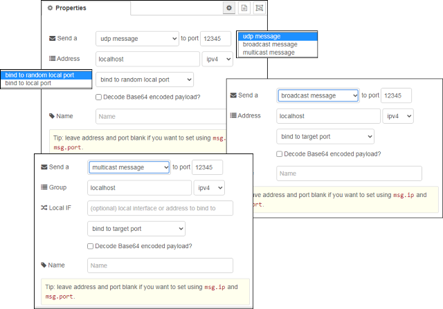

рис.6.8.Налаштування UDP out

Можна також використовувати `msg.ip` і `msg.port` для встановлення значень IP-адреси та порта призначення, але слід зауважити, що у цьому випадку статично налаштовані значення повинні бути порожніми.

Якщо вибрати широкомовлення (`broadcast`), тоді необхідно встановити адресу на ip адресу локального широкомовлення, або, `255.255.255.255`, яка є глобальною адресою широкомовної передачі. **Примітка**: У деяких системах вам може знадобитися мати root, щоб використовувати порти нижче 1024 та/або широкомовлення.

### UDP in

Вузол введення UDP, який виробляє `msg.payload`, що містить буфер, рядок або base64-кодований рядок. Підтримується багатоадресне отримування.

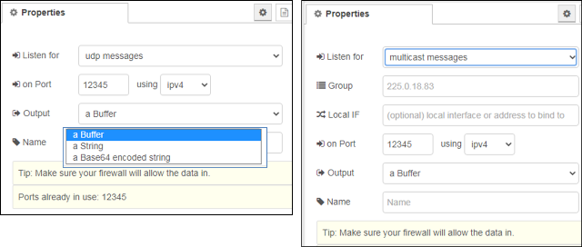

рис.6.9. Налаштування `UDP in`

Він також забезпечує передачу `msg.ip` та ` msg.port`, встановлені на ip-адресу та порт, з якого було отримано повідомлення. У деяких системах може знадобитися root або адміністраторський доступ для використання портів нижче 1024 та/або широкомовлення.

На рис.6.10 вказаний приклад використання UDP, де Node-RED відсилає повідомлення до самого себе. 

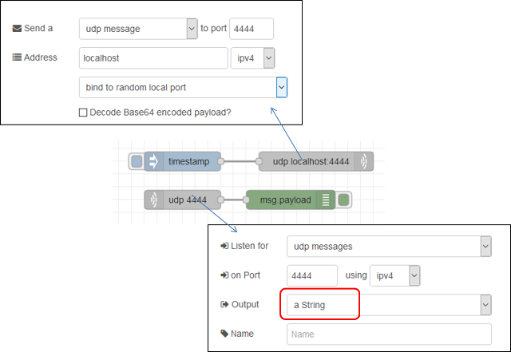

рис.6.10. Приклад роботи UDP

### TCP in 

 Забезпечує отримання вхідних даних з порта TCP.

Можна або підключитися до віддаленого порту TCP (`Type = Connect To`), або прийняти вхідні з'єднання (`Type = Liasten On`).

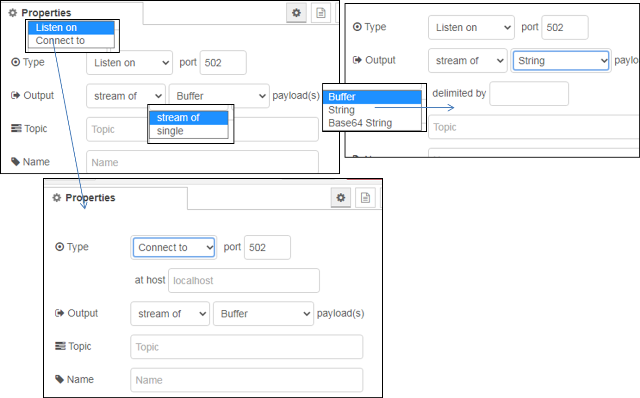

рис.6.11. Налаштування `TCP in`

У деяких системах вам може знадобитися root або адміністратор для доступу до портів нижче 1024.

При підключенні до віддаленого порту вузол для цього підключення буде тільки приймати вхідні повідомлення. При необхідності підключення в режимі запит/відповідь варто використовувати вузол TCP request.

### TCP out

Забезпечує відправлення вихідного повідомлення на TCP-порт. 

Можна або підключитися до віддаленого порту TCP (`Type=Connect to`), приймати вхідні з'єднання (`Type=Listen on`) або відповідати на повідомлення, отримані від вузла TCP In (`Type=Reply to TCP`).

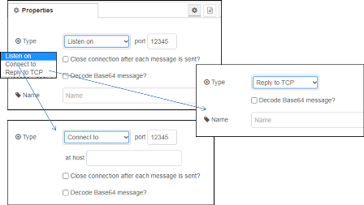

рис.6.12. Налаштування `TCP out`

Надсилається лише `msg.payload`. Якщо  `msg.payload` - рядок, що містить кодування бінарних даних Base64, опція `decode Base64` призведе до того, що вона буде перетворена назад у двійкові дані перед відправкою.

Якщо `msg._session` немає, корисне навантаження надсилається **всім** підключеним клієнтам. У деяких системах вам може знадобитися root або адміністратор для доступу до портів нижче 1024.

При підключенні до віддаленого порту вузол для цього підключення буде тільки відправляти вихідні повідомлення. При необхідності підключення в режимі запит/відповідь варто використовувати вузол TCP request.

### TCP Request

Простий вузол для відправки клієнтського запиту TCP та очікування відповіді. Запит відправляється через msg.payload на порт TCP-сервера, після чого очікується відповідь. Конфігурування вузла показано на рис.6.13.

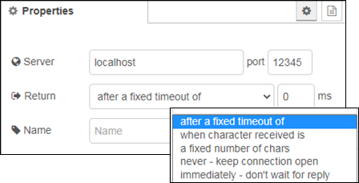

рис.6.13. Налаштування `TCP Request`

Вузол підключається по TCP, надсилає запит і чекає відповідь, яку формує на виході вузла `msg.payload`. За допомогою параметра Return налаштовується різні режими очікування відповіді для видачі отриманих даних в `msg.payload` та закриття з'єднання:

- за фіксованою кількістю символів у буфері (`fixed number of charts`),
- за вказаним символом, який сигналізує про завершення передачі (`when character received`)
- за фіксованим часом очікування (`after a fixed timeout`),
- передавати дані за надходженням  і ніколи не закривати з'єднання (`never`) 
- відправляти запит, а потім негайно закрити з'єднання, не чекаючи відповідь (`immediately`).

Відповідь буде виводитися у `msg.payload` як буфер. Для текстового перетворення можна скористатися методом `.toString()`.

Якщо в налаштуваннях залишити хост або порт tcp порожнім, їх потрібно встановити, використовуючи властивості `msg.host` та `msg.port` у кожному повідомленні, надісланому до вузла.

На рис.6.14 показаний приклад роботи вузлів TCP. У даному прикладі в Node-RED реалізоване як серверне так і клієнтське підключення для з'єднання самого з собою. Сервер відправляє клієнту те саме повідомлення, яке отримав (ехо-відповідь).

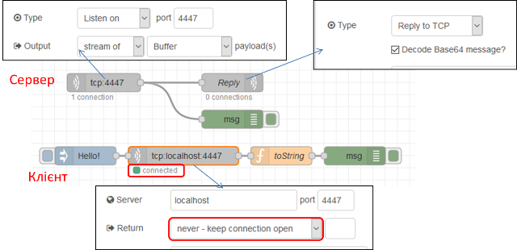

рис.6.14. Приклад роботи вузлів TCP

## Протокол HTTP 

**HTTP** (HyperText Transfer Protocol — «протокол передачі гіпертексту») — протокол прикладного рівня передачі даних, який є повінстю текстовим, тобто використовуються тільки літери та цифри. Початково проткол використовувався для передачі гіпертекстових документів HTML, зараз використовується для передачі чого завгодно. 

У обміні приймають участь два застосунки (рис.6.15):

- HTTP Клієнт (наприклад Web Browser) - ініціатор, той застосунок, якому потрібні ресурси серверу. Він формує запит (Request Message) на сервер на виконання операціъ з ресурсом. 
-  HTTP Сервер (Web Server) - той застосунок, у якого є ресурси. Він обробляє запит клієнта і відправляє відповідь (Response Message), у якому повертає результат обробки ресурсу, або сам ресурс. 

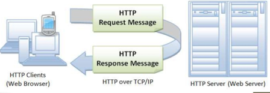

рис.6.15. Клієнт-серверний обмін в HTTP.

На сьогодні інсує кілька версій: HTTP/1.1, впроваджується HTTP/2 (з 2015) та HTTP/3 (з 2019).

HTTP так само і багато споріднених протоколів використовує стандартний стек TCP, UDP, IP та інші (рис.6.15)  


рис.6.15. Стек протоколів HTTP

Розглянемо приниципи функціонування HTTP на прикладі (рис.6.16). 

1) Коли користувач заходить за посиланням на WEB-ресурс він вказує *URL* того ресурсу (наприклад сторінки), який необхідно завантажити. 

2) Браузер запитує цей ресурс за допомогою повідомлення в текстовому форматі, що починається з назви методу `GET` в якому передається адреса ресурсу та додаткові параметри запиту. Це повідомлення передається по TCP до серверу по вказаному порту. Якщо користувач не вказав порт він буде рівним 80 (див. попередню лекцію).    


рис.6.16. Приклад фунуціонування протоколу HTTP. 

3) Сервер, отримавши повідомлення на отримання ресурсу, шукає його за URL.

4) У випадку знаходження ресурсу сервер відправляє відповідь, в заголовку якої вказує позитивний результат виконання запиту `200 Ok`. Також в корисному навантаженні він передає запрошуваний ресурс. 

5) Браузер виводить ресурс, якщо це буде HTML-сторінка показує її у відповідному вигляді.

### Ідентифікація ресурсу

**Ресурси** на сервері - це документи у різному форматі, які можна отримати, записати, змінити і т.п. Для доступу до потрібного ресурсу вказується його унікальний для серверу ідентифікатор розміщення -  **URL (**Uniform Resource Locator). Він задається у вигялді рядку і має наступний формат:

```http
<схема>://<логін>:<пароль>@<хост>:<порт>/<шлях>?<параметри>#<якір>
```

- схема – це означення того, який проткол використовується для доступу ресурсу, наприклад `http` або `https`
- логін та пароль – це ім'я і пароль користувача, якщо доступ до ресурсу обмежений; як видно вони розділені двокрапкою; якщо дсотуп до ресурсу не обмежується, логін та пароль не вказуються 
- хост - доменне ім'я хоста (DNS) або IP-адреса 
- порт – TCP порт хоста, якщо не вказується,  
- шлях – інформація що уточнює місцезнаходження ресурсу
- параметри – рядок запиту з параметрами, що передаються на сервер (методом GET) 
  - використовується разділювач параметрів — знак &. 
- #<якір> - якір, тобто заголовок всередині документа, або атрибут id 

Приклади:

`https://uk.wikipedia.org/wiki/Уніфікований_локатор_ресурсів#Cтруктура` `http://asu.in.ua/viewtopic.php?p=6135#p6135`

### Структура повідомлення

Як зазначалося в протоколі HTTP повідомлення-запит та повідомлення-відповідь мають повністю текстовий формат. Повідомлення складається з (рис.6.17): 

- стартового рядку, який завершується символом кінця рядку і включає в себе 
  - для запиту вказується рядок запиту (`request line`): у ньому вказується метод (на рисунку `GET`), ресурс (на рисунку `/doc/test.html`) та версія протоколу (на рисунку `HTTP/1.1`) 
  - для відповіді вказується статусний рядок (`status line`): у ньому вказується версія протоколу (на рисунку `HTTP/1.1`), код статусу (на рисунку `200`) та текстове представлення статусу (на рисунку `OK`) 
- headers (заголовки), які уточнюють повідомлення; кожен заголовок закінчується символом кінця рядку; є тільки один обовязковий заголовок для клієнта - `Host`, в якому  треба вказати імя хоста, до якого відбувається звернення; усі інші заголовки добалвяються за необхідності; 
- body (тіло повідомлення), яке включає зміст ресурсу; може бути порожнім, наприклад у повідомленні-запиті на отримання ресурсу
- розділювач - пустий рядок, який розділяє заголовки і тіло повідомлення    


рис.6.17. Структура повідомлення HTTP 

Перевірити роботу http можна за допомогою програми-терміналу, наприклад для систем Windows це PuTTY (рис.6.18). Для цього треба підключитися до потрібного порта потрібного `host` в режимі передачі тексту (`raw`). Далі у консольному вікні набрати текстове повідомлення, після подвійного `Enter` з'явиться відповідь від серверу.        


рис.6.18. Приклад перевірки роботи HTTP за допомогою PuTTY.

### Методи запитів

Метод запиту (HTTP Method) - це означення дії, яку необхідно провести над ресурсом. За великим рахунком це може бути довільний символьний набір, але цей метод повинен підтримуватися і Client і Server.  Тим не менше є стандартні методи, зокрема:

- **GET** – запит на зміст ресурсу 
- **POST** – передача даних для існуючого ресурсу 
- **HEAD** – запит інформації про ресурс але без змісту
- **PUT** – розміщення нового ресурсу на Web-сервері
- PATCH – часткова зміна ресурсу
- DELETE – видалення ресурсу з Web-серверу
- TRACE – трасировка (ехо-запит) перевірки зміни запиту по шляху
- OPTIONS – запит підтримуваних методів HTTP та розширень
- CONNECT – підключення до Web-серверу через проксі

### Статуси відповідей

Статус відповіді вказує на результат виконання сервером запиту. Він включає числове представлення у вигялді коду та текстову рошифровку. Перша цифра тризначного коду (сотні) вказують на тип відповіді: 

- **1XX** – інформаційна; наприклад `101 switching protocols` вказує на те, що відбулося переключення на інший протокол (наприклад з HTTP на WebSocket)
- **2XX** – успішне виконання; наприклад `200 ОК`
- **3ХХ** – перенаправлення на інше розміщення ресурсу; наприклад `301` – перенаправлення на постійне розміщення, `307` – перенаправлення на тимчасове переміщення
- **4ХХ** – помилка з причини клієнта; наприклад `403` –доступ заборонений за неправильної вказівки користувача та пароля, `404` – ресурс не знайдено за вказаним посиланням
- **5ХХ** – помилка на сервері; наприклад `500` – відбулася внутрішня помилка серверу

### Заголовки

Заголовки HTTP (HTTP Headers) уточнюють повідомлення. Описуються парою `ім'я: значення` (див. рис.6.19). Наприклад 

```http
Content-Type: text/html;charset=utf-8
```

задає формат і спосіб представлення тіла повідомлення типу `text/html` з кодуванням `charset=utf-8`.

Існують стандартні заголовки, які описані в документах RFC. Нестандартні  заголовки повинні починатися з `X-`. Для протоколу HTTP > v1.1 заголовок «Host» в повідомленні-запиті повинен бути обов'язковим, так як на одному IP/домені може бути декілька Веб-серверів. Список заголовків можна подивитися на [Вікіпедії](https://uk.wikipedia.org/wiki/Список_заголовків_HTTP).

Розглянемо вплив заголовку `Connection` на функціонування обміну. Заголовок вказує на властивість підключення, зокрема `Connection: Keep-Alive` вказує на необхідність утримання (`persistent`) з'єднання після відповіді на запит. У протоколі `HTTP/1.0` передбачалося, що після обробки кожного запиту – з'єднання розривається. Однак для багатьох випадків це може спричинити до значних часових затрат. Розглянемо це на прикладі (рис.7). Якщо при завантаженні сторінки необхідно додатково зробити запит, наприклад, на завантаження рисунків для неї, то в звичайному варіанті після кожного запиту GET TCP-з'єднання в `HTTP/1.0` буде розриватися, хоча логічний сеанс обміну при цьому триває. Як відомо з попередньої лекції це приведе до додаткових часових затрат, тому для утримання з'єднання в HTTP/1.0 потрібен заголовок `Connection: Keep-Alive`, який після відповіді серверу тримає TCP-з'єднання активним протягом 5-15 секунд (залежить від реалізації серверу). У версії `HTTP/1.1` за замовченням вважається даний параметр `persistent` а у 2-й версії заголовок взагалі заборонений.


рис.6.19. Функціонування постійного з'єднання `Persisten Connection`

Інший прикладом є використання заголовку `Cache-Control`. Для прискорення обміну завантажувані ресурси можуть кешуватися, тобто зберігатися на локальних (приватних) або проміжних загальнодоступних  (shared) кешах (рис.6.19). Тобто якщо запит проходить через сервера, які передбачають кешування, може повернутися старе значення ресурсу. Це з одного боку зменшує трафік, так як надає багатьом клієнтам швидше доступ до одного і того ж ресурсу. З іншого боку, якщо ресурс (наприклад сторінка) змінився, усі клієнти отримають старе значення. Для вказівки параметрів роботи з кешем передбачений заголовок: `Cashe Control`, наприклад:

- `Cache-Control: no-cache, no-store` - не кешувати, не зберігати, 
- `Cache-Control: max-age=31536000` - максимальний час збереження в кеші в секундах

## Робота з HTTP в Node-RED 

У Node-RED є вузли для роботи як з клієнтськими запитами так і для реалізації серверної обробки. 

### HTTP requests (робота з клієнтськими запитами)

Відправляє запити HTTP і повертає відповідь на нього (рис.6.20). В якості вхідного значення приймає наступні властивості повідомлень:

- `url` (string) – якщо не сконфігуроване у вузлі, ця опціональна властивість виставляє url для запиту.
- `method` (string) - якщо не сконфігуроване у вузлі, ця опціональна властивість виставляє метод HTTP для запиту. Повинно бути GET, PUT, POST, PATCH бо DELETE.
- `headers` (object) – виставляє HTTP заголовки в запиті 
- `cookies` (object) – якщо вказані, можуть бути     використані для відправки куків з запитом
- `payload` – виставляє тіло для запиту
- `rejectUnauthorized` – якщо виставлено в false дозволяє робити     запити на сайти https, які використовують сертифікати, які підписуються     самостійно 
- `followRedirects` – якщо виставлено в false запобігає     наступним перенаправленням (`HTTP 301`). true за замовчуванням

 

рис.6.20. Налаштування вузлу HTTP requests

На виході формує:

- `payload` (string | object | buffer) – тіло     відповіді. Вузол може бути     налаштований так, щоб повернути тіло у вигляді string,     спробувати розпарсити його як рядок JSON або залишити його у вигляді     двійкового буфера. 
- `statusCode` (number) - код стану відповіді або код помилки,     якщо запит не може бути завершений.
- `headers` (object) – об’єкт, що містить     заголовки відповідей 
- `responseUrl` (string) - у випадку,     якщо під час обробки запиту відбулися будь-які перенаправлення, це     властивість є останньою адресою, що переадресовується. В іншому випадку це URL оригінального запиту.
- `responseCookies` (object) - якщо відповідь     включає файли cookie, ця властивість є об'єктом пар імені/значення для     кожного cookie.

Якщо сконфігуровано у вузлі, властивість URL може містити теги [mustache-style](http://mustache.github.io/mustache.5.html). Вони дозволяють створювати URL, використовуючи значення вхідного повідомлення. Наприклад, якщо URL-адресу встановлено `example.com/{{{topic}}}` в це місце буде автоматично додано` `msg.topic. Використання потрійних фігурних дужок `{{{...}}}` запобігає вилученню `mustache` із символів на зразок `/&`  і т.д.

Примітка: Якщо запускається за проксі-сервері, необхідно встановити стандартну змінну середовища `http_proxy=...` і перезапустити Node-RED, або використовувати вузол Proxy Configuration. Якщо було встановлено вузол Proxy Configuration, конфігурація цього вузлу має перевагу перед змінною середовища. 

Для того щоб використовувати більше одного з таких вузлів в тому самому потоці, необхідно дотримуватися властивості `msg.headers`. Перший вузол встановить цю властивість з заголовками відповіді. Тоді наступний вузол буде використовувати ці заголовки для свого запиту - це звичайно не правильно. Якщо властивість `msg.headers` залишається незмінною між вузлами, вона буде ігноруватися другим вузлом. Щоб встановити користувальницькі заголовки, `msg.headers` слід спочатку видалити або скинути порожнім об'єктом: `{}`.

Властивість cookies, передана вузлу, повинна бути об'єктом з парою ім'я : значення. Значення для встановлення значення cookie може бути string, або об'єктом з єдиною властивістю value. Будь-які файли cookie, повернені запитом, передаються назад у властивості responseCookies.

Для виконання запиту завантаження файлу, `msg.headers["content-type"]` слід встановити на `multipart/form-data` , а `msg.payload` , переданий у вузол, повинен бути об'єктом із такою структурою: 

```json
{
    "KEY": {
        "value": FILE_CONTENTS,
        "options": {
            "filename": "FILENAME"
        }
    }
}
```

Значення KEY, FILE_CONTENTS та FILENAME слід встановити у відповідні значення.

Якщо `msg.payload` є Object, вузол буде автоматично встановлювати тип контенту запиту в `application/json` і кодувати тіло відповідним чином.

Для кодування запиту як форми даних `msg.headers["content-type"]` буде встановлюватися як `application/x-www-form-urlencoded`.

На рис.6.21 показаний приклад з вузлом HTTP requests

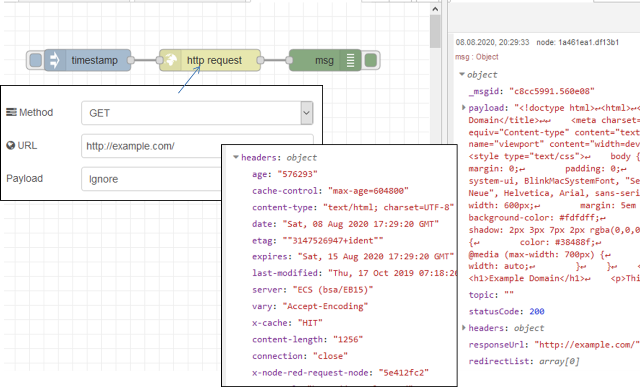 

рис.6.21. Приклад використання HTTP requests

### Http in (вхідне повідомлення HTTP-серверу)

  Створює точку для з`єднання  HTTP для створення веб-служб (рис.6.22). 

 


рис.6.22. Налаштування `Http in`

На виході формує:

- `Payload (object)` - Для запиту `GET` містить об'єкт з параметрами рядка запиту. В іншому випадку, містить тіло запиту HTTP.
- `req (object)` - Об'єкт запиту HTTP. Цей об'єкт містить кілька властивостей, які надають інформацію про запит. 

Вузол прослуховує конфігурований шлях для запитів певного типу. Шлях може бути повністю означений, наприклад `/user`, або включати іменовані параметри, які приймають будь-яке значення, наприклад `/user/:name`. Коли використовуються іменовані параметри, їх фактичне значення в запиті може бути доступне за посиланнями `msg.req.params`.
 Для запитів, які включають тіло, наприклад `POST` або `PUT`, вміст запиту доступний як msg.payload.

Якщо тип вмісту запиту може бути визначений, тіло буде проаналізовано до будь-якого відповідного типу. Наприклад, `application/json` буде парсений до його представлення в об'єкти JavaScript.

Примітка: цей вузол не надсилає відповіді на запит. Потік повинен містити вузол HTTP Response для завершення запиту.

### Http response (вихідне повідомлення HTTP-серверу)

  Надсилає відповіді на запити, отримані від вузла HTTP In (рис.6.23). 

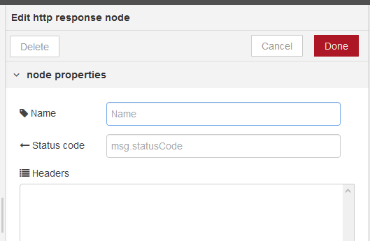 

рис.6.23. Налаштування `Http response`

В якості вхідного значення приймає наступні властивості повідомлень:

- `payload (string)` – тіло     відповіді 
- `statusCode (number)` – якщо встановлений,     використовується в якості статусного коду відповіді. За замовченням `200`
- `headers (object)` – заголовки, якщо     встановлений забезпечує HTTP заголовки, які     включаються у відповідь  
- `cookies (object)` – якщо встановлений, може     бути використаний для встановлення або видалення куків (cookies)

statusCode і headers також можуть бути встановлені в налаштуваннях самого вузла. У цьому випадку їх не можна перевизначити відповідними властивостями повідомлення.

Властивість cookies повинна бути об'єктом пар імен/значень. Значення може бути або рядком для встановлення значення куки з параметрами за замовчуванням, або це може бути об'єктом опцій.

Наступний приклад встановлює два файли cookies - один з них називається name зі значенням nick, інший називається session зі значенням 1234 з терміном дії 15 хвилин.

```json
msg.cookies = {
    name: 'nick',
    session: {
        value: '1234',
        maxAge: 900000
    }
}
```

Допустимі опції:

- `domain` - (String) ім’я домену     для куки 
- `expires` - (Date) термін дії в GMT. Якщо не вказано або встановлено на 0, створює сеансовий cookie 
- `maxAge` - (String) термін дії відносно поточного часу в мілісекундах
- `path` - (String) шлях куки, за замовченням `/`
- `value` - (String) значення для куки 

Для видалення, куки встановлюється в `null`

На рис.6.24 показаний приклад використання вузлів http in/out в парі. Коли відбувається запит на сторінку hello видається текстовий зміст.

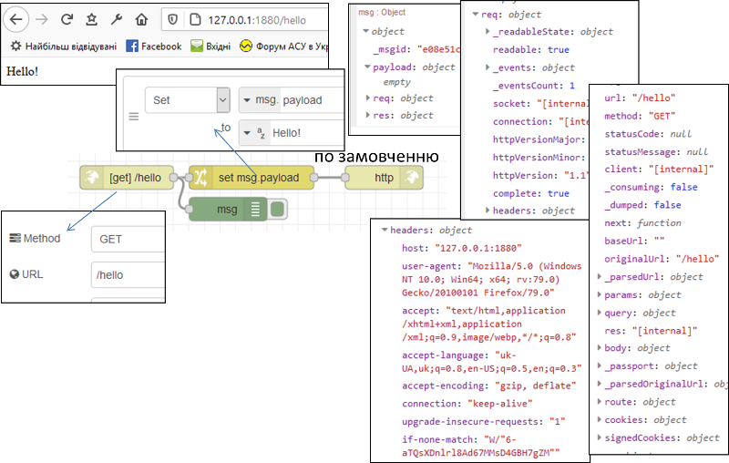 

рис.6.24. Приклад використання `http in/out`

## Робота зі змістом HTML повідомлень

### Тип змісту тіла повідомлення (Content-Type)

Хоч протокол HTTP повністю текстовий, за допомогою тексту можна кодувати будь-який зміст тіла, навіть бінарні файли. Однак для їх правильної інтерпретації необхідно вказати тип змісту за допомогою заголовка `Content-Type`. Заголовок може включати декілька директив, розділені крапкою з комою:

- `media-type`, тип змісту, наприклад `text/html`, або `multipart` - для вказівки багато-частинних повідомлень
- `charset` – стандарт кодування, наприклад `utf-8`
- `boundary` – для багато-частинних (`multipart`) повідомлень розділювач  

Наприклад:

```text
Content-Type: text/html; charset=utf-8 
Content-Type: multipart/form-data; boundary=something
```

Тип змісту, визначається типом **MIME**(Multipurpose Internet Mail Extensions) – стандарт на характер і формат документу, файлу або даних. Він описується парою тип/підтип, тобто:

```
type/subtype
```

Ці типи можуть бути дискретними, тобто які описують весь формат, або у випадку змішаного формату (наприклад текст та рисунки) включати кілька частин. Популярні дискретні формати

```
application/octet-stream (бінарний)
text/plain (текстовий)
text/css, text/html, text/javascript, text/xml (текстовий з ромзіткою)
image/gif, image/jpeg, image/png (зображення)
application/json (JSON)
```

Інші дискретні формати:

```
text/css, audio/mpeg, audio/ogg, audio/*, video/mp4, application/*, pplication/ecmascript
application/octet-stream ...
```

Для змісту що включає кілька розділів (зміст) виділяється тип **MIME Multipart**. На рис.6.25 показаний приклад використання змісту, який включає кілька розділів. Це тіло повідомлення відправлення HTML-форми. Для цього використовується директива `multipart/form-data` заголовку `Content Type` . Директива`boundary` вказує на роздільник, який використовується для ідентифікації початку частин. Далі кожен розділ тіла повідомлення починається з вказаного роздільника, після чого вказується тип формату через `Content-type` . 

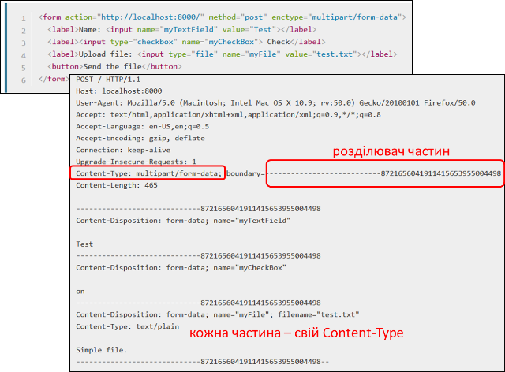 

рис.6.25. Приклад використання MIME Multipart

### Вузол HTML

  Витягує елементи з HTML-документа, що міститься в msg.payload  за допомогою селекторів CSS (рис.6.26).

В якості вхідного значення приймає наступні властивості повідомлень:

- `payload (string)` – html- рядок     з якого вилучаються елементи.
- `select (string)` -  селектор, може бути використане це значення     властивості msg, якщо воно не налаштовано на панелі редагування.

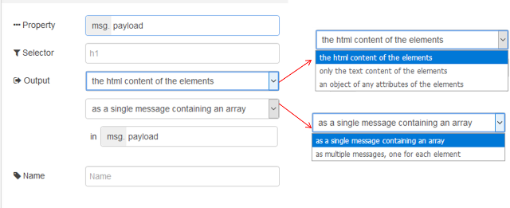 

рис.6.26. Налаштування вузлу HTML

На виході формує:

- `payload` (array | string) - результатом може бути одне повідомлення з корисним     навантаженням, що містить масив відповідних елементів, або кілька     повідомлень, кожен з яких містить відповідний елемент. 
- Якщо надсилаються декілька повідомлень, вони також     мають набір parts.

Цей вузол підтримує комбінацію селекторів CSS і jQuery. Докладніше про підтримуваний синтаксис див. [за цим посиланням](https://developer.mozilla.org/uk/docs/Web/CSS/CSS_Selectors) або [Документацію css-select](https://github.com/fb55/CSSselect#user-content-supported-selectors). 

На рис.6.27  наведений приклад використання HTML-парсера. Вузол  `http request` робить запит на сторінку з сайту `example.org` використовуючи метод `get`. Сторінка завантажується в Payload як текстове повідомлення. Далі повідомлення проходить через вузол парсера body, який витягує html-зміст усіх html-тегів body та відправляє їх окремими повідомленнями в payload. Враховуючи, щ вузол body в html-документі тільки один, його зміст виводиться один раз на панелі налагодження. Корисне навантаження цього повідомлення переходить через інший html-парсер з іменем p де вилучаються усі абзаци (тег p) і відправляються як масив повідомлень в форматі html.

 

рис.6.27. Приклад використання HTML-парсера 

### Вузол Template

Вузол Template може використовуватися для створення текстового значення за допомогою означеного шаблону та властивостей повідомлення, які вказуються в конкретних полях. Для формування результату він використовує шаблонну мову [Mustache](https://mustache.github.io/mustache.5.html), у якій поля-замінники в шаблоні виділяються подвійними фігурними дужками. Наприклад, шаблон:

`This is the payload: {{payload}} !`

замінить `{{payload}}` з значенням властивості повідомлення payload.

На рис.6.28 показано приклад налаштування вузла `Template`. Налаштування `Property` вказує на те, яка саме властивість буде змінюватися даним вузлом на виході. У якості шаблону можна задавати статичний шаблон, який записаний у полі Template, або передати його через властивість `msg.template`. У останньому випадку необхідно щоб поле `Template` в конфігурації вузла було порожнім. Можна вибирати різний синтаксис підсвічування в залежності від призначення виходу. 

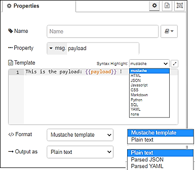                               

рис.6.28. Налаштування вузла Template

На рис.6.28 показаний простий приклад використання вузла Template.

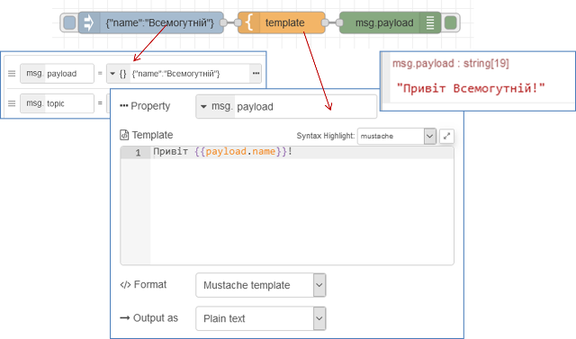 

рис.6.28. Простий приклад використання вузла Template

Для формування замінників в шаблоні окрім властивостей повідомлення можна використовувати значення контекстів. Це може бути як контекст за замовченням `{{flow.name}}` або `{{global.name}}`, так і іменоване сховище для контексту `{{flow[store].name}}` або `{{global[store].name}}`.

За замовчуванням, Mustache замінить певні символи своїми HTML-кодами. Щоб зупинити це, треба скористатися потрійними фігурними дужками: `{{{payload}}}`. На рис.6.29 показаний приклад, у якому для формування змісту у форматі html використовуються обидва варіанти – з подвійним і з потрійними дужками. Шаблони для обидвох вузлів зроблені у форматі html, який включає тег тіла, що у свою чергу включає замінник msg.payload. На їх вхід подається значення у форматі html. У першому варіанті (верхній вузол) символи що використовуються у форматуванні html замінені на їх кодові представлення (спецсимволи). Це робиться тому, що подвійні дужки вказують на те, що зміст має бути представлений як текст, а не як html. Тому відбувається перетворення, щоб зберегти відображення спецсимволів на кшталт "<" , "/", ">" у тому ж вигляді. При потрійних дужках ніякого попереднього перетворення не робиться, тому увесь зміст зрештою буде інтерпретуватися як html.    

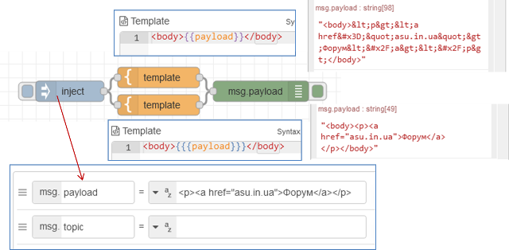 

рис.6.29. Приклад використання потрійних фігурних дужок. 

Mustache за допомогою секцій підтримують прості цикли у списках. Наприклад, якщо `msg.payload` містить масив імен, таких як: `["Nick", "Dave", "Claire"]`, то шаблон типу:

```
<ul>
{{#payload}}
 <li>{{.}}</li>
{{/payload}}
</ul>
```

створить список HTML імен:

```
<ul>
 <li>Nick</li>
 <li>Dave</li>
 <li>Claire</li>
</ul>
```

Додатково про форматування Mustache можна ознайомитися за [посиланням](https://pupenasan.github.io/NodeREDGuidUKR/base/mustach.html).  Якщо шаблон генерує валідний вміст JSON або YAML, його можна налаштувати для аналізу результату на відповідний об'єкт JavaScript.

## Питання для самоперевірки.

1. Яке призначення протоколів IP?
2. Як у IPv4 з використанням масок з адреси вузла виділяється адреса мережі?
3. Куди відправляється пакет за замовченням, якщо адреса IPv4 не в даній підмережі?
4. Поясніть що таке протокол ARP та таблиця ARP?    
5. Яке призначення у транспортних протоколів TCP та UDP? 
6. Поверх якого протоколу працюють TCP та UDP?
7. Виділіть основні відмінності в принципах роботи TCP та UDP.
8. Поясніть що таке порти TCP та UDP.
9. Поясніть на прикладі що таке добре відомі (Well-Known) порти TCP та UDP.
10. Які, як правило номери портів виділяються TCP та UDP клієнтам?
11. Поясніть принципи функціонування сокетів.
12. Яка принципова відмінність в роботі клієнтських та серверних сокетів TCP та UDP?
13. Яке призначення вузлів UDP-in та UDP-out в Node-RED?
14. Яке призначення вузлів TCP-in та TCP-out  в Node-RED?
15. Яке призначення вузла TCP-request в Node-RED? 
16. Розкажіть про загальні принципи функціонування протоколу HTTP.
17. На якому протоколі транспортного рівня базується HTTP?
18. Поясніть що таке ресурс HTTP? Як він ідентифікується на сервері?
19. Розкажіть про структуру повідомлення HTTP.
20. Розкажіть про призначення методів запитів HTTP.
21. Розкажіть про призначення статусів відповіді HTTP. 
22. Розкажіть про призначення заголовків HTTP. 
23. Розкажіть про призначення кешування в HTTP. Як можна керувати кешем в протоколі HTTP?
24. Як реалізована робота клієнта HTTP в Node-RED?
25. Як реалізована робота HTTP-сервера в Node-RED?
26. Як вказується формат повідомлення в HTTP?
27. Що таке Multipart повідомлення?
28. Рокзажіть про роботу вузла HTML-парсера в Node-RED.
29. Рокзажіть про роботу вузла `Template` в Node-RED.
